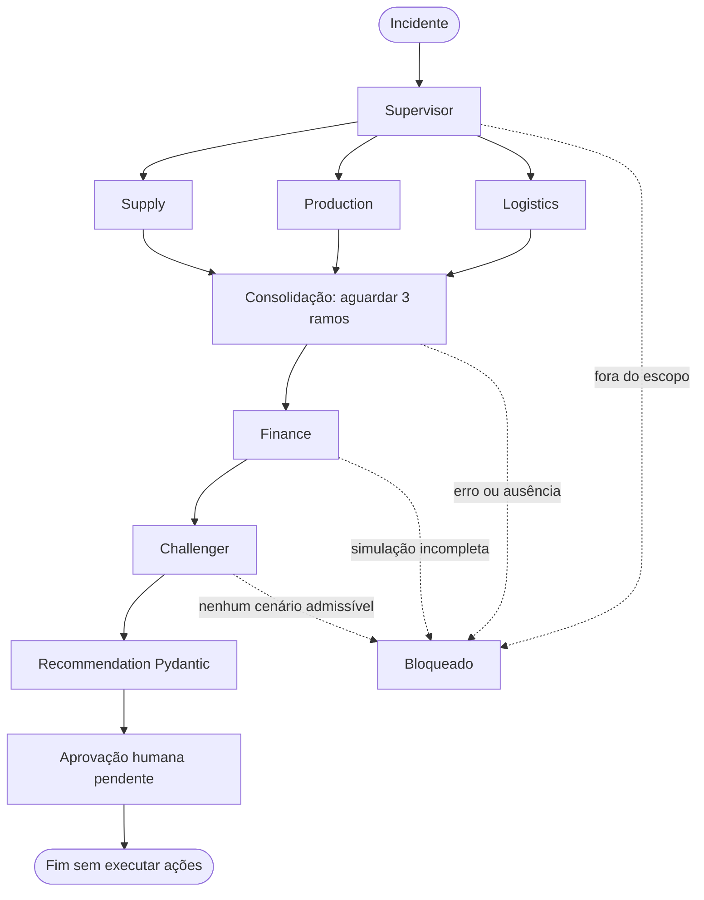

# Arquitetura da Aula 1

Start revisado: CLI → tools → CSV/JSON com Pydantic (171c324).
Complete candidato: as mesmas capabilities são coordenadas por um grafo finito LangGraph.

O arquivo [lesson-01-graph.mmd](lesson-01-graph.mmd) é gerado do grafo real por
`uv run control-tower graph`. O diagrama acima resume os conceitos para apresentação.

## Estado e transições

- WorkflowState Pydantic carrega incidente, plano, resultados dos três especialistas, investigação
  consolidada, FinanceReport, Review, Recommendation, Approval, bloqueios e status.
- Supply/Production/Logistics escrevem canais distintos. Sem reducer de lista compartilhada nem
  escrita concorrente nos mesmos campos. Result aceita dados ou erro, nunca ambos.
- Supervisor reconhece apenas o case INCIDENT-001 (M42/SP/Alpha) e seleciona os três especialistas.
  Esse roteamento é determinístico no mock, não uma escolha dinâmica de LLM.
- `add_edge(['supply', 'production', 'logistics'], 'consolidation')` espera todos os ramos. O join
  semântico rejeita evidência ausente/erro antes de chamar Finance.
- Finance simula quatro cenários usando alocação por prioridade, cronograma em dias e Decimal.
  Challenger verifica consistência/políticas e escolhe menor custo admissível. Recomendação só existe
  se há cenário admissível; senão, o terminal é blocked.
- Nó human_approval gera pending/awaiting_approval e encerra sem ações. Não é uma integração de aprovação
  nem um interrupt persistente: não há resume, banco ou comando de aprovar nesta etapa.

## Escolhas e limites

Mock executa o grafo real, mas seus papéis usam funções determinísticas. OpenAI foi adiado; não há
chave, acesso a API ou alegação de raciocínio probabilístico. A separação entre evidências, cálculos e
revisão permite adicionar um provider depois, mantendo cálculos fora do LLM. Não foi criada uma
abstração de provider sem uma segunda implementação para justificar sua complexidade.

`--sequential` altera somente as arestas para comparação didática. `--demo-delay-ms` injeta uma espera
limitada de até 2 s por especialista; padrão zero. Tempos reais variam, não são benchmark.
`--fail-specialist` demonstra a consequência de resultado ausente. Sem retry, timeout, backoff ou caos.

Dependências transitivas do LangGraph incluem LangSmith/checkpoint/SDK, mas não são serviços ativados.
Tracing é explicitamente desabilitado no workflow mock, inclusive quando o ambiente pede tracing.
Teste bloqueia conexões de rede. Estado é só em memória, sem persistência entre invocações.

Dados permanecem no checkout; `--root` permite outro diretório. Regras econômicas/temporais e limites
do simulador estão em [NOVACORE.md](../case/NOVACORE.md). Não há otimização global nem consulta a ERP.

## Aulas seguintes — fora desta entrega

Redis/Celery e estado distribuído (Aula 2); FastAPI/PostgreSQL/Docker (Aula 3);
OpenTelemetry/Langfuse/k6/chaos e FinOps (Aula 4). Nenhum deles foi introduzido.

Referências de implementação: [Graph API](https://docs.langchain.com/oss/python/langgraph/graph-api) e
[semântica de add_edge com múltiplas origens](https://reference.langchain.com/python/langgraph/graph/state/StateGraph/add_edge).
