# Arquitetura C4 — NovaCore LAB

Arquitetura implementada até a Aula 4, destinada aos alunos. Baseline: `c5ede1a75f41af8a01cdb0e9fd16d9a7836d0f3f` (main, 05/10/2026). Esta documentação não altera o runtime nem os checkpoints das aulas.

[PDF — 26 páginas](Arquitetura-C4-NovaCore-Aulas-1-a-4.pdf) · [Modelo editável](model.json)

## Como ler

Comece pelo contexto, percorra as duas vistas de containers e aprofunde apenas os componentes relevantes à discussão. As vistas de implantação, dinâmica e evolução complementam o C4. Não incluímos um diagrama de classes (nível 4): ele acrescentaria detalhes de implementação sem ajudar o objetivo desta disciplina.

**Container C4 significa aplicação ou armazenamento; não significa necessariamente container Docker.** As vistas de execução e gestão são recortes do mesmo sistema, não duas APIs independentes. O adaptador MCP tem sua própria fronteira de processo, descrita separadamente.

As caixas identificam tipo, responsabilidade e tecnologia. As setas têm direção e rótulo; respostas de chamadas retornam ao chamador. C1–C3 usam notação C4 simplificada; os arquivos Mermaid usam `flowchart` para renderização no GitHub. O layout automático do Mermaid pode diferir dos SVG/PDF.

## Catálogo e leitura guiada

### 01 — C1 · Contexto: Quem usa e de quem depende?

Sistema NovaCore: Control Tower + Control Plane

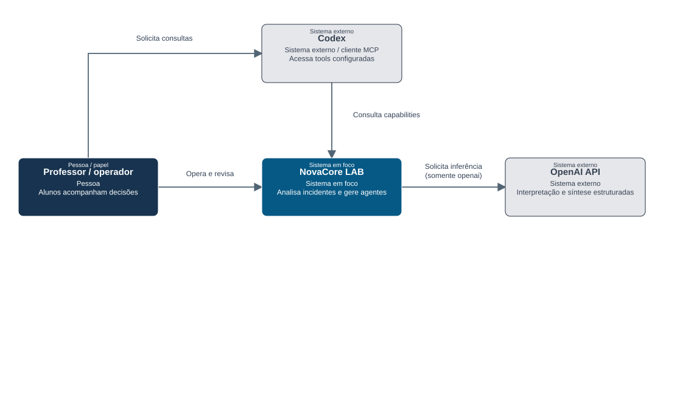

[Mermaid editável](diagrams/01-contexto.mmd) · [SVG](diagrams/01-contexto.svg)

**Como explicar**

- Comece pelo ator: o professor opera e revisa; os alunos observam arquitetura e limites.
- NovaCore reúne análise do processo industrial e gestão da workforce. Codex é um cliente externo; não é o Maestro.

**Limites**

- Não há integração real com ERP, fornecedor, transporte ou pagamento. O case utiliza arquivos locais e dados sintéticos.
- Mock dispensa chamadas ao provider. A eventual inferência própria do cliente Codex está fora do escopo do backend NovaCore.

**Evidência no repositório**

- [src/control_tower/application.py](../../../src/control_tower/application.py)
- [src/control_tower/mcp/server.py](../../../src/control_tower/mcp/server.py)
- [src/control_tower/cockpit/api.py](../../../src/control_tower/cockpit/api.py)

### 02 — C2 · Containers / vista operacional: Como um incidente é executado?

Containers lógicos do caminho HTTP; MCP detalhado na vista 04

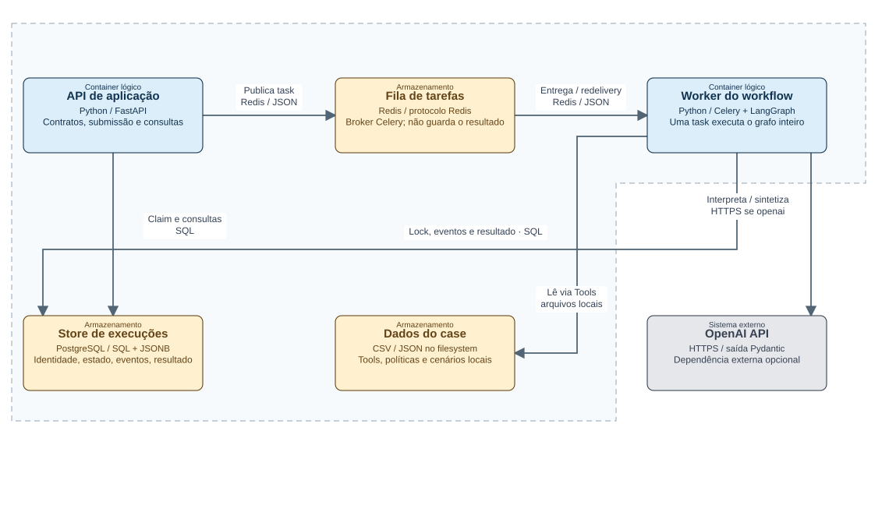

[Mermaid editável](diagrams/02-containers-execucao.mmd) · [SVG](diagrams/02-containers-execucao.svg)

**Como explicar**

- A API confirma a publicação e devolve execution_id. O trabalho acontece no worker, não no request de submissão.
- PostgreSQL é a fonte do resultado. Redis não é result backend: task_ignore_result=True.

**Limites**

- O claim é persistido antes da publicação: existe uma janela de falha entre banco e broker. O LAB usa reenvio explícito da mesma identidade; não implementa transactional outbox.
- CLI distribuída chama o mesmo producer/store por outro processo Python. A CLI local da Aula 1 executa o grafo diretamente, sem fila.

**Evidência no repositório**

- [src/control_tower/distributed/producer.py](../../../src/control_tower/distributed/producer.py)
- [src/control_tower/distributed/tasks.py](../../../src/control_tower/distributed/tasks.py)
- [src/control_tower/distributed/store.py](../../../src/control_tower/distributed/store.py)
- [src/control_tower/distributed/celery_app.py](../../../src/control_tower/distributed/celery_app.py)
- [src/control_tower/main.py](../../../src/control_tower/main.py)

### 03 — C2 · Containers / vista de gestão: Onde ficam UI, gestão e memória?

Cockpit e armazenamento; API é a mesma da vista operacional

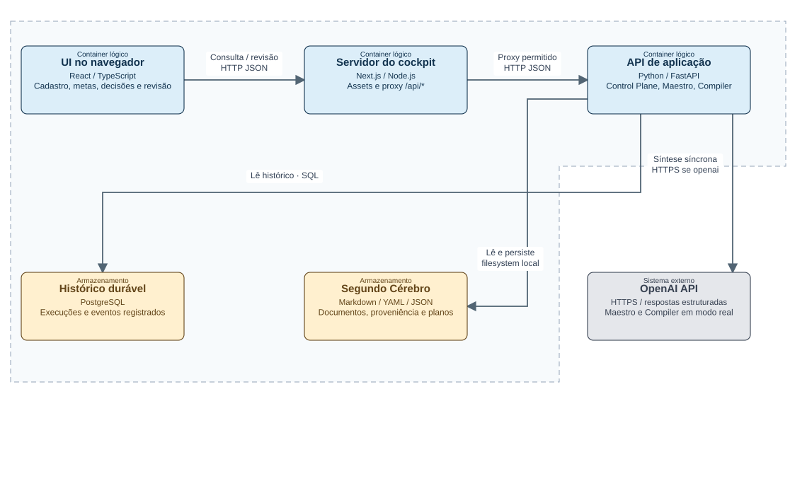

[Mermaid editável](diagrams/03-containers-gestao.mmd) · [SVG](diagrams/03-containers-gestao.svg)

**Como explicar**

- A UI não calcula metas ou custos. O proxy encaminha somente cockpit, maestro e knowledge; o backend valida as operações.
- Conversa e extração são chamadas síncronas no processo servidor. Não são tasks Celery nem jobs do LangGraph empresarial.

**Limites**

- A fonte didactic lê fixtures e sinais sintéticos; durable lê o PostgreSQL. Uma não preenche silenciosamente lacunas da outra.
- Sessões de chat ficam em memória do processo. Planos e conhecimento são arquivos persistidos em volume; não há vector database ou graph database.

**Evidência no repositório**

- [web/app/api/[...path]/route.ts](../../../web/app/api/[...path]/route.ts)
- [src/control_tower/cockpit/api.py](../../../src/control_tower/cockpit/api.py)
- [src/control_tower/cockpit/presentation.py](../../../src/control_tower/cockpit/presentation.py)
- [src/control_tower/cockpit/knowledge.py](../../../src/control_tower/cockpit/knowledge.py)
- [src/control_tower/cockpit/conversation.py](../../../src/control_tower/cockpit/conversation.py)

### 04 — Complemento · Fronteira MCP: Outra fronteira, os mesmos serviços

Processo Python transitório; sem novo serviço Compose nem porta MCP

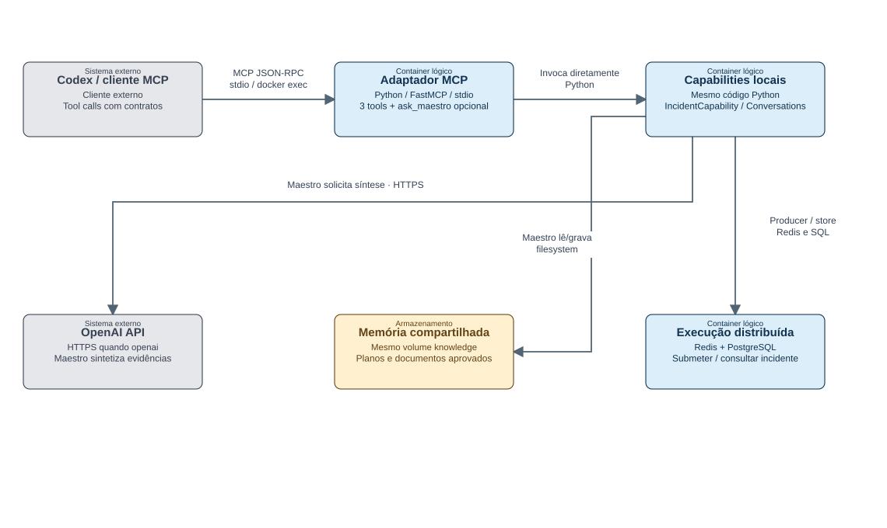

[Mermaid editável](diagrams/04-mcp.mmd) · [SVG](diagrams/04-mcp.svg)

**Como explicar**

- O launcher executa python -m control_tower.mcp.server --with-maestro dentro do container api já iniciado. Isso cria outro processo, não uma chamada HTTP à API.
- IncidentCapability e Conversations são reutilizados como código. O MCP possui sua própria instância de sessão; o chat do navegador não é compartilhado.

**Limites**

- submit_incident, get_execution_status e get_execution_result permanecem disponíveis. ask_maestro é adicionada pelo launcher opcional.
- MCP não oferece tool de aprovar conhecimento, mudar lifecycle ou executar plano. A memória persistida é comum; a autoridade não aumenta com a troca de cliente.

**Evidência no repositório**

- [scripts/start_maestro_mcp.sh](../../../scripts/start_maestro_mcp.sh)
- [scripts/start_lesson04_mcp.sh](../../../scripts/start_lesson04_mcp.sh)
- [src/control_tower/mcp/server.py](../../../src/control_tower/mcp/server.py)
- [src/control_tower/mcp/tools.py](../../../src/control_tower/mcp/tools.py)
- [src/control_tower/mcp/maestro.py](../../../src/control_tower/mcp/maestro.py)

### 05 — C3 · Componentes do worker: O que existe dentro de um worker?

Processo Python que executa a task Celery; nós não são microserviços

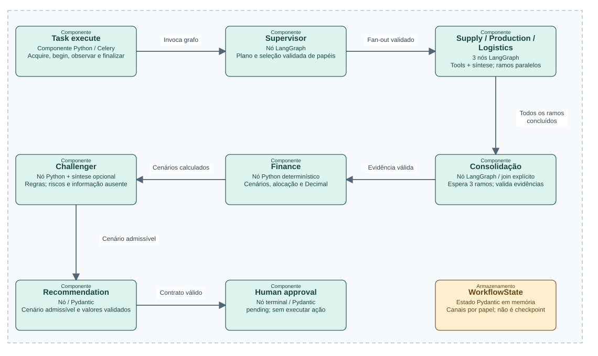

[Mermaid editável](diagrams/05-componentes-worker.mmd) · [SVG](diagrams/05-componentes-worker.svg)

**Como explicar**

- Celery distribui execuções completas entre workers. LangGraph coordena os papéis dentro de uma execução. O paralelismo local dos especialistas é outra dimensão.
- O join aguarda todos os três ramos, não a primeira resposta. Cada especialista atualiza um canal próprio do estado.

**Limites**

- Esta vista mostra o caminho de sucesso. Supervisor, consolidação, Finance, Challenger e Recommendation podem levar a blocked. Um especialista com erro é verificado no join.
- OpenAI adiciona interpretação e sínteses nos mesmos nós. Finance, tools, políticas e validação permanecem determinísticos. Approval termina o grafo; não há interrupt/resume persistente.

**Evidência no repositório**

- [src/control_tower/distributed/tasks.py](../../../src/control_tower/distributed/tasks.py)
- [src/control_tower/graph/workflow.py](../../../src/control_tower/graph/workflow.py)
- [src/control_tower/graph/state.py](../../../src/control_tower/graph/state.py)
- [src/control_tower/agents/finance.py](../../../src/control_tower/agents/finance.py)
- [src/control_tower/agents/interpretation.py](../../../src/control_tower/agents/interpretation.py)

### 06 — C3 · Componentes da API / consultas: Medir antes de recomendar

Módulos Python na API; não serviços implantáveis separados

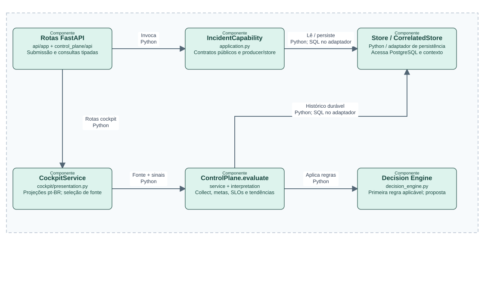

[Mermaid editável](diagrams/06-componentes-api.mmd) · [SVG](diagrams/06-componentes-api.svg)

**Como explicar**

- O Control Plane transforma sinais em métricas e limites, e então em recomendação. A chamada consulta evidências; não atua sobre workers ou modelos.
- Registry, pricing e configuração de SLOs vêm de código/arquivos locais. A fixture didática usa projeções próprias e mantém a origem explícita.

**Limites**

- A seta representa chamada/dependência, não apenas trânsito de dados: resultados retornam ao chamador. Producer/Redis estão na vista C2 operacional.
- Supply 74/90 mede cobertura didática de evidências. A meta técnica do Registry tem outro significado; os 50 exemplos de cobertura não são as 6 execuções ilustrativas.

**Evidência no repositório**

- [src/control_tower/api/app.py](../../../src/control_tower/api/app.py)
- [src/control_tower/control_plane/api.py](../../../src/control_tower/control_plane/api.py)
- [src/control_tower/control_plane/service.py](../../../src/control_tower/control_plane/service.py)
- [src/control_tower/control_plane/interpretation.py](../../../src/control_tower/control_plane/interpretation.py)
- [src/control_tower/control_plane/decision_engine.py](../../../src/control_tower/control_plane/decision_engine.py)
- [src/control_tower/cockpit/presentation.py](../../../src/control_tower/cockpit/presentation.py)

### 07 — C3 · Componentes da API / gestão: Síntese, proposta e conhecimento

Mesmo código reutilizado no processo MCP; Compiler/revisão acessados por HTTP

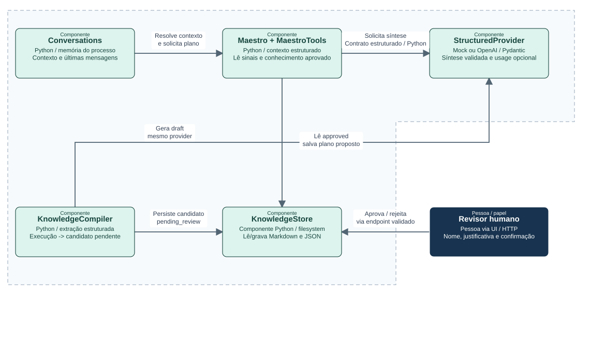

[Mermaid editável](diagrams/07-componentes-maestro.mmd) · [SVG](diagrams/07-componentes-maestro.svg)

**Como explicar**

- Maestro consulta sinais e memória aprovada, propõe plano e o persiste. Staffs são responsabilidades sugeridas; não são novos processos executados.
- Compiler usa evidências de uma execução para produzir candidato. O servidor valida referências e estrutura; revisão humana avalia conteúdo.

**Limites**

- O backend não tem autenticação/RBAC empresarial: o formulário é uma barreira didática de revisão, não comprovação inviolável de identidade.
- Conhecimento aprovado melhora contexto do Maestro. Não há treinamento de pesos nem injeção automática no LangGraph do próximo incidente. Planos e candidatos não são autorização empresarial.

**Evidência no repositório**

- [src/control_tower/cockpit/conversation.py](../../../src/control_tower/cockpit/conversation.py)
- [src/control_tower/cockpit/assistance.py](../../../src/control_tower/cockpit/assistance.py)
- [src/control_tower/cockpit/llm.py](../../../src/control_tower/cockpit/llm.py)
- [src/control_tower/cockpit/knowledge.py](../../../src/control_tower/cockpit/knowledge.py)
- [src/control_tower/cockpit/api.py](../../../src/control_tower/cockpit/api.py)

### 08 — Complemento · Implantação local: Como isso roda no computador do professor?

Docker Compose; réplicas físicas não são novos tipos de container C4

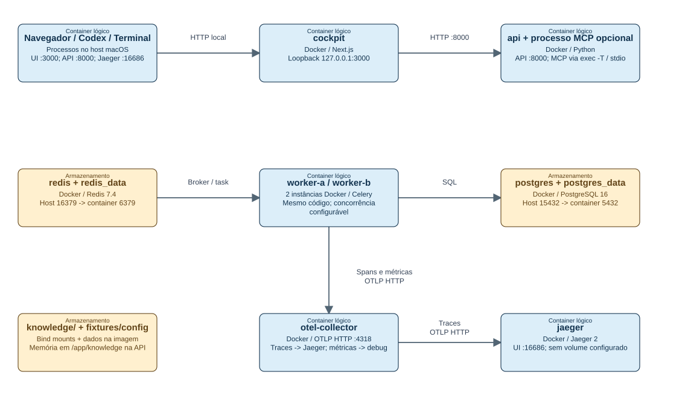

[Mermaid editável](diagrams/08-deployment.mmd) · [SVG](diagrams/08-deployment.svg)

**Como explicar**

- O desenho destaca instâncias físicas e portas. As demais dependências são as das vistas C2; aqui não repetimos todas as setas. API e MCP também exportam telemetria.
- O launcher combina cinco arquivos Compose. O MCP usa a imagem, ambiente e mount de knowledge do container API; não abre um endpoint remoto.

**Limites**

- Persistência: volumes para Redis/PostgreSQL; bind mount para conhecimento. Estado LangGraph e sessões de chat são memória de processo. Jaeger não tem volume persistente no Compose.
- OpenAI é externa e acessada por HTTPS quando habilitada. Serviços do LAB ficam no localhost; não há Kubernetes, balanceador, alta disponibilidade nem autenticação empresarial nesta implantação.

**Evidência no repositório**

- [compose.yaml](../../../compose.yaml)
- [compose.override.yaml](../../../compose.override.yaml)
- [compose.lesson04.yaml](../../../compose.lesson04.yaml)
- [compose.lesson04-complete.yaml](../../../compose.lesson04-complete.yaml)
- [compose.lesson04-cockpit.yaml](../../../compose.lesson04-cockpit.yaml)
- [scripts/cockpit.sh](../../../scripts/cockpit.sh)
- [scripts/start_maestro_mcp.sh](../../../scripts/start_maestro_mcp.sh)
- [deploy/otel/collector.yaml](../../../deploy/otel/collector.yaml)

### 09 — Complemento · Fluxo dinâmico: Do pedido ao resultado durável

Ordem conceitual do caminho HTTP/MCP; at-least-once e idempotência

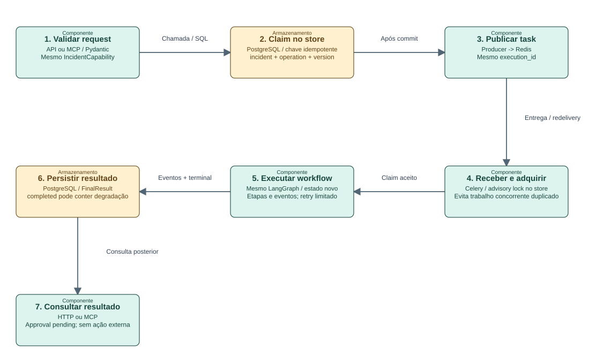

[Mermaid editável](diagrams/09-dinamica-incidente.mmd) · [SVG](diagrams/09-dinamica-incidente.svg)

**Como explicar**

- O cliente recebe um ID após submissão; consulta status/result separadamente. Workers podem receber a mesma identidade mais de uma vez.
- Retry tenta novamente; redelivery recupera entrega após perda de worker. O advisory lock vive na sessão, sem manter uma transação aberta durante a inferência.

**Limites**

- Idempotência no store não equivale a exactly-once para toda dependência externa. Uma falha antes de persistir conclusão pode repetir chamadas LLM e custo.
- Falha transitória de LLM tem retry limitado e decisão explícita de fallback: degradação determinística apenas para reference_replay seguro, ou human_review_required. Não há fallback de produção genérico para mock.

**Evidência no repositório**

- [src/control_tower/distributed/producer.py](../../../src/control_tower/distributed/producer.py)
- [src/control_tower/distributed/store.py](../../../src/control_tower/distributed/store.py)
- [src/control_tower/distributed/tasks.py](../../../src/control_tower/distributed/tasks.py)
- [src/control_tower/distributed/llm_runtime.py](../../../src/control_tower/distributed/llm_runtime.py)
- [src/control_tower/distributed/durable.py](../../../src/control_tower/distributed/durable.py)

### 10 — Complemento · Fluxo dinâmico: Da proposta ao contexto reutilizável

Interação humana obrigatória; nenhum ACT empresarial

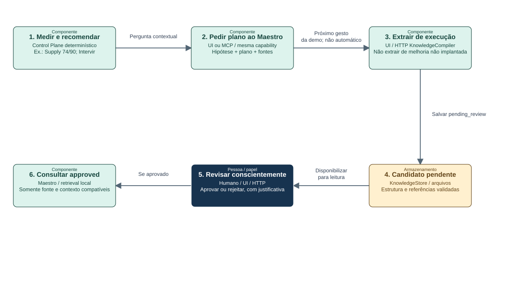

[Mermaid editável](diagrams/10-dinamica-conhecimento.mmd) · [SVG](diagrams/10-dinamica-conhecimento.svg)

**Como explicar**

- A seta entre plano e extração é uma sequência de ações do professor, não uma automação. O plano não foi executado; a lição usa uma execução anterior disponível.
- Aprovação de conhecimento altera o status do documento. Não aprova o incidente, não muda lifecycle e não executa o plano.

**Limites**

- Retrieval usa documentos aprovados, filtrados por fonte e tags; é busca local limitada, não RAG vetorial.
- Sessão HTTP e sessão MCP não são a mesma conversa. Um documento aprovado e um plano persistido podem ser lidos por ambos os processos.

**Evidência no repositório**

- [src/control_tower/cockpit/api.py](../../../src/control_tower/cockpit/api.py)
- [src/control_tower/cockpit/assistance.py](../../../src/control_tower/cockpit/assistance.py)
- [src/control_tower/cockpit/conversation.py](../../../src/control_tower/cockpit/conversation.py)
- [src/control_tower/cockpit/knowledge.py](../../../src/control_tower/cockpit/knowledge.py)

### 11 — Complemento · Evolução pedagógica: Um sistema, quatro necessidades

Camadas acumuladas; branches e tags preservam os estados didáticos

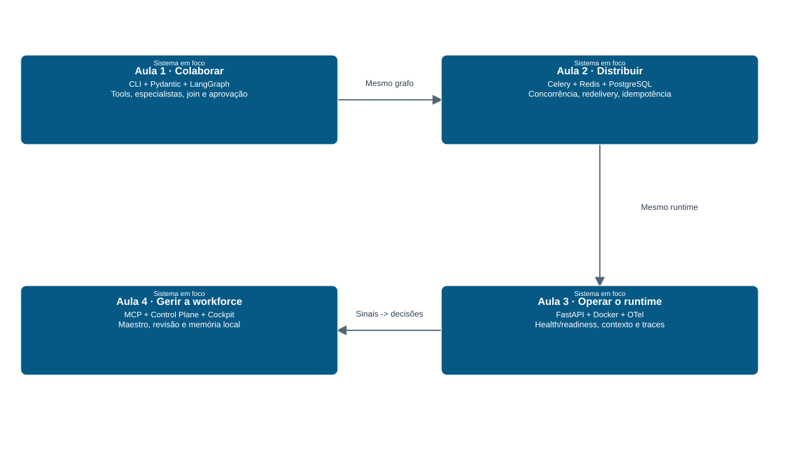

[Mermaid editável](diagrams/11-evolucao.mmd) · [SVG](diagrams/11-evolucao.svg)

**Como explicar**

- Comece com colaboração local. A necessidade de concorrência leva à fila e aos workers; implantação e diagnóstico levam à API e à telemetria; gestão exige identidade, metas e memória.
- As camadas não substituem o grafo por quatro aplicações. O caminho local continua útil para mock e demonstração conceitual.

**Limites**

- PostgreSQL entra na Aula 2, não na Aula 3. MCP e Control Plane entram na Aula 4; OpenTelemetry já é da Aula 3.
- Kubernetes, multi-provider routing, circuit breakers avançados, SLO-driven fallback e ACT autônomo não fazem parte da arquitetura implementada atual.

**Evidência no repositório**

- [docs/course/lesson-01-runbook.md](../../../docs/course/lesson-01-runbook.md)
- [docs/course/lesson-02-runbook.md](../../../docs/course/lesson-02-runbook.md)
- [docs/course/lesson-03-runbook.md](../../../docs/course/lesson-03-runbook.md)
- [docs/course/lesson-04-final-runbook.md](../../../docs/course/lesson-04-final-runbook.md)

## Manutenção e reprodução

Execute a partir da raiz do repositório:

```bash
uv run --with 'reportlab>=4,<5' python docs/architecture/c4/build.py
```

A primeira execução pode baixar ReportLab. A geração não inicia serviços nem chama OpenAI. Edite `model.json` para mudar conteúdo, relações ou coordenadas; execute o gerador para atualizar os 11 arquivos Mermaid, os 11 SVG e o PDF. Alterações feitas somente nos arquivos gerados serão sobrescritas. Arial é utilizada quando disponível; em outros sistemas há fallback para Helvetica.

O gerador valida identificadores, referências e existência dos arquivos-fonte. Após mudar o modelo, revise visualmente o PDF e os SVG: essas verificações não garantem clareza visual ou correção arquitetural. Atualize o baseline somente após conferir novamente o código.

## Referências de notação

- [C4 — System context](https://c4model.com/diagrams/system-context)
- [C4 — Container](https://c4model.com/diagrams/container)
- [C4 — Component](https://c4model.com/diagrams/component)
