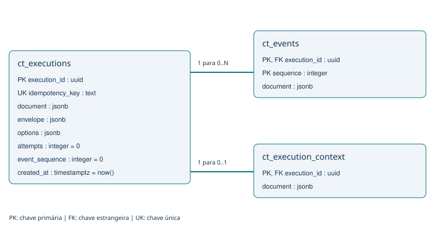

# Modelo de dados PostgreSQL - NovaCore LAB

Arquitetura atual até a Aula 4. Público: alunos. Conferido em 05/10/2026 no código do baseline c5ede1a e nos metadados do PostgreSQL 16 local (banco novacore, schema public). A consulta de validação foi somente leitura; não foram exportados registros dos ensaios.

## 1. Visão geral

O modelo combina relações SQL para identidade e integridade com documentos JSONB para contratos tipados de execução. Há 3 tabelas, 13 colunas físicas, 6 constraints de chave e 4 índices B-tree únicos. Todas as colunas físicas são NOT NULL; campos internos dos JSONB podem admitir null.

- ct_executions: identidade, estado atual, entrada, opções e resultado da execução.
- ct_events: histórico ordenado de eventos de cada execução, incluindo tentativas e eventos de LLM.
- ct_execution_context: associação opcional entre execução e identidades de correlação.

O banco registra processamento. Ele não é um modelo completo de ERP, de cadastro de agentes ou de conhecimento organizacional.

## 2. Diagrama entidade-relacionamento



Uma execução possui zero ou muitos eventos segundo as constraints SQL; o fluxo normal de claim já cria execution.queued. Cada evento pertence obrigatoriamente a uma execução. Uma execução tem zero ou um contexto: a PK/FK do contexto impede duas associações, mas não exige que todo registro pai possua contexto. Execuções criadas pelo Store da Aula 2 podem não ter essa associação.

## 3. Dicionário físico

### ct_executions

| Coluna | Tipo SQL | Regra / significado |
| --- | --- | --- |
| execution_id | uuid | PK; UUID gerado em Python, sem DEFAULT SQL. |
| idempotency_key | text | UNIQUE; identidade lógica da solicitação. |
| document | jsonb | DurableExecution: snapshot atual, resultado e estado. |
| envelope | jsonb | IncidentEnvelope: entrada sintética persistida no claim. |
| options | jsonb | TaskOptions: modo/modelo e opções daquela solicitação. |
| attempts | integer | DEFAULT 0; número de inícios de tentativa duravelmente contabilizados. |
| event_sequence | integer | DEFAULT 0; contador incrementado ao inserir eventos. |
| created_at | timestamptz | DEFAULT now(); criação da linha no banco. |

### ct_events

| Coluna | Tipo SQL | Regra / significado |
| --- | --- | --- |
| execution_id | uuid | Parte da PK; FK para ct_executions.execution_id. |
| sequence | integer | Parte da PK; ordenação por execução, não sequência global. |
| document | jsonb | DurableEvent: evento, instante, etapa, tentativa e métricas opcionais. |

### ct_execution_context

| Coluna | Tipo SQL | Regra / significado |
| --- | --- | --- |
| execution_id | uuid | PK e FK para ct_executions.execution_id. |
| document | jsonb | ExecutionContext: trace_id, correlation_id e identidades associadas. |

Não há ON DELETE CASCADE. As FKs usam a ação padrão NO ACTION: registros filhos impedem a exclusão do pai enquanto existirem. Não há tabelas dedicadas a agentes, aprovações ou recomendações.

## 4. Índices e integridade

| Índice existente | Colunas | Papel |
| --- | --- | --- |
| ct_executions_pkey | execution_id | Identidade e busca de execução. |
| ct_executions_idempotency_key_key | idempotency_key | Impede claims duplicados da mesma identidade. |
| ct_events_pkey | execution_id, sequence | Unicidade e leitura ordenada do histórico de uma execução. |
| ct_execution_context_pkey | execution_id | No máximo um contexto por execução. |

Não existem índices GIN em JSONB nem índices dedicados a status, llm_mode ou created_at. Consultas de coortes/status são adequadas ao LAB limitado; o desenho não afirma escala irrestrita.

O SQL assegura PK, FK, UNIQUE e NOT NULL. Não há CHECK SQL para estados, tentativas positivas ou conteúdo dos JSONB. Pydantic valida os contratos no caminho da aplicação. Uma escrita SQL direta pode violar essas regras sem violar as constraints físicas.

IDs e contadores se repetem em documentos: execution_id, idempotency_key e attempt no snapshot; execution_id e sequence nos eventos; execution_id no contexto. A aplicação os mantém coerentes, mas não há CHECK SQL comparando JSONB com a coluna física.

## 5. Contratos dentro de JSONB

Os campos abaixo são propriedades de documentos, NÃO colunas adicionais. O tipo descreve o contrato Pydantic/JSON. Obrigatório significa exigido na construção do contrato; campos com default podem ser omitidos na entrada e são normalmente serializados pelo Store.

### DurableExecution

Localização: ct_executions.document.

| Campo | Tipo / valores | Obrigatório / default |
| --- | --- | --- |
| execution_id | uuid | sim |
| incident_id | string | sim |
| status | queued, running, completed, failed | default "queued" |
| started_at | date-time / null | default null |
| completed_at | date-time / null | default null |
| current_step | string / null | default null |
| attempt | integer | default 1 |
| worker_id | string / null | default null |
| error | string / null | default null |
| workflow_status | awaiting_approval, blocked / null | default null |
| idempotency_key | string | sim |
| result | FinalResult / null | default null |
| llm_mode | mock, openai | default "mock" |
| duration_ms | number / null | default null |

### IncidentEnvelope

Localização: ct_executions.envelope.

| Campo | Tipo / valores | Obrigatório / default |
| --- | --- | --- |
| incident_id | string | sim |
| incident_type | supplier_delay, production_deviation, logistics_delay, sla_risk, inventory_shortage | sim |
| plant | string | sim |
| severity | low, medium, high, critical | sim |
| created_at | date-time | sim |
| business_priority | integer | sim |
| payload | objeto | sim |

### TaskOptions

Localização: ct_executions.options.

| Campo | Tipo / valores | Obrigatório / default |
| --- | --- | --- |
| demo_delay_ms | integer | default 0 |
| fail_specialist | supply, production, logistics / null | default null |
| fail_always | boolean | default false |
| llm_mode | mock, openai | default "mock" |
| llm_model | string | default "gpt-4.1-mini" |
| llm_failure | none, timeout | default "none" |
| fallback | human, deterministic_reference | default "human" |

### DurableEvent

Localização: ct_events.document.

| Campo | Tipo / valores | Obrigatório / default |
| --- | --- | --- |
| execution_id | uuid | sim |
| incident_id | string | sim |
| agent_id | string | sim |
| event_type | string | sim |
| timestamp | date-time | sim |
| status | queued, running, completed, failed | sim |
| duration_ms | number / null | default null |
| sequence | integer | sim |
| attempt | integer | default 1 |
| input_tokens | integer / null | default null |
| output_tokens | integer / null | default null |
| estimated_cost | number / string / null | default null |
| quality_score | number / null | default null |
| business_outcome | string / null | default null |
| detail | string / null | default null |

### ExecutionContext

Localização: ct_execution_context.document.

| Campo | Tipo / valores | Obrigatório / default |
| --- | --- | --- |
| trace_id | string | gerado automaticamente |
| correlation_id | string | gerado automaticamente |
| execution_id | uuid / null | default null |
| incident_id | string / null | default null |
| worker_id | string / null | default null |

### FinalResult

Localização: ct_executions.document.result.

| Campo | Tipo / valores | Obrigatório / default |
| --- | --- | --- |
| reference_case_id | "INCIDENT-001" | default "INCIDENT-001" |
| mode | mock, openai, degraded | default "mock" |
| outcome | recommendation, degraded_recommendation, human_review_required | default "recommendation" |
| model | string / null | default null |
| reason | string / null | default null |
| recommendation | Recommendation / null | default null |
| approval | Approval | sim |

### Recommendation

Localização: ct_executions.document.result.recommendation.

| Campo | Tipo / valores | Obrigatório / default |
| --- | --- | --- |
| incident_id | string | sim |
| severity | low, medium, high | sim |
| recommended_action | string | sim |
| estimated_cost_brl | number / string | sim |
| avoided_penalty_brl | number / string | sim |
| customer_delay_days | integer | sim |
| confidence | number | sim |
| risks | lista de string | sim |
| approval_required | true | default true |

### Approval

Localização: ct_executions.document.result.approval.

| Campo | Tipo / valores | Obrigatório / default |
| --- | --- | --- |
| required | true | default true |
| status | "pending" | default "pending" |
| authority | operations_manager, manager | sim |
| actions_executed | false | default false |

### Como interpretar esses contratos

- document.attempt começa em 1 por default; a coluna attempts começa em 0. Antes do primeiro begin, os valores não são iguais. Após iniciar, attempt recebe o contador durável. O limite protege contra loops de redelivery.
- document.started_at, worker_id e duração descrevem a tentativa corrente/final. As tentativas anteriores permanecem nos eventos; não há uma tabela de tentativas.
- created_at da linha é criação no banco; envelope.created_at é tempo do incidente sintético. Não confunda os dois relógios. Instantes em JSON são strings ISO; timestamptz é tipo físico SQL.
- Os cinco incident_type são envelopes de carga sintética. O resultado referencia INCIDENT-001: não são cinco workflows empresariais diferentes.
- result somente existe quando status é completed. human_review_required não contém recommendation; exige reason. degraded_recommendation exige mode degraded e reason.
- approval.required é true, status é pending e actions_executed é false. completed não significa compra executada ou aprovação concedida.
- llm_mode registra mock/openai solicitado; result.mode pode ser degraded. Compare ambos para reconhecer degradação explícita.
- Campos de usage, custo, qualidade e business_outcome são opcionais. Session.event grava duration_ms e tokens quando recebidos; não popula automaticamente estimated_cost, quality_score ou business_outcome. Null não significa custo zero nem benefício realizado.
- O contexto persistido é a primeira associação. Seu worker_id pode ser null; para o worker da tentativa consulte document.worker_id da execução. trace_id não é a chave da execução e esta tabela não armazena spans completos.

## 6. Escrita, transações e idempotência

1. A chave é idem-v1- seguida do SHA-256 do JSON canônico [incident_id, operation, version]. Mesmo incidente pode ter várias execuções com versão/operação diferentes.
2. claim insere ct_executions com ON CONFLICT DO NOTHING. Uma nova linha e execution.queued são gravados na mesma transação.
3. Para identidade repetida, envelope e options são comparados. Se diferirem, a aplicação rejeita e pede outra version; a chamada não sobrescreve a execução original.
4. CorrelatedStore adiciona contexto em outra transação, com ON CONFLICT DO NOTHING. A primeira associação vence. Claim e contexto NÃO formam uma única transação; pode existir execução sem contexto.
5. A publicação no Redis acontece após o claim. Não há transactional outbox; persistência SQL e envio ao broker não são atômicos.
6. O worker usa pg_try_advisory_lock(hashtextextended(key,0)) em uma sessão. Não há transação longa aberta durante o LangGraph. Fechar/perder a conexão libera o lock.
7. begin, step, finish e fail agrupam atualização de estado e eventos em transações. Session.event incrementa event_sequence e insere o evento atomicamente; RLock coordena callbacks paralelos na mesma conexão.
8. Redelivery pode reiniciar uma execução running após perder o worker. Uma execução terminal não é executada novamente pelo begin. A entrega é at-least-once; chamadas externas podem se repetir antes de um resultado ser persistido.

O histórico não é um event store completo para reconstrução de todo o WorkflowState. Eventos e snapshot convivem; o grafo não tem checkpoint/resume por nó no PostgreSQL. Também não há tabela de locks: advisory lock é recurso da sessão do PostgreSQL.

## 7. Estados e eventos para explicar em aula

Fluxo normal: queued -> running -> completed. Falha terminal: running -> failed. Retry: running -> failed -> queued -> running. Cada nova tentativa reinicia o workflow completo.

- execution.queued, execution.started, execution.completed, execution.failed.
- execution.retry registra nova tentativa; execution.interrupted registra running encontrado após reentrega adquirir lock liberado.
- Etapas usam sufixos .started, .completed e .failed; nomes e status são validados no contrato durável.
- LLM: llm.requested, llm.failed, llm.retry, llm.completed, llm.fallback_activated, llm.degraded e llm.escalated.

A sequence organiza eventos de uma execução em todas as tentativas; attempt separa a tentativa. timestamp ajuda a ler o tempo, mas sequence é o critério de ordenação usado pelo Store.

## 8. O que não está no PostgreSQL

| Informação | Local atual |
| --- | --- |
| Estoque, fornecedores, produção e logística do caso | Datasets CSV/JSON e tools determinísticas. |
| Cadastro de agentes, metas, políticas e preços | Arquivos/configuração local. |
| WorkflowState e evidências intermediárias completas | Memória do processo durante execução; não checkpoint SQL. |
| Lições, revisão de conhecimento e planos persistidos | KnowledgeStore em Markdown/JSON no filesystem. |
| Conversa recente do Maestro | Memória do processo; diferente do conhecimento persistido. |
| Mensagens aguardando workers | Redis/Celery; PostgreSQL mantém estado durável e eventos. |
| Spans de tracing | Pipeline OpenTelemetry/Jaeger, não ct_events. |

## 9. Demonstração SQL - somente leitura

Na raiz do repositório, com o PostgreSQL do LAB já iniciado, abra o cliente. Este comando não sobe serviços nem altera tabelas:

```bash
docker compose -f compose.yaml exec postgres psql -U novacore -d novacore -X
```

Dentro do psql, copie os comandos seguintes. Não é necessário escolher UUID manualmente. Se não houver execuções, as consultas retornarão zero linhas.

```sql
BEGIN READ ONLY;
\pset pager off
\dt public.ct_*
\d public.ct_executions
\d public.ct_events
\d public.ct_execution_context

SELECT execution_id, document->>'incident_id' AS incident,
       document->>'status' AS status,
       document->>'worker_id' AS worker,
       document->>'duration_ms' AS duration_ms,
       attempts, event_sequence
FROM ct_executions
ORDER BY created_at DESC, execution_id DESC LIMIT 5;

SELECT e.sequence, e.document->>'attempt' AS attempt,
       e.document->>'event_type' AS event,
       e.document->>'agent_id' AS agent,
       e.document->>'status' AS status
FROM ct_events e
WHERE e.execution_id = (
  SELECT execution_id FROM ct_executions
  ORDER BY created_at DESC, execution_id DESC LIMIT 1
)
ORDER BY e.sequence;

SELECT document->>'status' AS execution_status,
       document->'result'->>'outcome' AS outcome,
       document->'result'->'approval'->>'status' AS approval,
       document->'result'->'approval'->>'actions_executed' AS acted
FROM ct_executions
ORDER BY created_at DESC, execution_id DESC LIMIT 5;

SELECT e.execution_id, c.document->>'trace_id' AS trace_id,
       c.document->>'correlation_id' AS correlation_id
FROM ct_executions e LEFT JOIN ct_execution_context c
  ON c.execution_id = e.execution_id
ORDER BY e.created_at DESC, e.execution_id DESC LIMIT 5;
COMMIT;
\q
```

Explique: -> retorna JSON; ->> retorna texto. A consulta apresenta poucos campos para manter a tela legível. Mostre completed junto de pending/false, quando existir resultado final: terminar o processamento não concede autorização empresarial. O LEFT JOIN preserva execuções sem contexto.

## 10. Roteiro de apresentação - 12 minutos

- 2 min: diagrama. Uma identidade, um snapshot, vários eventos, contexto opcional.
- 3 min: colunas versus JSONB. Abra DurableExecution e o DDL; mostre onde fica a validação.
- 3 min: consultas curtas. Selecione a execução mais recente e acompanhe sequence/attempt.
- 2 min: idempotência. Mostre UNIQUE, comparação de payload e advisory lock; não prometa exactly-once.
- 2 min: completed versus aprovação e limites de persistência. Pergunte: o que sobreviviria à perda de um worker?

Deixe serviços e execução mock preparados antes da aula. Se o banco estiver indisponível, use o diagrama, o DDL e os contratos deste material; não improvise uma migração ao vivo.

## 11. Fontes e manutenção

- src/control_tower/distributed/store.py: DDL físico, claim, eventos e sessão.
- src/control_tower/runtime/store.py: contexto e consultas de projeção.
- src/control_tower/distributed/durable.py: contratos duráveis e opções.
- src/control_tower/distributed/models.py e events.py: campos herdados.
- src/control_tower/distributed/incidents.py: envelope sintético.
- src/control_tower/distributed/idempotency.py e producer.py: identidade e publicação.
- src/control_tower/telemetry/context.py: contrato de correlação.
- src/control_tower/models.py e graph/state.py: Recommendation e Approval.
- compose.yaml: PostgreSQL 16, banco novacore, porta local padrão 15432 e volume postgres_data.

schema.sql é espelho do DDL, não migração nova. contracts.schema.json contém JSON Schema extraído dos modelos; validadores Pydantic de consistência entre campos não são integralmente representados pelo JSON Schema. model.mmd é o ER editável. Nenhuma mudança no esquema ou nos dados foi aplicada.
