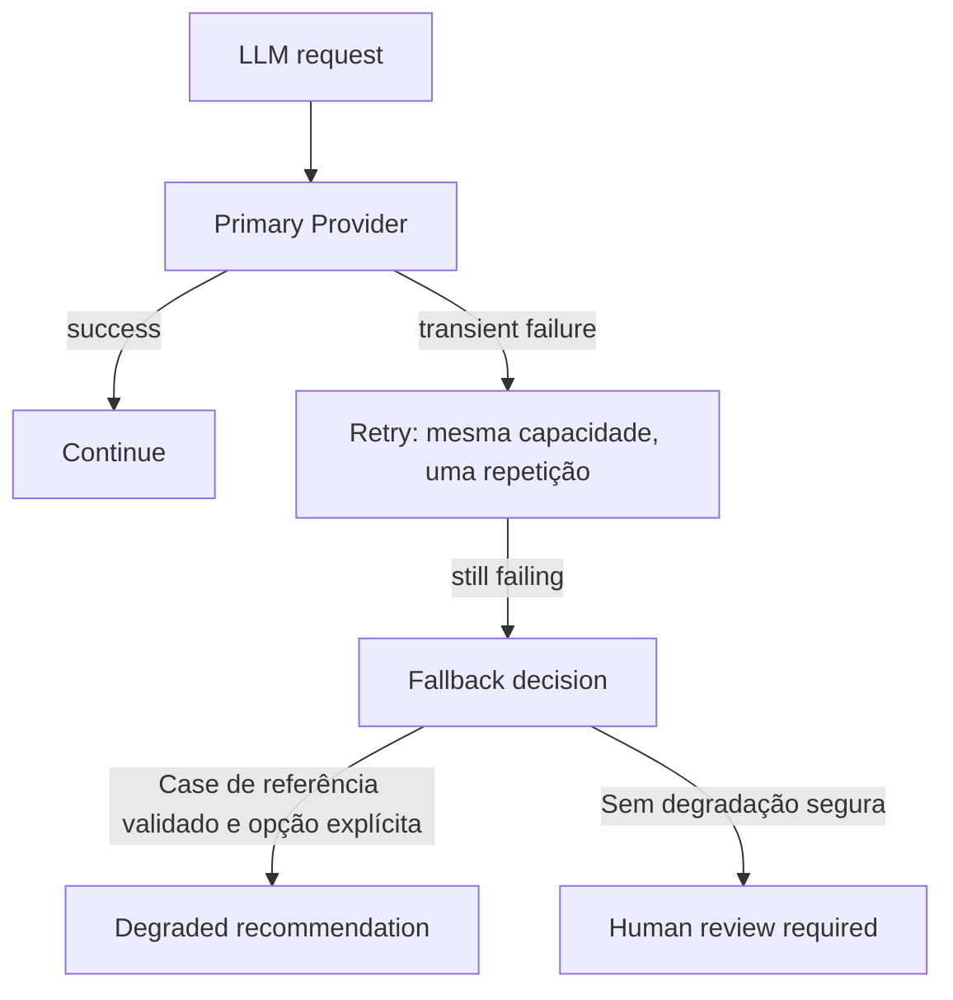

# Aula 2 — Execução Distribuída e Escala

**De um workflow multiagente para uma operação concorrente e resiliente**

## Candidato complete: roteiro do professor

Alunos observam decisões, comportamento e trade-offs; **não programam**.
O start aprovado continua disponível nos comandos batch/generate-incidents/idempotency-demo.
Agora a segunda metade usa Redis, Celery e PostgreSQL reais. Aula 1 permanece preservada.

> Escalar agentes não é aumentar o número de prompts. É controlar concorrência, estado, capacidade e falhas.

Método: problema → princípio arquitetural → trecho pronto → experimento → conclusão.
Reservar 65 min explícitos de contexto/teoria: 10 no bloco 1, 15 no 2, 10 no 4, 10 no 5,
5 no 6, 5 na demo OpenAI, 5 na demo Fallback e 5 no bloco 10.
Demais minutos são demonstração, discussão e reflexão. Nunca escrever infraestrutura ao vivo.

## Preparação (fora dos 240 min)

Inicialmente, nos três terminais: `export LLM_MODE=mock LESSON02_VISIBILITY_TIMEOUT=60`.

```bash
uv sync --locked --extra lesson02
uv run --extra lesson02 pytest -q
LLM_MODE=mock uv run control-tower smoke
LLM_MODE=mock uv run control-tower run INCIDENT-001

docker compose config --quiet
docker compose up -d --wait
docker compose ps
uv run control-tower db-init
LESSON02_INTEGRATION=1 uv run --extra lesson02 pytest tests/integration -q
```

Docker Desktop deve estar aberto. Docker é usado apenas para reproduzir infraestrutura local.
**Docker não é assunto da aula.** Redis/Postgres são os únicos containers; aplicação e workers são locais.
A instalação com extra lesson02 é obrigatória para comandos distribuídos. Sem extra, Aula 1 e batch
continuam funcionando. As demos originais continuam em mock. Somente os dois blocos LLM usam modo openai; a falha artificial
é interceptada antes da rede. Configurar credencial fora da projeção, conforme Aula 1.

Em **todos os terminais**, entrar na raiz do repositório. Opcionalmente configurar `CONTROL_TOWER_ROOT`
para esse caminho absoluto nos terminais dos workers. Variáveis opcionais, iguais entre producer/workers:
`LESSON02_DATABASE_URL`, `LESSON02_BROKER_URL`; defaults correspondem ao Compose local, Redis DB 2.
Se mudar portas/senha do Compose, configurar também variáveis `LESSON02_*_PORT`/`LESSON02_POSTGRES_PASSWORD`.

Ter abertos: [guia](../../labs/02_distributed_execution/README.md), [snippets](lesson-02/distributed-snippets.md),
[outputs reais](lesson-02/complete-demo-outputs.md) e [contratos/limites](lesson-02/distributed-contracts.md).
Fonte grande, aproximadamente 100 colunas; não projetar logs verbosos/JSON completos por padrão.

**Reprodução:** usar uma versão por experimento. Repetir a mesma versão/seed/count/opções demonstra
idempotência. Para um novo experimento, mudar `--version`. O gerador usa os mesmos IDs para um mesmo
seed; mudar count pode mudar payloads, então também mudar version. Não apagar banco para "fazer funcionar".

Os envelopes representam cinco categorias de chegada; tanto batch quanto Celery repetem o caso técnico
INCIDENT-001. Não são cinco novas análises de negócio. Datas fictícias de created_at são separadas dos
horários reais das execuções. completed significa workflow terminou; aprovação humana continua pending.

## Agenda — 240 minutos

| Horário | Bloco | Tempo |
|---|---|---:|
| 00:00–00:15 | 1. Retomada + escala | 15 min |
| 00:15–00:35 | 2. Concorrência e limites | 20 min |
| 00:35–00:50 | 3. Demo local 1 vs 5 | 15 min |
| 00:50–01:10 | 4. Capacidade e gargalo | 20 min |
| 01:10–01:25 | 5. Necessidade de fila | 15 min |
| 01:25–01:40 | Intervalo | 15 min |
| 01:40–02:00 | 6. Queue + Workers (mock) | 20 min |
| 02:00–02:20 | Demo — Distributed workers with real intelligence | 20 min |
| 02:20–02:35 | Demo — LLM Failure and Fallback | 15 min |
| 02:35–03:00 | 7. Worker failure + retry (mock) | 25 min |
| 03:00–03:15 | 8. Duplicate delivery (mock) | 15 min |
| 03:15–03:35 | 9. Estado e Execution Events | 20 min |
| 03:35–03:45 | 10. Garantias e limites | 10 min |
| 03:45–03:50 | Margem | 5 min |
| 03:50–04:00 | 11. Síntese | 10 min |

Total: 240 min, 65 min de contexto/teoria e 5 min de margem. Código pronto, sem live coding.

## 1. Retomada e provocação — 15 min

- **Objetivo:** mudar a unidade de raciocínio de um grafo para muitas execuções.
- **Conceito:** agentes dentro do workflow versus workflows independentes; 10 min contexto/teoria.
- **Fala-chave:** “Funcionou para 1 incidente. O que acontece quando chegam 500?”
- **Comandos:**

```bash
LLM_MODE=mock uv run control-tower show INCIDENT-001 recommendation
uv run control-tower generate-incidents --count 500
```

- **Output:** recomendação pendente; mix 120/85/140/65/90.
- **Pergunta:** “Onde esperam os outros 499?”
- **Fallback:** resultados do start em `lesson-02/demo-outputs.md` e Aula 1 em `examples/`.

## 2. Concorrência e limites — 20 min

- **Objetivo:** separar concorrência local, paralelismo interno e distribuição; 15 min teoria.
- **Conceito:** memória do processo, slots de processamento, chegada e espera.
- **Fala-chave:** “LangGraph coordena agentes dentro de uma execução. A fila coordena múltiplas execuções.”
- **Comando:** nenhum; usar os dois diagramas do guia.
- **Output:** alunos identificam as duas camadas de coordenação.
- **Pergunta:** “Três especialistas significam três workers Celery?”
- **Fallback:** quadro. Não explicar configurações Celery neste bloco.

## 3. Demo 1 — Local concurrency — 15 min

- **Objetivo:** comparar mesma carga com 1 e 5 threads.
- **Conceito:** sobrepor espera melhora throughput até o gargalo.
- **Fala-chave:** “Concorrência não é ausência de limite.”
- **Comandos:**

```bash
uv run control-tower batch --incidents 10 --workers 1 --demo-delay-ms 500
uv run control-tower batch --incidents 10 --workers 5 --demo-delay-ms 500
```

- **Output:** 10 completed, 0 failed, pico ativo 1/5; interpretar tempos medidos, não prometer tempos fixos.
- **Trecho pronto:** `distributed/batch.py`; mostrar apenas o limite de concorrência.
- **Pergunta:** “O que foi sobreposto? O que continua compartilhado?”
- **Fallback:** tabela real do start. Comandos levam segundos; usar o restante em hipótese e discussão.

## 4. Demo 2 — Provider capacity — 20 min

- **Objetivo:** observar saturação; 10 min teoria de throughput, backlog e backpressure.
- **Conceito:** semáforo limita workflows simultâneos, não requests/s OpenAI.
- **Fala-chave:** “O throughput do sistema é limitado pelo gargalo, não pelo número de workers.”
- **Comandos:**

```bash
uv run control-tower batch --incidents 50 --workers 5 --provider-limit 5 --demo-delay-ms 500
uv run control-tower batch --incidents 50 --workers 20 --provider-limit 5 --demo-delay-ms 500
uv run control-tower batch --incidents 50 --workers 50 --provider-limit 5 --demo-delay-ms 500
```

- **Output:** pico ativo até 5; espera cresce, throughput não cresce proporcionalmente.
- **Pergunta:** “Aceitar trabalho sem limite faz a espera desaparecer?”
- **Fallback:** outputs gravados; não apresentar como benchmark de produção.
- **Precisão:** a simulação limita processamento, não admissão. No Celery, prefetch=1 controla reserva;
  o broker armazena backlog, mas producer ainda não tem limite de admissão. Fila infinita não é solução.

## 5. Necessidade de fila — 15 min

- **Objetivo:** explicar onde o trabalho deve esperar antes de introduzir o broker.
- **Conceito:** desacoplar chegada e capacidade; 10 min de teoria/contexto.
- **Fala-chave:** “A fila organiza a espera; não fabrica capacidade.”
- **Comando:** nenhum; desenhar producer → espera → consumidores.
- **Output:** hipótese sobre publicar trabalho sem workers ativos, a testar depois do intervalo.
- **Pergunta:** “Se chegam 500 e cabem 5, onde ficam os outros?”
- **Fallback:** diagrama pronto. Idempotência será demonstrada depois de retry/redelivery.

## Intervalo — 15 min

- **Objetivo:** pausa; **conceito:** separar preparação operacional da explicação.
- **Fala-chave:** “Na volta veremos onde o trabalho espera e onde o estado permanece.”
- **Comando:** nenhum obrigatório; conferir terminais preparados.
- **Output:** três terminais prontos; **pergunta:** reservar dúvidas de configuração para depois.
- **Fallback:** outputs reais abertos. Dependências já devem estar instaladas antes da aula.

## 6. Demo 3 — Queue + Workers — 20 min

- **Objetivo:** enfileirar antes dos consumidores; 5 min teoria producer/consumer e desacoplamento.
- **Conceito:** broker retém trabalho, workers disputam tarefas, cada task invoca um LangGraph.
- **Fala-chave:** “A fila não necessariamente acelera o sistema. Ela desacopla produtores e consumidores e absorve picos.”

**Terminal 3 — producer, inicialmente sem workers:**

```bash
uv run control-tower enqueue --count 20 --version demo3-v1 --demo-delay-ms 500
uv run control-tower executions
```

**Terminal 1 — worker A:**

```bash
uv run celery -A control_tower.distributed.celery_app worker --pool=solo --concurrency=1 --hostname='lesson02-A@%h' --loglevel=INFO --without-gossip --without-mingle
```

**Terminal 2 — worker B:**

```bash
uv run celery -A control_tower.distributed.celery_app worker --pool=solo --concurrency=1 --hostname='lesson02-B@%h' --loglevel=INFO --without-gossip --without-mingle
```

**Terminal 3 — consultar enquanto processam:**

```bash
uv run control-tower executions
```

- **Output:** queued diminui, running até 2, completed cresce; worker_id mostra A e B.
  Contadores são cumulativos do banco, não somente o lote atual. `queued` é estado persistido;
  não é medição exata do comprimento Redis durante reserva/retry.
- **Trecho pronto:** task de 10–30 linhas em snippets. Não explicar todo o SQL.
- **Pergunta:** “Quem decide o especialista Supply: Celery ou LangGraph?”
- **Fallback:** transcrição real; confirmar nome da queue/defaults e diretório antes de tentar corrigir ao vivo.

## Demo — Distributed workers with real intelligence — 20 min

- **Objetivo:** observar um provider real como recurso externo, variável e finito; 5 min contexto.
- **Conceito:** mesmos dados/tools/cálculos e mesmo LangGraph; muda o ambiente operacional.
- **Falas-chave:** “A inteligência não mudou. Mudou o ambiente operacional ao redor dela.”
  “Um LLM é também uma dependência externa com latência, capacidade, falhas e custo.”
- **Slide antes:** provider-limit=5 era um semáforo simulado. Dois workers podem gerar até seis
  requests simultâneas nos três especialistas; worker count não equivale à capacidade do provider.
- **Condução:** 5 min contexto, 5 min executar/observar, 7 min debate, 3 min transição.

Depois de concluir o lote mock, parar A/B com Ctrl-C. Credencial já configurada nos terminais dos
workers e producer via OPENAI_API_KEY (ou arquivo privado autorizado via OPENAI_API_KEY_FILE,
conforme Aula 1). Nunca projetar chave, prompts ou respostas extensas. Sem chave, enqueue falha
claramente antes de publicar. Não criar chave nem depurar permissão ao vivo.

**Nos três terminais:**

```bash
export LLM_MODE=openai
export OPENAI_MODEL=gpt-4.1-mini
export LESSON02_VISIBILITY_TIMEOUT=900
```

Reutilizar exatamente os comandos Celery A/B da Demo 3, **reiniciando ambos**. Nenhum worker mock
antigo deve continuar consumindo esta queue. 900 s evita tratar requests mais lentas como perda de
worker; os 60 s da demo mock não são uma configuração apropriada para o provider real.

**Terminal 3 — somente 3 envelopes:**

```bash
uv run control-tower enqueue --count 3 --version demo-llm-v1
uv run control-tower executions --limit 3
uv run control-tower execution <UUID_LLM>
```

Para projetar queued, publicar o lote antes de reiniciar A/B. Depois observar running/completed,
worker e duration na CLI. A duração mede processamento da tentativa, exclui espera na fila.

- **Output:** queued → running → completed; modo openai, modelo configurado, duração variável.
  As três execuções reais do ensaio duraram 13,27 / 19,31 / 11,74 s. Não são garantia nem benchmark.
- **Pergunta:** “Se dobrarmos workers, a capacidade contratada do provider dobra?”
- **Debate:** rate limit, timeout, custo por request e backpressure. Tokens retornados naturalmente
  ficam em ExecutionEvent; não implementar cálculo de custo nem tracing.
- **Precisão:** envelopes de múltiplas categorias continuam simulando carga. Não existem cinco
  workflows empresariais novos. A recomendação continua exigindo aprovação humana.
- **Fallback de sala:** se credencial/rede falhar, mostrar [captura real](lesson-02/llm-demo-outputs.md).
  Identificar como gravação; não apresentar mock como OpenAI. Limitar diagnóstico a 2 min.
- **Código:** apenas a chamada ao workflow com interpreter; não abrir prompts.

## Demo — LLM Failure and Fallback — 15 min

- **Objetivo:** separar retry/redelivery/fallback/escalation, com 5 min de teoria/contexto.
- **Conceito:** uma repetição por request transitória, depois continuidade explicitamente limitada.
- **Slide obrigatório:**



**Retry ≠ Redelivery ≠ Fallback ≠ Escalation**

| Conceito | Mensagem |
|---|---|
| Retry | Tenta novamente a mesma capacidade |
| Redelivery | Recupera trabalho de um worker perdido |
| Fallback | Muda a forma de executar |
| Escalation | Reconhece que a automação chegou ao seu limite |

“Fallback não é apenas trocar de modelo. É desenho de continuidade operacional.”

**Após a carga OpenAI funcionar, com A/B ainda no perfil openai:**

```bash
uv run control-tower enqueue --count 1 --version demo-llm-degraded-v1 --llm-failure timeout --fallback deterministic_reference
uv run control-tower events <UUID_DEGRADED> --llm
uv run control-tower result <UUID_DEGRADED>
uv run control-tower enqueue --count 1 --version demo-llm-human-v1 --llm-failure timeout --fallback human
uv run control-tower events <UUID_HUMAN> --llm
uv run control-tower result <UUID_HUMAN>
```

- **Output determinístico após falha artificial:** llm.requested → llm.failed → llm.retry →
  llm.requested → llm.failed → llm.fallback_activated → llm.degraded **ou** llm.escalated.
  A falha artificial ocorre antes da rede; não gasta tokens do provider.
- **Degraded:** descarta sínteses parciais e executa o mesmo grafo com capacidades determinísticas.
  Permitido explicitamente apenas para o case de referência validado; resultado tem mode=degraded,
  outcome=degraded_recommendation, reason e aprovação pendente. Não é mock disfarçado nem fallback
  genérico de produção. Se validação falhar ou o case não for elegível, escalar.
- **Human:** outcome=human_review_required, sem recomendação automática. completed significa que a
  decisão de continuidade terminou; não que o incidente foi resolvido. Approval continua pendente.
- **Falhas não transitórias:** autenticação/contrato inválido não recebem retry indiscriminado nem
  degradação que esconda o problema. Erro de configuração de chave falha claramente.
- **Pergunta:** “Quando é mais correto parar a automação do que produzir uma resposta alternativa?”
- **Código:** retry curto, decisão explícita de continuidade e evento; sem model routing.
- **Fallback de sala:** transcrição gravada dos dois outcomes. Não fazer SIGKILL com OpenAI.

**Voltar obrigatoriamente ao mock antes da Demo 4 original:**

1. Aguardar estas execuções terminarem; parar ambos os workers com Ctrl-C.
2. Nos três terminais:

```bash
export LLM_MODE=mock
export LESSON02_VISIBILITY_TIMEOUT=60
```

3. Reiniciar A/B com os comandos originais. As demos de worker failure, retry de especialista e
   idempotência usam somente mock. Não matar worker com requests reais em andamento.

Reservado à Aula 4: multi-provider/model routing, seleção por custo/qualidade, model health,
circuit breakers avançados, SLO, policies/governance e portfolio-level fallback. Nada disso é
implementado nesta etapa.

## 7. Demo 4 — Falha tratada e desaparecimento do worker — 25 min

- **Objetivo:** distinguir retry explícito de redelivery pelo broker.
- **Conceito:** late ack, tentativa durável, lock liberado com morte do processo, repetição completa do grafo.
- **Fala-chave:** “Processos são descartáveis. A execução não pode ser.”

**Parte A — falha tratada, Terminal 3, ambos workers disponíveis:**

```bash
uv run control-tower enqueue --count 1 --version demo4-retry-v1 --fail-specialist logistics
uv run control-tower execution <execution_id>
uv run control-tower events <execution_id> --lifecycle
```

Substituir `<execution_id>` pelo UUID impresso. Primeira tentativa falha no Logistics, espera 2 s,
segunda conclui. Para demonstrar orçamento esgotado opcionalmente usar outra version e `--fail-always`:
três tentativas, esperas 2/4 s, failed terminal. Não fazer essa extensão se o bloco estiver atrasado.

**Parte B — perda do processo inteiro:**

1. Após terminar o lote, parar B com Ctrl-C no Terminal 2. Manter A pronto.
2. No Terminal 3:

```bash
uv run control-tower enqueue --count 1 --version demo4-crash-v1 --demo-delay-ms 10000
uv run control-tower execution <execution_id>
```

3. Confirmar `running` e copiar **o PID final do worker_id de A** (formato `lesson02-A@host:PID`).
   Dentro dos 10 s de delay, no Terminal 3:

```bash
kill -KILL <PID_DE_A>
```

4. Reiniciar B no Terminal 2 usando exatamente o comando da Demo 3. Não reiniciar A ainda.
5. No Terminal 3:

```bash
uv run control-tower execution <execution_id>
uv run control-tower events <execution_id> --lifecycle
```

- **Output:** running com A permanece até recuperação; B recebe redelivery, attempt=2, completed.
  Trilha inclui execution.interrupted, novo execution.started e execution.completed.
- **Tempo:** reservar 2–3 min para observar recuperação. Visibility timeout=60 s mais varredura Redis
  e execução; não prometer recuperação imediata. Usar a espera para discutir “running significa vivo?”.
- **Precisão:** solo mata o worker inteiro; `reject_on_worker_lost` sozinho não faz redelivery imediato.
  Em prefork, pai vivo pode rejeitar mensagem do filho perdido. Não confundir os dois experimentos.
- **Pergunta:** “E se o commit do resultado aconteceu antes da queda, mas o ack ainda não?”
- **Fallback:** outputs gravados. Se completou antes do kill, não alegar falha: repetir com outra version.
  Se exceder o tempo de sala, preservar o UUID e usar a trilha gravada; não apagar o banco.

## 8. Demo 5 — Duplicate delivery — 15 min

- **Objetivo:** observar duas publicações, uma identidade e uma tentativa efetiva.
- **Conceito:** UNIQUE protege identidade; advisory lock protege processamento concorrente.
- **Fala-chave:** “Retry é inevitável. Duplicidade precisa ser planejada.”
- **Comandos (Terminal 3; reiniciar A para ter dois workers):**

```bash
uv run control-tower enqueue --count 1 --version demo5-v1 --demo-delay-ms 3000
uv run control-tower enqueue --count 1 --version demo5-v1 --demo-delay-ms 3000
uv run control-tower execution <execution_id>
uv run control-tower events <execution_id> --lifecycle
```

- **Output:** primeira publicação novas=1, segunda existentes=1, mesmo UUID, attempt=1, um started/completed.
  Uma duplicata durante processamento retorna sem executar; após completed também é no-op.
- **Trecho:** claim/constraint e lock nos snippets; não escrever SQL ao vivo.
- **Pergunta:** “Uma mensagem entregue duas vezes é o mesmo que uma compra executada duas vezes?”
- **Fallback:** teste concorrente + transcrição real. Payload/opções diferentes sob mesma chave geram erro;
  isso exige escolher nova versão, não ignorar conflito.
- **Precisão:** At-least-once delivery + idempotent processing. Não afirmar exactly-once.

## 9. Demo 6 — Durable execution history — 20 min

- **Objetivo:** consultar dados após workers encerrarem.
- **Conceito:** estado atual, resultado final e sequência de eventos são coisas distintas.
- **Fala-chave:** “Estado crítico não deve depender da memória de um processo. Toda execução deve deixar uma trilha.”
- **Comandos:** parar workers com Ctrl-C e, no Terminal 3:

```bash
uv run control-tower execution <execution_id>
uv run control-tower events <execution_id>
uv run control-tower result <execution_id>
```

- **Output:** dados continuam consultáveis; resultado exige aprovação humana. `--json` opcional para
  inspeção posterior, não para projeção. `events --lifecycle` destaca retries/perdas.
- **Trecho:** Execution, Event e persistência nos snippets. Campos futuros permanecem null.
- **Pergunta:** “Isso permite continuar do nó Finance ou apenas começar outra tentativa?”
- **Fallback:** exemplos persistidos em complete-demo-outputs; explicar ausência de checkpoint por nó.

## 10. Arquitetura e trade-offs — 10 min

- **Objetivo:** consolidar fronteiras; 5 min teoria das garantias e janelas de falha.
- **Conceito:** Redis entrega, PostgreSQL registra, Celery executa, LangGraph coordena agentes.
- **Fala-chave:** “A fila coordena múltiplas execuções; o grafo coordena agentes.”
- **Comando:** nenhum; diagrama do guia + janela commit/publicação nos contratos.
- **Output:** alunos reconhecem limitação: não há transação única Postgres/Redis; reenviar mesmo enqueue
  recupera claim sem mensagem, mas não implementa transactional outbox.
- **Pergunta:** “Que garantia temos se o produtor morreu entre commit e publicação?”
- **Fallback:** quadro; não introduzir DLQ avançada, telemetria ou Control Plane.

## 11. Síntese — 10 min

- **Objetivo:** responder às cinco perguntas iniciais e distinguir garantias observadas das ausentes.
- **Conceito:** limite de concorrência, fila, estado durável, idempotência, retry.
- **Fala-chave:** “Escalar agentes não é aumentar prompts. É controlar concorrência, estado, capacidade e falhas.”
- **Comando de encerramento, depois de parar workers:**

```bash
docker compose down
```

- **Output:** containers encerrados, volumes mantidos. Não usar `down -v`.
- **Pergunta:** “Qual gargalo você mediria antes de adicionar workers?”
- **Fallback:** quadro de aprendizados; próxima aula fica fora desta entrega.

## Mensagens que devem permanecer na discussão

- Escalar agentes não é aumentar o número de prompts. É controlar concorrência, estado, capacidade e falhas.
- LangGraph coordena agentes dentro de uma execução. A fila coordena múltiplas execuções.
- Concorrência não é ausência de limite.
- A fila não necessariamente acelera o sistema. Ela desacopla produtores e consumidores e absorve picos.
- Retry é inevitável. Duplicidade precisa ser planejada.
- O throughput do sistema é limitado pelo gargalo, não pelo número de workers.
- Estado crítico não deve depender da memória de um processo.
- Toda execução deve deixar uma trilha.
