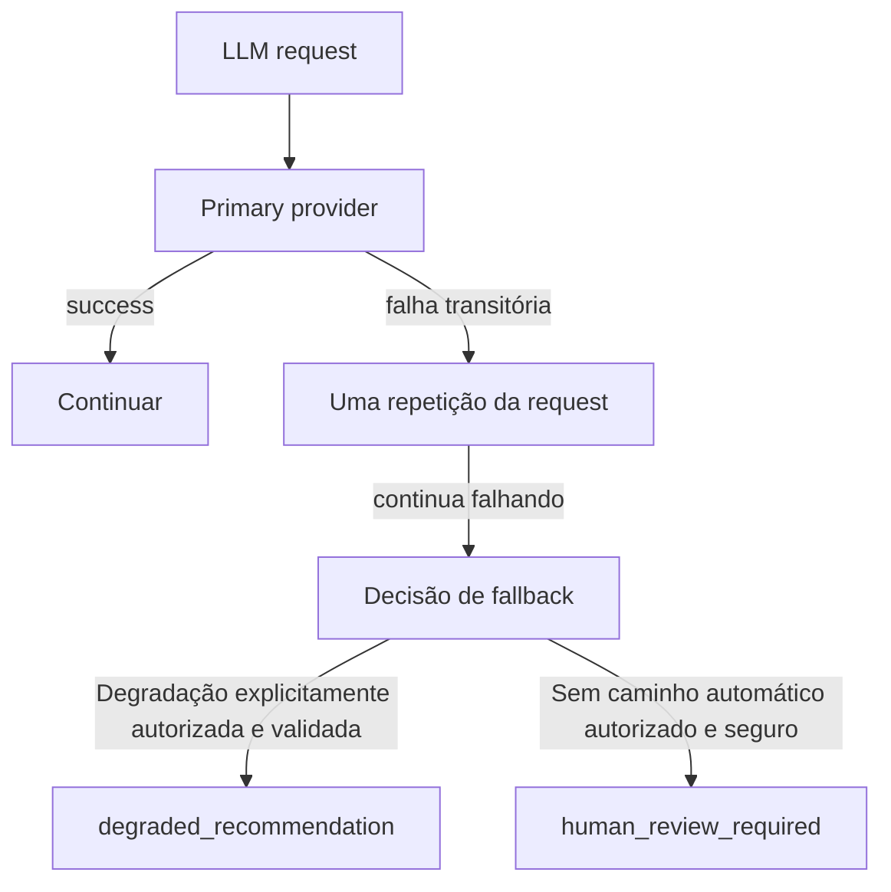

# Aula 2 — runbook do professor sincronizado com a apresentação

**Execução Distribuída e Escala — De um workflow multiagente para uma operação concorrente e resiliente**

Base: apresentação `Aula-2-Multi-Agent-Systems-Deployment-and-Scaling.pdf`, 50 páginas, recebida em
18/09/2026. “Slide” abaixo significa a página do PDF, contando a capa como 1.
Este roteiro usa a numeração **DEMO 1 a DEMO 7 da apresentação**. O PDF não foi alterado.
Os alunos observam; o professor executa comandos preparados. Não há programação pelos alunos.

> Escalar agentes não é aumentar o número de prompts. É controlar concorrência, estado, capacidade e falhas.

## 1. Como usar este roteiro

1. Fazer toda a preparação **antes da aula**, uma vez por sessão.
2. Usar três terminais na mesma raiz do repositório: **A = worker A**, **B = worker B**,
   **C = producer/status**. Só C publica incidentes e consulta o histórico.
3. Copiar os blocos em ordem. Os comandos de worker ocupam A/B; não colar comandos de consulta neles.
4. Não executar um `enqueue` isolado sem `--version`. Cada demo usa uma versão diferente, derivada
   da sessão. Apenas a verificação de duplicata repete intencionalmente a mesma versão.
5. Não substituir `uv run --extra lesson02` por `uv run` nos comandos distribuídos. O extra inclui
   Celery/Redis/psycopg. `--help` funciona sem o extra, mas execução distribuída precisa dele.
6. Ao mudar mock ↔ OpenAI: concluir trabalhos, parar workers, alterar perfil, recarregar C,
   recarregar e reiniciar A/B. Editar uma variável em C não altera os processos de A/B.
7. Os blocos são para **zsh/bash no macOS**. `$AULA2_DIR` e `$AULA2_RUN` serão definidos na preparação.
   As extrações com `awk` apenas copiam UUIDs da saída existente; não são código da aplicação.

**Critério antes de avançar:** execução da demo concluída, modo esperado, worker esperado e outcome
verificado. Não interpretar `completed` sozinho como aprovação humana ou sucesso da inteligência.

### Mapa da apresentação e das demonstrações

| Slides | Conteúdo | Ação no terminal |
|---|---|---|
| 1–6 | Objetivos e foco | Nenhuma; estabelecer o problema |
| 7–11 | Aula 1 → 500 incidentes → limites | Recomendação e generator; manter workers parados |
| **12** | **DEMO 1 — 1 worker vs. 5 workers** | Batch local 10/1 e 10/5 |
| 13–15 | Debrief; local ≠ distribuído; gargalo | Voltar aos slides |
| **16** | **DEMO 2 — 5 vs. 20 vs. 50 workers** | Batch 50 incidentes, capacidade 5 |
| 17–23 | Resultado, backlog, queue, workers, implementação | Slides e ressalva técnica do slide 23 |
| **24** | **DEMO 3 — Queue + Workers** | Publicar 20 antes de iniciar A/B |
| 25–27 | Identidade; mock → provider real | Consultar identidade; preparar troca de perfil |
| **28** | **DEMO 4 — Distributed Workers with Real Intelligence** | 3 incidentes OpenAI, 2 workers |
| 29–33 | Capacidade real; tipos de recuperação | Debater antes de injetar falha |
| **34** | **DEMO 5 — LLM Failure and Fallback** | Falha artificial; degraded e human review |
| 35–36 | Worker perdido e redelivery | Voltar explicitamente para mock |
| **37** | **DEMO 6 — Worker Failure + Redelivery** | Encerrar somente A; iniciar B; mesmo UUID |
| 38–40 | Duplicatas, idempotência e at-least-once | Verificação curta de duplicata; não renumerar como Demo 7 |
| 41–42 | Estado durável versus eventos | Preparar consultas com workers desligados |
| **43** | **DEMO 7 — Durable History** | execution → events → result sem workers |
| 44–50 | Arquitetura, síntese e transição | Encerramento; slide 50 é apenas anúncio da Aula 3 |

### Agenda de condução — 240 minutos

| Horário | Slides / bloco | Minutos | Teoria/contexto reservados |
|---|---|---:|---:|
| 00:00–00:15 | 1–6: abertura e objetivos | 15 | 10 |
| 00:15–00:30 | 7–11: retomada e escala | 15 | 10 |
| 00:30–00:45 | 12–14: Demo 1 + debrief | 15 | 5 |
| 00:45–01:05 | 15–17: Demo 2 + gargalo | 20 | 5 |
| 01:05–01:25 | 18–23: fila e workers | 20 | 15 |
| 01:25–01:40 | Intervalo; sem instalação de infraestrutura | 15 | — |
| 01:40–02:00 | 24–27: Demo 3 e transição | 20 | 5 |
| 02:00–02:20 | 28–29: Demo 4, provider real | 20 | 5 |
| 02:20–02:40 | 30–34: recuperação + Demo 5 | 20 | 5 |
| 02:40–03:05 | 35–37: Demo 6, incluindo espera de redelivery | 25 | — |
| 03:05–03:20 | 38–40: idempotência / duplicata | 15 | — |
| 03:20–03:40 | 41–43: Demo 7, estado e eventos | 20 | — |
| 03:40–03:50 | Margem para atrasos / perguntas acumuladas | 10 | — |
| 03:50–04:00 | 44–50: síntese e perguntas de saída | 10 | 5 |
| **Total** | | **240** | **65** |

Tempos de aula incluem hipótese, comando, leitura e discussão. Não são duração de processamento.
Os números dos slides 17, 28 e 34 são de ensaios anteriores, não metas de performance. Não tentar
“reproduzir o número exato” ao vivo. Se houver atraso, reduzir inspeção de código, não a teoria.

### Ressalvas a fazer na fala, sem mudar a arquitetura para combinar com o slide

- **Slide 23 / Redis:** neste projeto Redis é o broker. O backend de resultado Celery é desativado;
  resultado final e histórico ficam no PostgreSQL, não no Redis.
- **Slide 23 / PostgreSQL:** guarda Execution, ExecutionEvent, resultado final e claim de idempotência.
  Não persiste todas as estruturas internas do grafo e não há checkpoint/resume por nó.
- **Slide 35:** o worker é consumidor, não a entrada do usuário. O producer representa a chegada.
- **Slide 44:** o desenho resume responsabilidades. PostgreSQL é escrito já no claim e durante a
  execução, não somente após o LLM. Finance, cálculos e validação continuam determinísticos.
- **Slide 34 / Caminho B:** o comando `--fallback human` demonstra a decisão conservadora de não
  autorizar degradação automática. Não afirmar que o LLM “provou” a ausência de alternativa segura.
- **Slides 8/28:** múltiplas categorias são simulação de carga. Cada envelope reaplica o case técnico
  INCIDENT-001; não existem cinco novos workflows empresariais implementados.

## 2. Preparação do professor — fora das quatro horas

### 2.1 Abrir três terminais e entrar no repositório

**Em A, B e C**, executar (ajustar somente se o checkout estiver em outro diretório):

```bash
cd "/Users/leandrolopes/Documents/ChatGPT/Disciplina Mult-Agents/agentic-operations-control-tower"
pwd
git branch --show-current
```

Esperado: raiz que contém `pyproject.toml` e `compose.yaml`; branch `codex/lesson-02-complete`.
Se estiver em outra branch, conferir `git status` antes de trocar. Não descartar alterações locais.
Não fazer checkout de uma tag da Aula 1 para executar as demos da Aula 2.

### 2.2 Criar identidade da sessão — somente Terminal C, uma vez

```bash
uv sync --locked --extra lesson02
set -o pipefail
export AULA2_RUN="aula2-$(date +%Y%m%d-%H%M%S)"
export AULA2_DIR="$PWD/artifacts/$AULA2_RUN"
mkdir -p "$AULA2_DIR"
printf 'export AULA2_RUN=%q\nexport AULA2_DIR=%q\n' \
  "$AULA2_RUN" "$AULA2_DIR" > artifacts/aula2-session.env
printf 'Sessão: %s\nArquivos: %s\n' "$AULA2_RUN" "$AULA2_DIR"
```

`artifacts/` é ignorado pelo Git. Esse arquivo guarda somente nomes/caminhos, nunca a chave OpenAI.
**Não recriar a sessão entre demos.** Uma nova aula/dry run recebe uma nova sessão; repetir uma demo
na mesma sessão exige trocar sua versão, conforme seção de recuperação abaixo.

### 2.3 Definir perfil inicial mock — somente Terminal C

```bash
cat > "$AULA2_DIR/profile.env" <<'ENV'
export LLM_MODE=mock
export OPENAI_MODEL=gpt-4.1-mini
export LESSON02_VISIBILITY_TIMEOUT=60
ENV
source "$AULA2_DIR/profile.env"
export CONTROL_TOWER_ROOT="$PWD"
```

### 2.4 Carregar a mesma sessão — Terminais A e B

**Em cada um dos dois terminais**, executar:

```bash
source artifacts/aula2-session.env
source "$AULA2_DIR/profile.env"
export CONTROL_TOWER_ROOT="$PWD"
printf 'sessão=%s | modo=%s | visibility=%ss\n'   "$AULA2_RUN" "$LLM_MODE" "$LESSON02_VISIBILITY_TIMEOUT"
```

Esperado nos três terminais: a mesma sessão, `mock`, `60`. **Ainda não iniciar workers.**
As variáveis da sessão e o arquivo de perfil não reconfiguram workers que já estejam executando.

### 2.5 Infraestrutura e banco — Terminal C

Abrir Docker Desktop antes destes comandos. Docker não é assunto da aula; deixar tudo instalado.

```bash
docker compose config --quiet
docker compose up -d --wait
docker compose ps
docker compose exec -T redis redis-cli ping
docker compose exec -T postgres pg_isready -U novacore -d novacore
uv run --extra lesson02 control-tower db-init
uv run --extra lesson02 control-tower executions --limit 5
```

Esperado: Redis/PostgreSQL `healthy`, `PONG`, `accepting connections`, tabelas prontas.
`db-init` é idempotente, não remove o histórico. `executions` pode mostrar completed de outros ensaios.
**Antes da Demo 3, queued e running de trabalhos antigos devem estar resolvidos.** Se houver trabalhos
pendentes, identificar seus UUIDs/modos e terminar o ensaio anterior com o perfil correto. Não iniciar
workers às cegas nem usar purge/flush/down -v como limpeza. O banco e o broker são compartilhados
pela mesma queue `lesson02`; não devem existir consumidores antigos em outros terminais.

### 2.6 Verificação técnica, sem projetar a suíte em sala — Terminal C

```bash
uv run --extra lesson02 pytest -q
LLM_MODE=mock uv run --extra lesson02 control-tower smoke
LLM_MODE=mock uv run --extra lesson02 control-tower run INCIDENT-001
LESSON02_INTEGRATION=1 uv run --extra lesson02 pytest tests/integration -q
uv run --extra lesson02 control-tower enqueue --help
uv run --extra lesson02 control-tower executions --help
```

Não transformar contagem de testes em aula de pytest. Os testes unitários não chamam OpenAI.
A integração exige os serviços acima. O fluxo da Aula 1 deve terminar com aprovação humana pendente.

### 2.7 Preparar credencial OpenAI sem exibi-la — antes da aula

Reutilizar a credencial autorizada da Aula 1. Não colar chave no runbook, em logs ou na projeção.
Settings aceita `OPENAI_API_KEY` no ambiente, `.env` ou o arquivo indicado por `OPENAI_API_KEY_FILE`.

**Neste workspace**, o arquivo autorizado fica um diretório acima da raiz do repositório.
Em C, registrar somente o caminho para ser compartilhado com A/B:

```bash
export OPENAI_API_KEY_FILE="$PWD/../.keys"
test -f "$OPENAI_API_KEY_FILE" && printf 'Arquivo privado localizado; conteúdo não exibido.\n'
printf 'export OPENAI_API_KEY_FILE=%q\n' "$OPENAI_API_KEY_FILE"   > "$AULA2_DIR/credential-path.env"
```

Se seu arquivo estiver na raiz, usar `"$PWD/.keys"` na primeira linha. Se a chave já estiver em
`OPENAI_API_KEY`, manter essa configuração privada nos três terminais; ela tem precedência. Um
arquivo ausente não é motivo para copiar a chave para o código. Ajustar o caminho fora da projeção.

Pré-checagem em C, **sem request pago e sem alterar o perfil mock do terminal**:

```bash
LLM_MODE=openai LESSON02_VISIBILITY_TIMEOUT=900 uv run --extra lesson02 python - <<'PYCODE'
from pathlib import Path
from control_tower.settings import Settings
settings = Settings.load(Path.cwd())
print(f"Configuração válida: mode={settings.mode}, model={settings.model}, chave presente.")
PYCODE
```

Isso confirma configuração local, não saldo/permissão/disponibilidade do provider. Se a credencial
não estiver pronta, preparar o fallback gravado da Demo 4, sem tentar corrigir autenticação na aula.

### 2.8 Preparar a projeção

- Slides abertos; terminal de aproximadamente 100 colunas por 24 linhas, fonte grande.
- A/B ficam visíveis para mostrar consumidores, mas o foco projetado é C e suas views curtas.
- Abrir os outputs gravados referenciados ao final de cada demo.
- Não mostrar `.keys`, `.env`, `env`, `printenv`, prompts ou JSON completo por padrão.
- Comandos com `tee` preservam a saída local para recuperar UUIDs sem digitar; não ocultam o output.

## 3. Slides 1–11 — abertura e problema de escala

**Objetivo:** mudar a unidade de raciocínio: de uma decisão coordenada para muitas execuções.
**Fala:** “Funcionou para 1 incidente. Onde esperam os outros 499?”

No **slide 7**, Terminal C:

```bash
uv run --extra lesson02 control-tower show INCIDENT-001 recommendation
```

Esperado: cenário, custos determinísticos, riscos e aprovação obrigatória. Não abrir todo o estado JSON.
No **slide 8**:

```bash
uv run --extra lesson02 control-tower generate-incidents --count 500 --seed 42
```

Esperado:

```text
count: 500 | seed: 42
supplier_delay: 120
production_deviation: 85
logistics_delay: 140
sla_risk: 65
inventory_shortage: 90
```

Esse comando **gera envelopes; não publica 500 tarefas nem chama OpenAI**.
Nos slides 9–11, perguntar qual recurso limita a capacidade. O “10 jobs → 50 workers” do slide 11 é
uma provocação; a comparação controlada de saturação usa 50 incidentes no slide 16.
**Fallback:** recomendação e mix já gravados em [outputs do start](lesson-02/demo-outputs.md).

## 4. DEMO 1 — 1 worker vs. 5 workers — slide 12

**Antes:** A/B parados; C em mock; Docker não é necessário para este batch.
**Conceito:** sobrepor espera em um processo. “workers” aqui são threads locais, não Celery.
**Tempo:** bloco de 15 min incluindo slides 13–14; comandos costumam levar segundos.

### 4.1 Terminal C — executar sequencial

```bash
uv run --extra lesson02 control-tower batch \
  --incidents 10 --workers 1 --demo-delay-ms 500
```

### 4.2 Terminal C — executar com cinco threads

```bash
uv run --extra lesson02 control-tower batch \
  --incidents 10 --workers 5 --demo-delay-ms 500
```

Os comandos abreviados do slide omitem o prefixo CLI e o delay. O delay de 500 ms é acrescentado
para tornar a comparação observável; não representa latência real medida de OpenAI.

### 4.3 O que apontar na saída

```text
Batch execution | mock | threads locais, sem Celery
incidents: 10
workers: 1                 # depois 5
completed: 10
failed: 0
duration: <medido>
throughput: <medido> incidents/s
```

Os comentários/valores entre `<...>` acima são explicativos, não saída literal nem comandos.
Conferir pico ativo 1 versus até 5; completed=10/failed=0. Não comparar somente a última casa decimal.
Voltar ao **slide 13**: “melhorou throughput, mas continuamos em um único processo”.
No **slide 14**: “na distribuição, os processos podem falhar independentemente; neste laboratório
eles ainda rodam na mesma máquina”.

**Pergunta:** “Aumentar threads mantém o estado vivo se esse processo morrer?”
**Código opcional:** só o trecho ThreadPoolExecutor de `distributed/batch.py`, até 1 min.
**Fallback:** tabela em [ensaio final](lesson-02/final-rehearsal-outputs.md). Não depurar durante mais de 2 min.
**Nota de leitura:** a última linha do batch diz que fila durável/deduplicação/retry “ainda não existem”.
Ela descreve somente o runner local usado nesta demo, não o candidato distribuído completo.
**Saída para a próxima demo:** ainda em mock; A/B continuam parados.

## 5. DEMO 2 — 5 vs. 20 vs. 50 workers — slides 15–17

**Antes:** mesmas condições da Demo 1. **Hipótese no slide 15:** “Se multiplicarmos workers por 10,
o throughput cresce 10 vezes?”. **Tempo:** 20 min de bloco; executar as três rodadas sem mudar a carga.

No **slide 16**, Terminal C:

```bash
uv run --extra lesson02 control-tower batch \
  --incidents 50 --workers 5 --provider-limit 5 --demo-delay-ms 500
uv run --extra lesson02 control-tower batch \
  --incidents 50 --workers 20 --provider-limit 5 --demo-delay-ms 500
uv run --extra lesson02 control-tower batch \
  --incidents 50 --workers 50 --provider-limit 5 --demo-delay-ms 500
```

**Apontar:** completed=50, failed=0, provider_limit=5, pico ativo ≤5, duração/throughput e `waited`.
No slide 17, explicar que ~9,03/~8,96/~9,05 são observações de um ensaio, não valores hard-coded.
Mais threads podem aumentar espera sem aumentar capacidade. `provider_wait_total` soma tempo de
espera de várias threads; não é o tempo de relógio do lote.

**Fala:** “O throughput é limitado pelo gargalo, não pelo número de workers.”
**Precisão:** semáforo local simula slots por workflow. Não é rate limit real de OpenAI nem requests/s.
**Pergunta:** “Se continuarmos recebendo mais do que processamos, onde a espera vai crescer?”
**Código:** dispensável; não abrir implementação do semáforo a menos que responda uma dúvida concreta.
**Fallback:** valores e saídas completas em [outputs do start](lesson-02/demo-outputs.md).

## 6. Slides 18–23 — por que fila e workers

- **18:** chegada 100/min, processamento 30/min → backlog +70/min; capacidade insuficiente vira espera.
- **19:** Producer → Queue → Consumer. A fila organiza espera e separa os ritmos.
- **20:** não elimina gargalos, duplicatas ou necessidade de persistência.
- **21:** LangGraph coordena agentes dentro da execução; fila coordena várias execuções.
- **22:** cada worker recebe uma task e executa um workflow. Falha de A não exige queda de B.
- **23:** Redis/Celery/PostgreSQL concretizam o padrão. Fazer as ressalvas da seção 1 sobre resultado e
  ausência de checkpoint por nó. Não ensinar configuração dessas ferramentas.

**Pergunta antes do intervalo:** “Podemos publicar trabalho antes de existir consumidor?”
Intervalo de 15 min. Infraestrutura já deve estar pronta; não instalar pacotes durante a pausa.
Ao voltar, A/B ainda parados e C no perfil mock.

## 7. DEMO 3 — Queue + Workers — slide 24

**Objetivo:** tornar visível `enqueue 20 → queued → iniciar workers → running → completed`.
**Tempo:** 20 min incluindo slides 25–27. **Modo:** mock, visibility=60.
Usar 2 s de delay por execução nesta demo para dar tempo de iniciar B e observar o consumo; isso não
é benchmark e não muda o workflow. A comparação local anterior conserva 500 ms.

### 7.1 Terminal C — conferir perfil e contagem inicial

```bash
source artifacts/aula2-session.env
source "$AULA2_DIR/profile.env"
printf 'modo=%s | visibility=%ss\n' "$LLM_MODE" "$LESSON02_VISIBILITY_TIMEOUT"
uv run --extra lesson02 control-tower executions --limit 5
```

Esperado: mock/60, sem queued/running antigos. Anotar a contagem inicial de completed; ela é cumulativa.

### 7.2 Terminal C — publicar antes de iniciar A/B

```bash
D3_VERSION="$AULA2_RUN-d3-queue"
uv run --extra lesson02 control-tower enqueue \
  --count 20 --seed 42 --version "$D3_VERSION" --demo-delay-ms 2000 \
  | tee "$AULA2_DIR/demo3-enqueue.txt"
D3_ID="$(awk 'length($0)==36 && $0 ~ /^[0-9a-f-]+$/ {print; exit}' "$AULA2_DIR/demo3-enqueue.txt")"
printf 'Execution de referência da Demo 3: %s\n' "$D3_ID"
uv run --extra lesson02 control-tower executions --limit 8
uv run --extra lesson02 control-tower execution "$D3_ID"
```

Esperado: `Publicadas: 20 | novas executions: 20 | existentes: 0`; queued aumenta em 20;
execution de referência está queued, sem worker/início. A CLI imprime só os primeiros 8 UUIDs,
mas publicou os 20. **Se D3_ID estiver vazio ou houver erro, não avançar.**

### 7.3 Terminal A — iniciar worker A

```bash
source artifacts/aula2-session.env
source "$AULA2_DIR/profile.env"
printf 'modo=%s | modelo=%s | visibility=%ss\n' "$LLM_MODE" "$OPENAI_MODEL" "$LESSON02_VISIBILITY_TIMEOUT"
uv run --extra lesson02 celery -A control_tower.distributed.celery_app worker \
  --pool=solo --concurrency=1 \
  --hostname='lesson02-A@%h' \
  --pidfile="$AULA2_DIR/worker-A.pid" \
  --loglevel=INFO --without-gossip --without-mingle
```

Esperar `lesson02-A@... ready.`. O nome do host varia. Não explicar todas as linhas do log.

### 7.4 Terminal B — iniciar worker B logo em seguida

```bash
source artifacts/aula2-session.env
source "$AULA2_DIR/profile.env"
printf 'modo=%s | modelo=%s | visibility=%ss\n' "$LLM_MODE" "$OPENAI_MODEL" "$LESSON02_VISIBILITY_TIMEOUT"
uv run --extra lesson02 celery -A control_tower.distributed.celery_app worker \
  --pool=solo --concurrency=1 \
  --hostname='lesson02-B@%h' \
  --pidfile="$AULA2_DIR/worker-B.pid" \
  --loglevel=INFO --without-gossip --without-mingle
```

Deixar ambos os comandos preparados para iniciar em sequência. Se B só iniciar depois de A concluir
o lote, não há evidência de consumo compartilhado; repetir com outra versão, mantendo o mesmo perfil.

### 7.5 Terminal C — observar consumo e conclusão

```bash
uv run --extra lesson02 control-tower executions --limit 8
uv run --extra lesson02 control-tower execution "$D3_ID"
```

Reexecutar `executions` usando seta para cima conforme necessário. O lote leva dezenas de segundos
com o delay didático. Confirmar `worker` A e B em linhas recentes, running até 2 e completed crescendo.
Ao final: queued/running voltam a zero para a carga concluída e completed cresceu em 20.

**Não afirmar:** counters são tamanho exato da lista Redis. São estados duráveis do banco, incluindo
reservas, trabalhos anteriores e retries. Prefetch=1 reduz reserva; não limita a admissão do producer.

No **slide 25**, mostrar:

```bash
uv run --extra lesson02 control-tower execution "$D3_ID"
uv run --extra lesson02 control-tower events "$D3_ID" --lifecycle
```

Esperado: `status: completed`, `attempt: 1`, worker A ou B, duration e
`result: recommendation; actions_executed=false`.
**Pergunta:** “Quem escolheu Supply/Production/Logistics: Celery ou LangGraph?”
**Código opcional:** uma chamada `run_workflow(...)` dentro da task; não o módulo completo.
**Fallback:** [outputs da fila](lesson-02/complete-demo-outputs.md); no máximo 2 min de diagnóstico.
**Checkpoint:** esperar todos concluírem antes de trocar para OpenAI.

## 8. Slides 26–27 — transição para provider real

**Fala:** “Até agora isolamos o sistema com mock. Agora recolocamos o provider real.”
“A inteligência não mudou. Mudou o ambiente operacional ao redor dela.”
“Um LLM é também uma dependência externa com latência, capacidade, falhas e custo.”

Explicar primeiro; só então operar os terminais. Dois workers não significam só duas requests:
os três especialistas de cada workflow podem chamar o provider em paralelo.

## 9. DEMO 4 — Distributed Workers with Real Intelligence — slides 28–29

**Objetivo:** 3 envelopes, 2 workers, gpt-4.1-mini, mesmo LangGraph. **Tempo:** 20 min.
Os 13,27/19,31/11,74 s do slide 28 são ensaio anterior, não SLA. Não publicar 20 ou 500 aqui.

### 9.1 A e B — parar workers mock normalmente

Conferir queued/running=0 em C. Em A e B, pressionar **Ctrl-C uma vez** e aguardar o prompt voltar.
Não usar kill para mudar de modo. Só continuar quando ambos estiverem parados.

### 9.2 Terminal C — escrever perfil OpenAI e recarregar

```bash
cat > "$AULA2_DIR/profile.env" <<'ENV'
export LLM_MODE=openai
export OPENAI_MODEL=gpt-4.1-mini
export LESSON02_VISIBILITY_TIMEOUT=900
ENV
source "$AULA2_DIR/profile.env"
source "$AULA2_DIR/credential-path.env"
printf 'modo=%s | modelo=%s | visibility=%ss\n'   "$LLM_MODE" "$OPENAI_MODEL" "$LESSON02_VISIBILITY_TIMEOUT"
```

Esperado: openai / gpt-4.1-mini / 900. Se usa somente OPENAI_API_KEY no ambiente, manter a chave
privada configurada e dispensar o source de credential-path.env. Não imprimir variáveis de credencial.

### 9.3 Terminal C — validar configuração e publicar uma identidade nova

```bash
uv run --extra lesson02 python - <<'PYCODE'
from pathlib import Path
from control_tower.settings import Settings
from control_tower.distributed.config import visibility_timeout
s = Settings.load(Path.cwd())
assert s.mode == 'openai', 'Perfil precisa ser openai'
assert visibility_timeout() >= 600, 'Visibility insuficiente para OpenAI'
print(f"Pronto: mode={s.mode}, model={s.model}, visibility={visibility_timeout()}s; chave não exibida.")
PYCODE
D4_VERSION="$AULA2_RUN-d4-openai"
uv run --extra lesson02 control-tower enqueue \
  --count 3 --seed 42 --version "$D4_VERSION" \
  | tee "$AULA2_DIR/demo4-enqueue.txt"
awk 'length($0)==36 && $0 ~ /^[0-9a-f-]+$/ {print}'   "$AULA2_DIR/demo4-enqueue.txt" > "$AULA2_DIR/demo4-ids.txt"
D4_ID="$(head -n 1 "$AULA2_DIR/demo4-ids.txt")"
uv run --extra lesson02 control-tower executions --limit 3
```

Esperado: novas=3/existentes=0, modo openai, três UUIDs, queued antes dos workers.
Não reutilizar D3_VERSION: count/opções/payloads mudaram. Não prosseguir se houver erro de chave,
modelo, visibility ou idempotência. A opção `--version` já elimina o conflito do `v1` padrão.

### 9.4 Terminal A — recarregar perfil/credencial e iniciar

```bash
source artifacts/aula2-session.env
source "$AULA2_DIR/credential-path.env"
```

```bash
source artifacts/aula2-session.env
source "$AULA2_DIR/profile.env"
printf 'modo=%s | modelo=%s | visibility=%ss\n' "$LLM_MODE" "$OPENAI_MODEL" "$LESSON02_VISIBILITY_TIMEOUT"
uv run --extra lesson02 celery -A control_tower.distributed.celery_app worker \
  --pool=solo --concurrency=1 \
  --hostname='lesson02-A@%h' \
  --pidfile="$AULA2_DIR/worker-A.pid" \
  --loglevel=INFO --without-gossip --without-mingle
```

### 9.5 Terminal B — recarregar perfil/credencial e iniciar imediatamente

```bash
source artifacts/aula2-session.env
source "$AULA2_DIR/credential-path.env"
```

```bash
source artifacts/aula2-session.env
source "$AULA2_DIR/profile.env"
printf 'modo=%s | modelo=%s | visibility=%ss\n' "$LLM_MODE" "$OPENAI_MODEL" "$LESSON02_VISIBILITY_TIMEOUT"
uv run --extra lesson02 celery -A control_tower.distributed.celery_app worker \
  --pool=solo --concurrency=1 \
  --hostname='lesson02-B@%h' \
  --pidfile="$AULA2_DIR/worker-B.pid" \
  --loglevel=INFO --without-gossip --without-mingle
```

O bloco de worker já recarrega profile.env. Conferir openai/900 em ambos antes de iniciar.
Não misturar workers mock e OpenAI consumindo a mesma queue. Não usar SIGKILL neste bloco.

### 9.6 Terminal C — mostrar estado, worker e duração

```bash
uv run --extra lesson02 control-tower executions --limit 3
uv run --extra lesson02 control-tower execution "$D4_ID"
```

Repetir `executions` até os três ficarem terminais. Mostrar queued → running → completed;
a duração aparece no término e mede a tentativa, sem espera de fila. O tempo de OpenAI pode variar.
Depois, se quiser conferir os três individualmente sem copiar UUID:

```bash
while IFS= read -r DEMO_ID; do
  uv run --extra lesson02 control-tower execution "$DEMO_ID"
done < "$AULA2_DIR/demo4-ids.txt"
```

Não projetar o loop completo se provocar muita rolagem; `executions --limit 3` é a view principal.
Conferir `mode: openai` e `result: recommendation` nos casos bem-sucedidos. Se houver
`human_review_required`, isso não é uma recomendação bem-sucedida: mostrar motivo e discutir o limite.
Não repetir automaticamente a carga para “obter sucesso” e aumentar custo.

No **slide 29**, perguntar: “Dobrar workers dobra a capacidade contratada do provider?”
Lembrar que `provider-limit=5` era simulação; esta demo não provoca rate limit real nem mede quota.
Tokens, quando retornados, estão em eventos; não projetar prompts/respostas nem implementar custo.
**Fallback:** [captura OpenAI real](lesson-02/llm-demo-outputs.md). Se rede/chave falhar, identificar
claramente que está mostrando captura. Mock não deve ser apresentado como provider real.
**Se não houver credencial/configuração válida:** use as capturas das Demos 4 **e 5**. A falha
artificial da Demo 5 não faz request de rede, mas ainda exige configuração OpenAI válida.
Retome os comandos ao vivo na seção 12, em mock.
**Checkpoint:** todas as três execuções terminais antes da Demo 5; A/B permanecem openai/900.

## 10. Slides 30–33 — preparar a distinção entre mecanismos

Antes dos comandos da Demo 5, explicar:

| Mecanismo | O que muda | Evidência |
|---|---|---|
| Retry | Repete request à mesma capacidade | llm.retry; Execution.attempt não aumenta |
| Redelivery | Outro worker recebe trabalho não confirmado | Mesmo execution_id; nova tentativa da task |
| Fallback | Muda o caminho de continuidade | llm.fallback_activated e modo/outcome explícitos |
| Escalation | Para a recomendação automática | llm.escalated; human_review_required |

**Retry ≠ Redelivery ≠ Fallback ≠ Escalation.**


```mermaid
flowchart TD
  R[LLM request] --> P[Primary provider]
  P -->|success| C[Continuar]
  P -->|falha transitória| T[Uma repetição da request]
  T -->|continua falhando| F[Decisão de fallback]
  F -->|Degradação explicitamente autorizada e validada| D[degraded_recommendation]
  F -->|Sem caminho automático autorizado e seguro| H[human_review_required]
```

Timeout/conexão/408/429/5xx são tratados como transitórios. Chave/configuração inválida deve falhar
claramente; não “resolver” autenticação com fallback silencioso. Resposta fora do contrato exige
revisão, não invenção de conteúdo. Este bloco não ensina circuit breakers ou roteamento de modelos.

## 11. DEMO 5 — LLM Failure and Fallback — slide 34

**Antes:** A/B e C em openai/900; trabalho real anterior concluído.
**Objetivo:** falha artificial → uma repetição → decisão explícita. **Tempo:** 20 min com slides 30–33.
A flag timeout falha **antes da rede**, desde o Supervisor. Usa configuração válida, mas não chama
OpenAI nesses dois experimentos; resultados após a falha são determinísticos.

### 11.1 Caminho A — Terminal C, degradação autorizada para o case

```bash
D5A_VERSION="$AULA2_RUN-d5-degraded"
uv run --extra lesson02 control-tower enqueue \
  --count 1 --seed 42 --version "$D5A_VERSION"   --llm-failure timeout --fallback deterministic_reference \
  | tee "$AULA2_DIR/demo5a-enqueue.txt"
D5A_ID="$(awk 'length($0)==36 && $0 ~ /^[0-9a-f-]+$/ {print; exit}' "$AULA2_DIR/demo5a-enqueue.txt")"
uv run --extra lesson02 control-tower execution "$D5A_ID"
uv run --extra lesson02 control-tower events "$D5A_ID" --llm
uv run --extra lesson02 control-tower result "$D5A_ID"
```

Se a consulta chegou antes do término, repetir `execution/events/result`. Não reenfileirar para consultar.
Esperado:

```text
llm.requested
llm.failed
llm.retry
llm.requested
llm.failed
llm.fallback_activated
llm.degraded
```

Resultado: `mode=degraded`, `outcome=degraded_recommendation`, `reason=simulated_timeout`, approval pending,
actions_executed=false. Execution.attempt permanece 1; request_attempt é detalhe dos eventos de LLM.
Não confundir retry de request com tentativa Celery. Tempo de ~1,12 s no slide é referência anterior.

**Fala:** “Descartamos sínteses parciais e usamos o caminho determinístico validado do mesmo case.
Não chamamos mock de fallback de produção; declaramos a degradação e exigimos aprovação humana.”

### 11.2 Caminho B — Terminal C, encaminhamento humano

```bash
D5B_VERSION="$AULA2_RUN-d5-human"
uv run --extra lesson02 control-tower enqueue \
  --count 1 --seed 42 --version "$D5B_VERSION"   --llm-failure timeout --fallback human \
  | tee "$AULA2_DIR/demo5b-enqueue.txt"
D5B_ID="$(awk 'length($0)==36 && $0 ~ /^[0-9a-f-]+$/ {print; exit}' "$AULA2_DIR/demo5b-enqueue.txt")"
uv run --extra lesson02 control-tower execution "$D5B_ID"
uv run --extra lesson02 control-tower events "$D5B_ID" --llm
uv run --extra lesson02 control-tower result "$D5B_ID"
```

Esperado: sequência análoga, terminando em `llm.escalated`; resultado `human_review_required`, sem
Recommendation automática. O status externo pode ser completed: terminou a **decisão de encaminhar**,
não uma recomendação bem-sucedida nem a revisão feita por um humano. Tempo de ~1,04 s é ensaio anterior.

**Pergunta:** “Quando é mais correto reconhecer o limite do que produzir uma resposta alternativa?”
**Código opcional:** ramo curto de retry e decisão de continuidade em `llm_runtime.py`/`tasks.py`.
**Fallback:** [trilhas gravadas de degraded e human](lesson-02/llm-demo-outputs.md).
**Checkpoint:** confirmar D5A/D5B terminais. Próxima demonstração é obrigatoriamente mock.

## 12. Retorno obrigatório para mock — antes dos slides 35–37

**Terminal C:** confirme que as execuções OpenAI anteriores terminaram. **A e B:** pressione Ctrl+C
uma vez em cada worker e aguarde o prompt. Não misture workers com perfis diferentes na mesma fila.

**Terminal C:**

```bash
cat > "$AULA2_DIR/profile.env" <<'EOF'
export LLM_MODE=mock
export OPENAI_MODEL=gpt-4.1-mini
export LESSON02_VISIBILITY_TIMEOUT=60
EOF
source "$AULA2_DIR/profile.env"
printf 'modo=%s | visibility=%ss\n' "$LLM_MODE" "$LESSON02_VISIBILITY_TIMEOUT"
```

**Terminal A:** inicie somente A com o comando abaixo. **Terminal B:** permaneça parado.

```bash
source artifacts/aula2-session.env
source "$AULA2_DIR/profile.env"
printf 'modo=%s | modelo=%s | visibility=%ss\n' "$LLM_MODE" "$OPENAI_MODEL" "$LESSON02_VISIBILITY_TIMEOUT"
uv run --extra lesson02 celery -A control_tower.distributed.celery_app worker \
  --pool=solo --concurrency=1 \
  --hostname='lesson02-A@%h' \
  --pidfile="$AULA2_DIR/worker-A.pid" \
  --loglevel=INFO --without-gossip --without-mingle
```

**Slides antes da demo:** no slide 35, esclareça que o producer recebe/publica o trabalho e o worker
é consumidor. A legenda que apresenta Worker A como entrada do usuário não representa este código.
No slide 36, explique ack tardio: perder o processo antes do ack permite redelivery. O broker não sabe
se o efeito de negócio aconteceu; precisamos também de idempotência no store.

## 13. DEMO 6 — Worker Failure + Redelivery — slide 37

**Objetivo:** mesmo execution_id, outro worker, tentativa 2. **Tempo:** 25 min incluindo discussão.
**Condições:** mock/60 nos terminais; A ativo, B parado; nenhuma carga anterior pendente.
O atraso de 30 s é artificial e oferece tempo para interromper o processo. Não representa latência do LLM.

### 13.1 Terminal C — identificar A antes de publicar

```bash
A_PID="$(cat "$AULA2_DIR/worker-A.pid")"
ps -p "$A_PID" -o pid=,command=
```

Confirme que a linha corresponde ao worker `lesson02-A` desta sessão. Não use `pkill` nem mate todos
os processos Python/Celery da máquina.

### 13.2 Terminal C — publicar uma execução e capturar sua identidade

```bash
D6_VERSION="$AULA2_RUN-d6-loss"
uv run --extra lesson02 control-tower enqueue \
  --count 1 --seed 42 --version "$D6_VERSION" --demo-delay-ms 30000 \
  | tee "$AULA2_DIR/demo6-enqueue.txt"
D6_ID="$(awk 'length($0)==36 && $0 ~ /^[0-9a-f-]+$/ {print; exit}' "$AULA2_DIR/demo6-enqueue.txt")"
uv run --extra lesson02 control-tower execution "$D6_ID"
```

Espere aparecer `running`, attempt 1, worker A. Se ainda queued, repita somente a última consulta.
Execute o próximo bloco imediatamente; se já completed, a janela passou: refaça com versão `-r2`.

### 13.3 Terminal C — interromper somente o processo confirmado

```bash
uv run --extra lesson02 control-tower execution "$D6_ID" --json > "$AULA2_DIR/demo6-before-kill.json"
D6_STATUS="$(uv run --extra lesson02 python -c 'import json,sys; print(json.load(open(sys.argv[1]))["status"])' "$AULA2_DIR/demo6-before-kill.json")"
D6_WORKER="$(uv run --extra lesson02 python -c 'import json,sys; print(json.load(open(sys.argv[1]))["worker_id"] or "")' "$AULA2_DIR/demo6-before-kill.json")"
if [ "$D6_STATUS" = running ] && [ "${D6_WORKER##*:}" = "$A_PID" ] && [ "${D6_WORKER%%@*}" = lesson02-A ]; then
  kill -KILL "$A_PID"
else
  printf 'Não interrompido: confirme running em A; se já terminou, use uma nova versão.\n'
fi
```

A saída do Terminal A indica término abrupto. Isso é **perda do processo inteiro**; `solo` e
concurrency 1 tornam a demonstração previsível. Não é o retry de uma exceção tratada pela task.

### 13.4 Terminal B — iniciar o consumidor que recuperará a mensagem

```bash
source artifacts/aula2-session.env
source "$AULA2_DIR/profile.env"
printf 'modo=%s | modelo=%s | visibility=%ss\n' "$LLM_MODE" "$OPENAI_MODEL" "$LESSON02_VISIBILITY_TIMEOUT"
uv run --extra lesson02 celery -A control_tower.distributed.celery_app worker \
  --pool=solo --concurrency=1 \
  --hostname='lesson02-B@%h' \
  --pidfile="$AULA2_DIR/worker-B.pid" \
  --loglevel=INFO --without-gossip --without-mingle
```

### 13.5 Terminal C — observar a recuperação

```bash
uv run --extra lesson02 control-tower execution "$D6_ID"
uv run --extra lesson02 control-tower events "$D6_ID" --lifecycle
```

Repita as duas consultas a cada 10–15 s. Explique enquanto espera:

- inicialmente o store ainda pode mostrar running em A: o processo morreu sem gravar sua conclusão;
- visibility timeout de 60 s não é promessa de recuperação exatamente em 60 s; há varredura do broker;
- quando B recupera e obtém o claim, o histórico registra interrupção e nova tentativa;
- a segunda tentativa repete também os 30 s de atraso didático;
- espera prática reservada: cerca de 2–3 min, variável com o ambiente.

**Output a projetar, forma resumida (UUID/hostname/tempo variam):**

```text
execution_id: <o mesmo UUID>
status: completed
attempt: 2
worker_id: lesson02-B@<host>:<pid>
```

Mostre no histórico início em A, interrupção reconhecida na recuperação, início em B e conclusão.
A duração não deve ser apresentada como tempo exclusivo de inferência.

**Pergunta:** “Se A tivesse produzido um efeito externo antes de morrer, o que impediria duplicá-lo?”
**Mensagem:** “Redelivery recupera trabalho de um worker perdido; não garante exactly-once.”
**Fallback após 3 min sem recuperação:** use [ensaio gravado](lesson-02/final-rehearsal-outputs.md).
Não publique repetidamente nem limpe Redis/PostgreSQL. Continue a explicação com a captura; antes de
retomar demos ao vivo, resolva a execução pendente e confirme o perfil mock.

## 14. Verificação de idempotência — slides 38–40

Este é o desdobramento da Demo 6, **não uma Demo 8**. **Tempo:** 15 min.
Explique o slide 39 antes do comando: incident_id + operation + version identificam a operação;
mesma identidade exige mesmo payload/opções. Claim atômico no store impede dois donos simultâneos.
PostgreSQL combina unicidade e lock de sessão; não é um `if` em memória do worker.

**Preparação:** B ativo; D6 terminal. Para reiniciar A, no Terminal C remova apenas seu pidfile
obsoleto, após verificar que o processo anterior morreu:

```bash
if ! kill -0 "$A_PID" 2>/dev/null; then
  rm -f -- "$AULA2_DIR/worker-A.pid"
fi
```

No Terminal A, repita o comando de iniciar A da seção 12. Ambos continuam mock/60.

### 14.1 Terminal C — publicar duas vezes a mesma operação

Cole o bloco inteiro. Mantenha count, seed, version e opções **idênticos** entre as duas publicações.

```bash
IDEM_VERSION="$AULA2_RUN-idempotency"
uv run --extra lesson02 control-tower enqueue \
  --count 1 --seed 42 --version "$IDEM_VERSION" --demo-delay-ms 5000 \
  | tee "$AULA2_DIR/idempotency-first.txt"
uv run --extra lesson02 control-tower enqueue \
  --count 1 --seed 42 --version "$IDEM_VERSION" --demo-delay-ms 5000 \
  | tee "$AULA2_DIR/idempotency-second.txt"
IDEM_ID="$(awk 'length($0)==36 && $0 ~ /^[0-9a-f-]+$/ {print; exit}' "$AULA2_DIR/idempotency-first.txt")"
IDEM_SECOND_ID="$(awk 'length($0)==36 && $0 ~ /^[0-9a-f-]+$/ {print; exit}' "$AULA2_DIR/idempotency-second.txt")"
if [ -n "$IDEM_ID" ] && [ "$IDEM_ID" = "$IDEM_SECOND_ID" ]; then
  printf 'Mesma identidade: %s\n' "$IDEM_ID"
fi
uv run --extra lesson02 control-tower execution "$IDEM_ID"
uv run --extra lesson02 control-tower events "$IDEM_ID" --lifecycle
```

**Esperado:** primeira publicação novas executions: 1; segunda existentes: 1; UUID igual.
Após concluir, attempt 1 e uma execução efetiva. A segunda entrega não cria nova execução efetiva.
Se já estava completed quando a duplicata chegou, o no-op continua válido, mas não é prova visual
de concorrência simultânea; explique a diferença sem alterar o resultado observado.

**Pergunta:** “Publicar duas mensagens significa executar duas vezes?”
**Mensagem:** at-least-once com idempotência no store, sem promessa de exactly-once universal.
**Código que vale mostrar:** restrição de unicidade/claim em `store.py`, sem escrever SQL ao vivo.
**Fallback:** [saídas do candidato](lesson-02/complete-demo-outputs.md).

## 15. DEMO 7 — Durable History — slides 41–43

**Tempo:** 20 min incluindo os slides 41–42. **Objetivo:** o histórico sobrevive aos workers.
**Antes:** todas as execuções terminais. Ctrl+C uma vez em A e B; aguarde os prompts.
**Mantenha Redis/PostgreSQL em execução.** Parar workers não significa parar o banco.

Explique primeiro: estado responde “como está agora”; eventos respondem “como chegou aqui”.
`completed` descreve a execução técnica. Aprovação humana continua obrigatória e nenhuma compra,
transferência ou contratação de transporte é executada.

### 15.1 Terminal C — sequência exata do slide: execution → events → result

Recupere o UUID salvo, inclusive se perdeu a variável:

```bash
D6_ID="$(awk 'length($0)==36 && $0 ~ /^[0-9a-f-]+$/ {print; exit}' "$AULA2_DIR/demo6-enqueue.txt")"
uv run --extra lesson02 control-tower execution "$D6_ID"
uv run --extra lesson02 control-tower events "$D6_ID" --lifecycle
uv run --extra lesson02 control-tower result "$D6_ID"
```

Projete: mesmo UUID; completed/attempt 2/worker B; sequência de recuperação; resultado e aprovação
pendente. Para examinar eventos dos nós, opcionalmente:

```bash
uv run --extra lesson02 control-tower events "$D6_ID" --limit 100
```

Não projete JSON extenso. Se a Demo 6 usou fallback, escolha uma execução **realmente concluída**
da Demo 3 e explique que ela tem attempt 1, sem inventar histórico de recuperação:

```bash
D3_ID="$(awk 'length($0)==36 && $0 ~ /^[0-9a-f-]+$/ {print; exit}' "$AULA2_DIR/demo3-enqueue.txt")"
uv run --extra lesson02 control-tower execution "$D3_ID"
uv run --extra lesson02 control-tower events "$D3_ID" --lifecycle
uv run --extra lesson02 control-tower result "$D3_ID"
```

**Pergunta:** “O que perderíamos se o resultado estivesse apenas na memória do worker?”
**Mensagem:** execução, eventos e resultado são duráveis; não há checkpoint de cada nó do LangGraph.
**Fallback:** [histórico gravado](lesson-02/final-rehearsal-outputs.md).

## 16. Fechamento — slides 44–50

Reserve 10 min finais, preservando a margem anterior de 10 min.

- Slide 44: percorra Producer → Redis → Workers → mesmo LangGraph → LLM/continuidade → PostgreSQL.
  O banco participa também do claim e dos eventos durante a execução; o desenho simplifica isso.
- Slides 45–46: separe coordenação cognitiva (grafo), operacional (fila/workers) e persistência (store).
- Slides 47–48: peça respostas às perguntas de saída; conecte capacidade, redelivery e idempotência.
- Slides 49–50: delimite o que foi demonstrado. Aula 3 aparece apenas como próxima aula.

**Frases de fechamento:**

> A inteligência não mudou. Mudou o ambiente operacional ao redor dela.
>
> Um LLM é também uma dependência externa com latência, capacidade, falhas e custo.
>
> Fallback não é apenas trocar de modelo. É desenho de continuidade operacional.

Após encerrar as consultas, opcionalmente pare os serviços de demonstração:

```bash
docker compose down
```

Não use `down -v`: os volumes guardam o histórico. Não execute este encerramento se outro trabalho
estiver usando os mesmos serviços.

## 17. Recuperação rápida durante o dry run

### 17.1 Conflito de identidade — erro “Mesma chave com payload/opções diferentes”

Não é necessário apagar o banco. Uma execução anterior usou a mesma identidade com opções diferentes.
Para repetir a Demo 4 como **nova operação**, altere a primeira linha do bloco da Demo 4 para:

```bash
D4_VERSION="$AULA2_RUN-d4-openai-r2"
```

Depois execute o restante daquele bloco, mantendo `--version "$D4_VERSION"`, e capture os novos UUIDs.
Na próxima repetição use r3. Não execute novamente a atribuição antiga, pois ela restaura a identidade
anterior. Para demonstrar idempotência, ao contrário, mantenha a mesma versão **e as mesmas opções**.

### 17.2 Diagnóstico objetivo

| Sintoma | Ação do professor |
|---|---|
| `No module named celery/psycopg` | Execute `uv sync --locked --extra lesson02`; use `uv run --extra lesson02` nos comandos distribuídos e testes. |
| OpenAI exige visibility >= 600 | Pare workers após concluir pendências; aplique perfil openai/900 em C e reinicie A/B com esse perfil. Alterar somente o producer não basta. |
| UUID vazio / erro ao consultar execution | Confira se enqueue terminou sem erro e se o arquivo contém UUID. Não consulte ID vazio nem suponha que a publicação inteira foi revertida. |
| Publicação parcialmente concluída | Corrija a causa e repita com exatamente a mesma identidade/opções para recuperar o que falta; inspecione as execuções já criadas. |
| Todos queued | Confirme worker `ready`, banco inicializado, diretório/configuração iguais e perfil correto. |
| Chave ausente | Confira caminho privado e Settings.load da preparação; não use echo/cat para projetar a chave. |
| Worker com modo/modelo divergente | Pare o consumidor inadequado, confira pendências e reinicie com o perfil correspondente à carga. |
| OpenAI termina em human_review_required | Consulte `events --llm` e `result`; é encaminhamento explícito, não sucesso da recomendação. Não repita chamadas pagas indefinidamente. |
| pidfile já existe | Examine PID com `ps`; se vivo, não remova. Se pertence ao worker encerrado desta sessão, remova apenas esse pidfile. |
| SIGKILL não produz recuperação imediata | Visibility timeout + varredura + atraso da task; use captura após o limite pedagógico, sem prometer 60 s exatos. |
| Contadores maiores que a carga atual | `executions` inclui histórico; compare o baseline e consulte os UUIDs capturados. |
| Datas do case diferentes do relógio | Dataset tem referência temporal própria; timestamps da execução registram o processamento atual. Não confunda as duas linhas do tempo. |

### 17.3 Recuperar um terminal fechado

```bash
cd '/Users/leandrolopes/Documents/ChatGPT/Disciplina Mult-Agents/agentic-operations-control-tower'
source artifacts/aula2-session.env
source "$AULA2_DIR/profile.env"
export CONTROL_TOWER_ROOT="$PWD"
```

Se estiver em OpenAI com arquivo privado, carregue também o arquivo que contém **somente o caminho**:

```bash
source "$AULA2_DIR/credential-path.env"
```

Os UUIDs permanecem nos arquivos `*-enqueue.txt`; recapture-os com o `awk` da respectiva demo.
Não recrie AULA2_RUN no meio da aula e não inicie worker adicional sem verificar os que já estão vivos.

## 18. Código a mostrar e infraestrutura que deve estar pronta

Limite leitura de código a trechos curtos, cerca de 10–12 min distribuídos entre as demos.
Nenhuma implementação é exercício para os alunos.

| Quando | Trecho | Conceito a destacar |
|---|---|---|
| Demo 3 | [tasks.py](../../src/control_tower/distributed/tasks.py) | Task chama o workflow existente; Celery não substitui LangGraph. |
| Demo 4 | [llm_runtime.py](../../src/control_tower/distributed/llm_runtime.py) | Provider como dependência externa; contratos e evidências determinísticas permanecem. |
| Demo 5 | [llm_runtime.py](../../src/control_tower/distributed/llm_runtime.py) e ramo de continuidade da task | Retry limitado, evento explícito e decisão degraded/human; sem routing avançado. |
| Slides 39–40 | [store.py](../../src/control_tower/distributed/store.py) | Identidade única + claim/lock no store; não um conjunto em memória. |
| Demo 7 | [remote_cli.py](../../src/control_tower/distributed/remote_cli.py) | Três consultas: estado, eventos, resultado; leitura independente do worker. |

**Preparar antes, sem live coding:** ambiente uv, extras, Docker/serviços, schema, credenciais,
configuração Celery, pidfiles, perfis de ambiente, dataset, contratos Pydantic, tools, testes e capturas.
Não gastar a aula explicando instalação, SQL/DDL, flags internas de Celery, YAML ou JSON completo.

**Fora do escopo:** novo grafo, cinco workflows empresariais, execução automática de ações,
monitoramento completo, routing multi-provider, circuit breakers avançados, SLO e governança.

## 19. Anexo opcional — retry de task, fora da sequência principal

Use apenas se houver tempo; não substitui a Demo 6. Workers mock/60 ativos, carga anterior concluída.
Falha transitória simulada no especialista permite comparar retry tratado com perda abrupta de processo.

```bash
RETRY_VERSION="$AULA2_RUN-optional-retry"
uv run --extra lesson02 control-tower enqueue \
  --count 1 --seed 42 --version "$RETRY_VERSION" --fail-specialist supply \
  | tee "$AULA2_DIR/retry-enqueue.txt"
RETRY_ID="$(awk 'length($0)==36 && $0 ~ /^[0-9a-f-]+$/ {print; exit}' "$AULA2_DIR/retry-enqueue.txt")"
uv run --extra lesson02 control-tower execution "$RETRY_ID"
uv run --extra lesson02 control-tower events "$RETRY_ID" --lifecycle
```

Repita consultas após alguns segundos. Esperado: falha da primeira tentativa, retry tratado e conclusão
na tentativa 2. Não houve SIGKILL. Esse retry da task é diferente do retry interno de uma requisição LLM,
que permanece dentro de Execution.attempt 1 na Demo 5.

## 20. Checklist do professor e evidências

- [ ] Serviços saudáveis, db-init feito, nenhuma execução antiga queued/running.
- [ ] Três terminais no mesmo checkout; extras instalados; sessão/perfil compartilhados.
- [ ] Capturas locais acessíveis caso rede/provider/infra falhem.
- [ ] Cada demo usa sua version; repetições deliberadas usam sufixo r2/r3.
- [ ] Demo 3 mostra queued antes de ligar workers.
- [ ] Demo 4 usa só 3 incidentes reais, 2 workers, com credencial fora da projeção.
- [ ] Demo 5 distingue degraded recommendation de human_review_required.
- [ ] Antes da Demo 6, A/B reiniciados em mock; nenhuma chamada OpenAI no SIGKILL/idempotência.
- [ ] Demo 6 preserva UUID e mostra worker/tentativa diferentes.
- [ ] Idempotência publica opções idênticas e conserva uma execução efetiva.
- [ ] Demo 7 consulta histórico com workers parados e banco ligado.
- [ ] Preservados 65 min de teoria/contexto, intervalo e margem dentro de 4 horas.

**Material de fallback já existente:**

- [Saídas de OpenAI e continuidade](lesson-02/llm-demo-outputs.md).
- [Ensaio final e recuperação](lesson-02/final-rehearsal-outputs.md).
- [Saídas do candidato distribuído](lesson-02/complete-demo-outputs.md).
- [Concorrência local e gargalo](lesson-02/demo-outputs.md).

Tempos registrados nesses materiais são evidências de ensaios anteriores, não garantias desta máquina.
As estimativas desta agenda incluem explicação, troca de terminais, perguntas e contingência.
