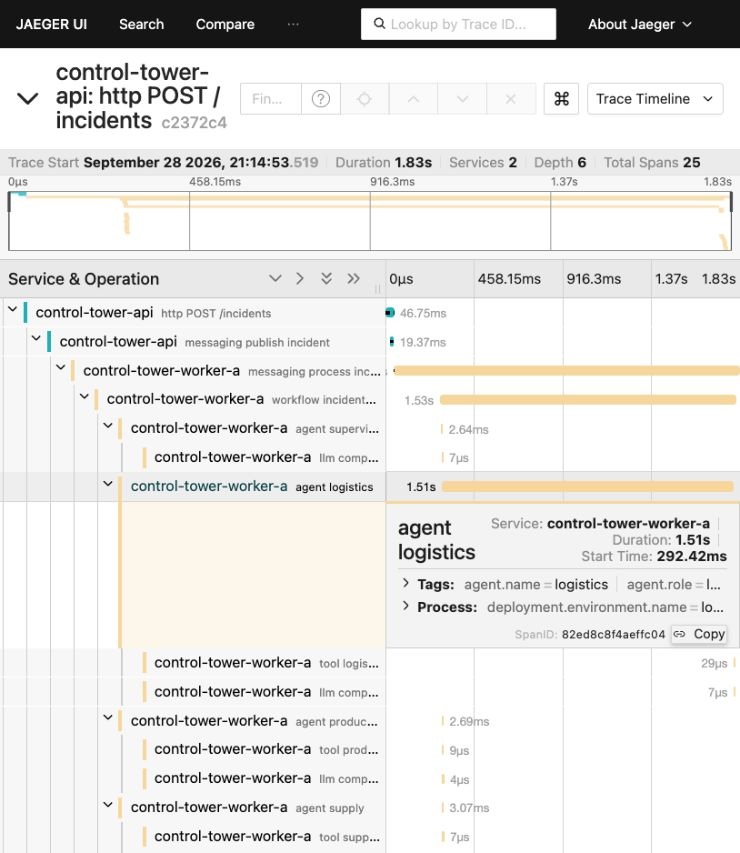
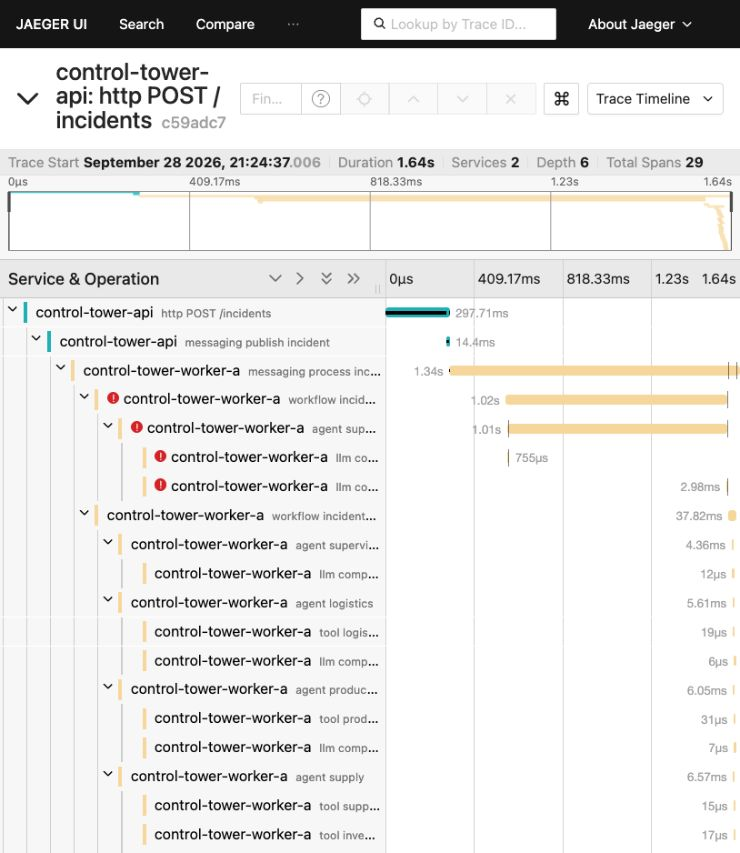
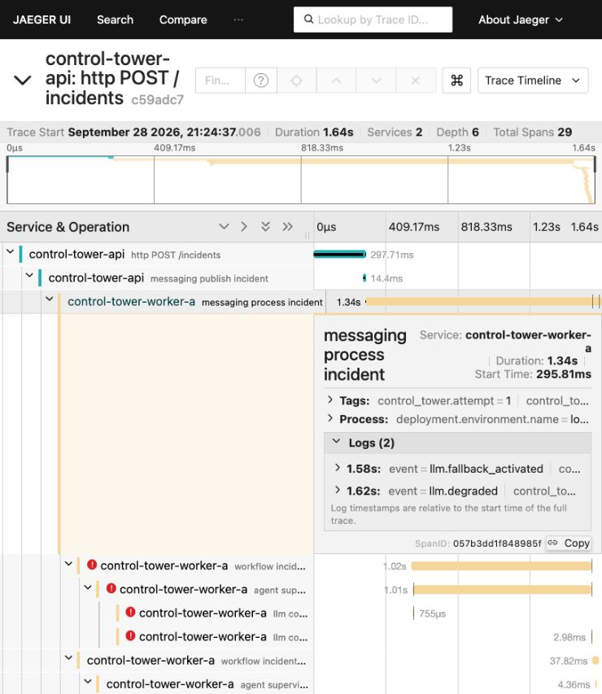

# Capturas reais — lesson-03-complete

[Fechamento formal e regressão final de 30/09/2026](final-freeze.md).

## Validação adicional informada pelo professor — registro em 30/09/2026

**OpenAI real:** smoke executado e aprovado pelo professor, conforme confirmação no pedido de
congelamento. Nenhuma chamada paga foi repetida neste fechamento. Não foram encontrados nos
artefatos deste candidato os detalhes exatos desse smoke. Campos pendentes de registro documental:

| Campo | Evidência disponível |
|---|---|
| Data/hora da execução | Não informada; 30/09/2026 é a data deste registro |
| Modelo solicitado/retornado | Não informado |
| execution_id / trace_id | Não informados |
| Status | Validação aprovada pelo professor; status técnico exato não informado |
| Duração / spans relevantes | Não informados |
| Token usage | Não informado; nenhum valor estimado |

Esses campos podem ser complementados pelo professor com seus outputs. Não impedem o congelamento
aprovado. A validação real é adicional; mock continua obrigatório e reproduzível, sem dependência
de quota, rede ou provider externo para ministrar a aula.

**Full pedagogical rehearsal completed by professor.** Todas as demos executadas com sucesso,
progressão aprovada e aula considerada ministrável em quatro horas, conforme relato do professor.
Tempos efetivamente medidos por bloco não foram fornecidos; a agenda continua uma estimativa.
Preparação do ambiente, setup/build/pull ficam fora das quatro horas. Capturas permanecem como fallback.


Ensaio de 28/09/2026 (São Paulo); timestamps do backend em UTC podem indicar 29/09.
Somente mock e falha artificial, sem OpenAI real. Jaeger usa memória: URLs não são arquivos permanentes.

## normal

Execution `2012d701-9145-44b4-ba55-9e991ee1403a` · trace `3896ccd6ebd856cd24bc974f408aa58a`

Duração persistida: **342.43 ms**. Helper até trace validado: **1.145 s**. Spans: **25**. Outcome: `recommendation`.

[JSON exportado do Jaeger](captures/normal-trace.json) · [Árvore de texto](captures/normal-tree.txt)

```text
http POST /incidents [55.31 ms]
  messaging publish incident [18.25 ms]
    messaging process incident [371.35 ms]
      workflow incident-investigation [25.87 ms]
        agent supervisor [2.25 ms]
          llm completion [0.01 ms]
        agent logistics [4.87 ms]
          tool logistics.lookup [0.01 ms]
          llm completion [0.00 ms]
        agent production [4.77 ms]
          tool production.lookup [0.01 ms]
          llm completion [0.00 ms]
        agent supply [4.61 ms]
          tool supplier.lookup [0.01 ms]
          tool inventory.lookup [0.01 ms]
          tool inventory.lookup [0.01 ms]
          tool supplier.lookup [0.00 ms]
          llm completion [0.00 ms]
        workflow consolidation [1.28 ms]
        deterministic finance [1.49 ms]
        agent challenger [1.78 ms]
          llm completion [0.01 ms]
        agent recommendation [1.55 ms]
          llm completion [0.00 ms]
        workflow human_approval [1.24 ms]
```

## bottleneck

Execution `a92cd857-a4cd-4a35-8c1d-bcaf376e301a` · trace `c2372c4317b9e81dd08bbc9275173984`

Duração persistida: **1757.84 ms**. Helper até trace validado: **3.069 s**. Spans: **25**. Outcome: `recommendation`.

[JSON exportado do Jaeger](captures/bottleneck-trace.json) · [Árvore de texto](captures/bottleneck-tree.txt)

```text
http POST /incidents [46.75 ms]
  messaging publish incident [19.37 ms]
    messaging process incident [1788.02 ms]
      workflow incident-investigation [1531.21 ms]
        agent supervisor [2.64 ms]
          llm completion [0.01 ms]
        agent logistics [1507.66 ms] demo_delay_ms=1500
          tool logistics.lookup [0.03 ms]
          llm completion [0.01 ms]
        agent production [2.69 ms]
          tool production.lookup [0.01 ms]
          llm completion [0.00 ms]
        agent supply [3.07 ms]
          tool supplier.lookup [0.01 ms]
          tool inventory.lookup [0.01 ms]
          tool inventory.lookup [0.01 ms]
          tool supplier.lookup [0.00 ms]
          llm completion [0.00 ms]
        workflow consolidation [2.19 ms]
        deterministic finance [2.40 ms]
        agent challenger [2.13 ms]
          llm completion [0.01 ms]
        agent recommendation [1.94 ms]
          llm completion [0.01 ms]
        workflow human_approval [1.47 ms]
```

## failure

Execution `4775bdd9-6e11-4ad4-abae-d40d7af56377` · trace `c59adc7292c16be6659f1c1a919923e9`

Duração persistida: **1314.43 ms**. Helper até trace validado: **3.229 s**. Spans: **29**. Outcome: `degraded_recommendation`.

[JSON exportado do Jaeger](captures/failure-trace.json) · [Árvore de texto](captures/failure-tree.txt)

```text
http POST /incidents [297.71 ms]
  messaging publish incident [14.39 ms]
    messaging process incident [1340.86 ms]
      workflow incident-investigation [1020.93 ms] ERROR
        agent supervisor [1014.20 ms] ERROR
          llm completion [0.76 ms] ERROR
          llm completion [2.98 ms] ERROR
      workflow incident-investigation [37.81 ms]
        agent supervisor [4.36 ms]
          llm completion [0.01 ms]
        agent logistics [5.61 ms]
          tool logistics.lookup [0.02 ms]
          llm completion [0.01 ms]
        agent production [6.05 ms]
          tool production.lookup [0.03 ms]
          llm completion [0.01 ms]
        agent supply [6.57 ms]
          tool supplier.lookup [0.01 ms]
          tool inventory.lookup [0.02 ms]
          tool inventory.lookup [0.01 ms]
          tool supplier.lookup [0.01 ms]
          llm completion [0.01 ms]
        workflow consolidation [1.60 ms]
        deterministic finance [1.55 ms]
        agent challenger [1.67 ms]
          llm completion [0.01 ms]
        agent recommendation [1.33 ms]
          llm completion [0.01 ms]
        workflow human_approval [1.10 ms]
```

## Evidência visual







Supply também inspecionado: [captura real](captures/agent-supply.png). Em tela estreita, ampliar a coluna Service & Operation; para aula, abrir navegador em tela cheia. Spans muito curtos exigem zoom.

## Exportação de métricas

Nomes realmente observados no Collector/debug: executions.started, executions.completed, execution.duration, llm.calls, llm.failures. Tokens input/output e executions.failed têm instruments reais cobertos em memória, sem alegar tokens de provider real neste ensaio.

## Comparação de overhead

Duas execuções de aquecimento por perfil, cinco amostras sequenciais. Mediana sem OTel: 17,7486 ms; com OTel: 21,4341 ms; diferença: 3,6855 ms (~20,8%). Amostra pequena com duração base muito curta; não é benchmark nem overhead universal. [Amostra off](captures/overhead-disabled.json) · [Amostra on](captures/overhead-enabled.json).

## Collector indisponível

Collector parado por pelo menos 8 s; erro de exportação observado. Health 200, ready 200, POST 202 e completed em 25,31 ms de tentativa. [Resultado medido](captures/collector-down.json). Runtime permaneceu operacional.
