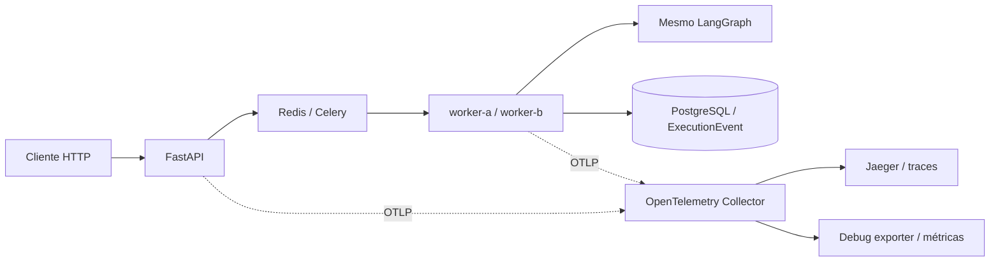

# Parecer final — lesson-03-complete

[Fechamento formal e regressão final de 30/09/2026](final-freeze.md).

## Validação adicional informada pelo professor — registro em 30/09/2026

**OpenAI real:** smoke executado e aprovado pelo professor, conforme confirmação no pedido de
congelamento. Nenhuma chamada paga foi repetida neste fechamento. Não foram encontrados nos
artefatos deste candidato os detalhes exatos desse smoke. Campos pendentes de registro documental:

| Campo | Evidência disponível |
|---|---|
| Data/hora da execução | Não informada; 30/09/2026 é a data deste registro |
| Modelo solicitado/retornado | Não informado |
| execution_id / trace_id | Não informados |
| Status | Validação aprovada pelo professor; status técnico exato não informado |
| Duração / spans relevantes | Não informados |
| Token usage | Não informado; nenhum valor estimado |

Esses campos podem ser complementados pelo professor com seus outputs. Não impedem o congelamento
aprovado. A validação real é adicional; mock continua obrigatório e reproduzível, sem dependência
de quota, rede ou provider externo para ministrar a aula.

**Full pedagogical rehearsal completed by professor.** Todas as demos executadas com sucesso,
progressão aprovada e aula considerada ministrável em quatro horas, conforme relato do professor.
Tempos efetivamente medidos por bloco não foram fornecidos; a agenda continua uma estimativa.
Preparação do ambiente, setup/build/pull ficam fora das quatro horas. Capturas permanecem como fallback.


Validação concluída em 29/09/2026. Branch `codex/lesson-03-complete`, base `ff3166d`.
Fechamento local autorizado em 30/09/2026: commit/tag após regressão final; sem push.
Resultados de 28–29/09 abaixo preservados como evidências históricas; ver fechamento final em validation.md.

## 1. Resumo executivo

**APPROVED — arquitetura e narrativa aprovadas pelo professor.** O mesmo sistema agora permite observar causalidade entre API, publicação, processamento, workflow, agentes e capabilities. O comportamento de negócio, a aprovação humana e o histórico durável permanecem preservados.

351 testes passaram em 17,72 s, incluindo integrações habilitadas. As quatro novas demos foram ensaiadas com stack real. OpenAI real não foi executado pelo agente na rodada de 28–29/09; mock e falha artificial são suficientes para todas as demos obrigatórias.

## 2. Arquivos do candidato

Lista de arquivos adicionados/alterados, incluindo este relatório. A alteração preexistente em `lesson-02-runbook.md` não faz parte deste trabalho.

```text
.env.example
AGENTS.md
compose.override.yaml
deploy/otel/collector.yaml
docs/course/PROJECT_CONTEXT.md
docs/course/lesson-03-runbook.md
docs/course/lesson-03/captures/agent-supply.png
docs/course/lesson-03/captures/bottleneck-summary.json
docs/course/lesson-03/captures/bottleneck-trace.json
docs/course/lesson-03/captures/bottleneck-tree.txt
docs/course/lesson-03/captures/bottleneck.png
docs/course/lesson-03/captures/collector-down.json
docs/course/lesson-03/captures/failure-events.png
docs/course/lesson-03/captures/failure-summary.json
docs/course/lesson-03/captures/failure-trace.json
docs/course/lesson-03/captures/failure-trace.png
docs/course/lesson-03/captures/failure-tree.txt
docs/course/lesson-03/captures/normal-summary.json
docs/course/lesson-03/captures/normal-trace.json
docs/course/lesson-03/captures/normal-tree.txt
docs/course/lesson-03/captures/overhead-disabled.json
docs/course/lesson-03/captures/overhead-enabled.json
docs/course/lesson-03/captures/profile-transition.json
docs/course/lesson-03/complete-demo-outputs.md
docs/course/lesson-03/complete-review.md
docs/course/lesson-03/contracts.md
docs/course/lesson-03/validation.md
labs/03_runtime_production/README.md
scripts/measure_lesson03_overhead.py
scripts/trace_lesson03.py
src/control_tower/api/app.py
src/control_tower/runtime/__main__.py
src/control_tower/runtime/bootstrap.py
src/control_tower/runtime/settings.py
src/control_tower/runtime/signals.py
src/control_tower/telemetry/README.md
src/control_tower/telemetry/__init__.py
src/control_tower/telemetry/config.py
src/control_tower/telemetry/context.py
src/control_tower/telemetry/http.py
src/control_tower/telemetry/instrumentation.py
src/control_tower/telemetry/logging.py
src/control_tower/telemetry/propagation.py
src/control_tower/telemetry/tracing.py
tests/integration/test_lesson03_traces.py
tests/test_lesson03_tracing.py
```

## 3. Arquitetura final



O código usa SDK/OTLP; somente a configuração do Collector seleciona o backend. API, papéis dos containers, settings e contratos do start foram estendidos para instrumentação, sem redesenho do runtime.

## 4. Decisão de propagação assíncrona

Headers W3C `traceparent` e `tracestate` atravessam a fila. Para uma mensagem individual, o processamento continua como filho do span de criação/publicação. O HTTP pode terminar antes do consumo: parentesco expressa causalidade, não contenção temporal obrigatória entre processos.

Retry publica uma nova mensagem e novo contexto de publicação. Redelivery conserva o contexto da mensagem e cria outro span de processamento. Mesma `execution_id` não implica mesma tentativa ou mesmo span. Uma requisição idempotente mantém a associação canônica da execução; `X-Request-Trace-ID` identifica a requisição atual. Sem contexto publicado, o consumidor inicia uma raiz. Não há necessidade de Span Links no caminho atual de uma mensagem; fan-in de mensagens independentes exigiria outra decisão.

A perda abrupta de um worker pode perder spans ainda não exportados. Não fabricamos seu término. ExecutionEvent continua sendo a fonte durável; esta rodada não repetiu um ensaio SIGKILL real, mas cobriu continuação/redelivery/retry em testes de contexto.

## 5. Modelo de spans

SERVER para HTTP, PRODUCER para publicação, CONSUMER para processamento, INTERNAL para workflow/agentes/tools, CLIENT para chamadas reais ao provider. Especialistas são irmãos sob workflow, com intervalos sobrepostos. Consolidation é outro span, iniciado após os especialistas; não é filho artificial do último agente.

`Trace não é o LangGraph`: o primeiro registra operações observadas; o segundo define coordenação lógica. Finance aparece como operação determinística.

## 6. Naming convention

Nomes estáveis: `http POST /incidents`, `messaging publish incident`, `messaging process incident`, `workflow incident-investigation`, `agent supervisor`, `agent supply`, `agent production`, `agent logistics`, `deterministic finance`, `agent challenger`, `agent recommendation`, `tool inventory.lookup`, `tool supplier.lookup`, `tool production.lookup`, `tool logistics.lookup`, `llm completion`. Consolidation e human approval têm spans próprios.

## 7. Atributos

IDs de execução/incidente/correlação, tentativa, worker, operação/versão; método/rota/status HTTP; sistema/destino/operação de messaging; nome de agente/tool; provider, modelo solicitado e usage quando fornecido; outcome, fallback e `demo_delay_ms`. IDs são atributos de diagnóstico, nunca labels das métricas. Duração vem dos timestamps reais.

`execution_id` identifica o registro durável; `trace_id`, uma cadeia observada; `correlation_id`, a correlação de domínio. Não são intercambiáveis.

## 8. Segurança e privacidade

Conteúdo desligado por padrão. `OTEL_CAPTURE_CONTENT=true` é rejeitado explicitamente nesta etapa: não há captura de conteúdo implementada. Sem prompts, respostas, payload empresarial, API keys ou DSNs nos spans. Erros registram tipo sanitizado, sem mensagem arbitrária ou stack que possa carregar conteúdo. Testes incluem sentinelas de conteúdo sensível. Capturas usam dados fictícios do case.

## 9. Stack de telemetria

Collector `0.123.0`, Jaeger `2.11.0`, exportação OTLP/HTTP. Jaeger local usa memória; os JSONs e screenshots salvos são as evidências permanentes deste ensaio. Métricas vão ao debug exporter; Jaeger não é apresentado como dashboard de métricas.

## 10. Compose final

Sete serviços: api, worker-a, worker-b, redis, postgres, otel-collector e jaeger. Compose base da Aula 2 preservado; override adiciona a camada operacional. Porta nova: UI `127.0.0.1:16686`; OTLP fica na rede interna. Serviços de negócio mantêm healthchecks. Collector/Jaeger não são dependências de `/ready`; não possuem healthcheck adicional no Compose, portanto `--wait` verifica seu estado iniciado, e o helper confirma o trace disponível.

Configuração, build e startup foram validados. Ao finalizar, os containers foram encerrados com `docker compose down`, preservando volumes. A UI deixa de estar disponível; usar capturas ou subir a stack novamente.

## 11. Exemplo real de trace

Normal: execution `2012d701-9145-44b4-ba55-9e991ee1403a`, trace `3896ccd6ebd856cd24bc974f408aa58a`, 25 spans. Workflow 25,87 ms; tentativa persistida 342,43 ms. São intervalos diferentes: processamento também inclui trabalho fora do grafo e inicialização.

[JSON real](captures/normal-trace.json) · [Outputs completos](complete-demo-outputs.md).

## 12. Árvore real observada

[Árvore integral com durações](captures/normal-tree.txt): HTTP → publish → process → workflow → Supervisor, especialistas, consolidation, Finance, Challenger, Recommendation e human approval. A listagem textual não pretende representar a sobreposição temporal; a UI e os timestamps comprovam o paralelismo.

## 13. Agent Spans observados

Supervisor, Supply, Production, Logistics, Challenger e Recommendation presentes. No trace normal, houve 3.408 µs de sobreposição comum dos três especialistas; consolidation começou após todos. Finance foi identificado separadamente. [Supply na UI](captures/agent-supply.png).

## 14. Tool e LLM spans

Supply contém inventory/supplier; Production e Logistics têm lookup próprio. No mock, o core não faz chamada real ao provider: `llm completion` é um marcador INTERNAL explícito da fronteira de substituição determinística (`provider=mock`, modo mock), não uma medição de inferência. Não há tokens inventados.

Chamadas reais usam CLIENT e eventos existentes do provider para início/fim/falha. No caminho degradado, o marcador usa provider determinístico e modo degraded, evitando apresentar mock como fallback de produção. Model/usage são registrados apenas quando disponíveis; modelo de resposta não é inventado.

## 15. Trace de falha

Trace `c59adc7292c16be6659f1c1a919923e9`, execution `4775bdd9-6e11-4ad4-abae-d40d7af56377`, 29 spans. Dois requests artificiais falharam; os spans LLM e o workflow primário aparecem ERROR. Retry é evento; `llm.fallback_activated` e `llm.degraded` aparecem no processamento. Segundo workflow determinístico concluiu com `degraded_recommendation`, approval pendente e nenhuma ação executada.

Tentativa 1.314,43 ms; workflow primário 1.020,93 ms; degradado 37,81 ms. A espera do retry não é falsamente atribuída à duração dos requests. [Trace JSON](captures/failure-trace.json) · [Screenshot](captures/failure-trace.png) · [Eventos](captures/failure-events.png).

## 16. Métricas

Oito instruments reais: `executions.started`, `executions.completed`, `executions.failed`, `execution.duration`, `llm.calls`, `llm.failures`, `llm.tokens.input`, `llm.tokens.output`. Contagem de execução é por tentativa, e duration exclui espera na fila.

Cinco nomes foram observados no Collector: started, completed, duration, calls e failures de LLM. Failed de execução e tokens foram validados com exporter em memória. Usage sintético de teste não é apresentado como consumo real. No mock, calls conta marcadores de capacidade, distinguíveis pelo provider/mode.

## 17. Overhead observado

Docker Desktop no macOS, mock, duas execuções de aquecimento e cinco amostras sequenciais por perfil. Mediana sem OTel: 17,7486 ms; com OTel: 21,4341 ms; diferença 3,6855 ms (~20,8%). Medida da tentativa persistida, não da fila nem do flush/exportação completo. A base muito curta amplifica o percentual. Não é benchmark científico nem estimativa universal.

[Amostras off](captures/overhead-disabled.json) · [Amostras on](captures/overhead-enabled.json).

## 18. Testes

Comando executado:

```bash
LESSON02_INTEGRATION=1 LESSON03_INTEGRATION=1 LESSON03_TRACING_INTEGRATION=1 LLM_MODE=mock uv run --extra lesson03 pytest -q
```

**351 passed in 17.72s.** Testes novos cobrem propagação, HTTP, publish, worker, workflow, agentes/tools/LLM, paralelismo/join, privacidade, erros, retry/fallback, logs, métricas, OTel desligado sem rede. Integração opcional consulta o backend real e verifica a estrutura; o caso de falha também passou separadamente. Nenhuma chamada OpenAI nos testes.

## 19. Regressões e falha da observabilidade

Smoke Aula 1: OK, 12 verificações. Smoke Aula 2: 10 execuções concluídas, zero falhas, 0,343 s no cenário local medido. Regressão start mock passou, incluindo idempotência e estados; health/readiness passou: ao parar Redis, health 200 e ready 503, voltando a 200 após recuperação.

Collector parado por pelo menos oito segundos: erro real de exportação observado; health 200, ready 200, POST 202 e execução completed em 25,31 ms. [Evidência](captures/collector-down.json). OTel desabilitado tem teste que impede acesso à rede. Hashes dos arquivos congelados das Aulas 1/2 continuam preservados.

## 20. Dry run das Demos 6–9

| Demo | Tempo técnico medido | Comandos do roteiro | Tempo pedagógico |
|---|---:|---:|---:|
| 6 — primeiro trace | helper 1,145 s, mais troca de perfil/startup | 10, incluindo exports | 15 min |
| 7 — agentes | reutiliza trace, sem nova execução | 2 | 15 min |
| 8 — gargalo | helper 3,069 s, mais troca de perfil | 5 | 10 min |
| 9 — falha | helper 3,229 s, mais troca de perfil | 5 + 4 para restaurar | 7 min |

Uma troca final de perfil levou 15,784 s, incluindo `up --wait`; não foi medido individualmente o startup de cada demo. Abrir o trace final e obter a UI levou 518 ms via automação; isso não mede tempo humano para explicar/navegar. As estimativas pedagógicas incluem pergunta, leitura visual, discussão e conclusão.

Gargalo: Logistics 1.507,66 ms, com atraso explicitamente marcado em 1.500 ms. Em UI estreita, ampliar a coluna de nomes; projetar em tela cheia. Spans curtos exigem zoom. Se UI/exportação atrasar, usar screenshot + árvore/JSON salvos. Se Docker não estiver saudável antes da aula, usar as capturas e preservar o tempo conceitual.

Houve travamento do Docker Desktop na preparação; reiniciar o aplicativo recuperou o ambiente. Esse incidente de host não foi incluído nos tempos dos helpers. Build/pull/startup devem ocorrer antes da aula, não no bloco de explicação.

## 21. Runbook revisado

[Runbook completo](../lesson-03-runbook.md): 240 minutos, com 80 minutos de contexto/conceitos preservados antes dos blocos adicionais de health e tracing. Demos 1–5 mantêm a história do start; Demo 5 usa captura curta no bloco de correlação, sem repetir a demo longa de falha.

Demos novas seguem problema → hipótese → execução → trace → evidência → conclusão. Comandos copiados diretamente, IDs extraídos automaticamente e helper imprimindo link. Leitura de código novo: aproximadamente 10 minutos, limitada a configuração (2), headers (2), workflow/agent (4), LLM/eventos (2). Instrumentação, YAML e imports ficam preparados. Alunos observam e discutem; não programam.

## 22. Limitações e trade-offs

- Instrumentação explícita instalada no runtime envolve pontos existentes sem editar core congelado. Isso preserva os checkpoints, mas depende dos pontos de extensão/observer e exige testes quando o core mudar.
- Marcador mock não representa latência de inferência. O modo degradado é rotulado separadamente.
- Jaeger em memória, exportação best effort, sem garantia durável de telemetria e sem plataforma completa de métricas/logs.
- SDK nasce em cada processo filho do worker, evitando transportar threads do exporter através de fork.
- OpenAI real não executado pelo agente em 28–29/09; aprovação posterior do professor registrada acima; adaptação do provider, tokens e erros coberta com provider simulado.
- Redelivery/SIGKILL real não repetido nesta rodada; spans em voo podem se perder. Histórico durável permanece separado.
- Estado preparado para demonstração local, sem alegação de prontidão empresarial de produção.

## 23. Deliberadamente fora da Aula 3

Kubernetes, autoscaling, CI/CD, service mesh, HA/multi-region, plataforma Grafana/Prometheus completa, Control Plane, FinOps, routing avançado, governance, evaluation, LLM-as-a-Judge e dashboards executivos. Langfuse é somente um possível destino/complemento especializado, sem dependência adicionada.

## 24. Parecer técnico

**APPROVED — aprovado pelo professor.** Fluxo distribuído real, contextos válidos, erros visíveis, paralelismo preservado, regressões passando e Collector não crítico para o negócio. Limites de mock, persistência da telemetria e validação de provider estão explícitos.

## 25. Parecer pedagógico

**APROVAR.** A conclusão visual sustenta “Correlation nos ajuda a encontrar. Tracing nos ajuda a entender causalidade”. O roteiro cabe em quatro horas com ambiente preparado e mantém o foco em decisões, evidências e perguntas, não em configuração de ferramentas. A última pergunta abre a Aula 4 sem implementá-la.

## Referências e materiais

- [Contratos e decisões detalhadas](contracts.md)
- [Capturas e outputs completos](complete-demo-outputs.md)
- [Convenções oficiais de messaging OTel](https://opentelemetry.io/docs/specs/semconv/messaging/messaging-spans/)
- [Configuração oficial do Collector](https://opentelemetry.io/docs/collector/configuration/)
- [Jaeger 2.11](https://www.jaegertracing.io/docs/2.11/getting-started/)
