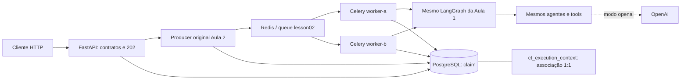

# lesson-03-start — decisões e limites do runtime

## Arquitetura

Antes: CLI → producer → Redis → workers → grafo → PostgreSQL.
Depois: HTTP → **mesmo producer**, mesma fila/task/contratos/graph/store, acrescido de runtime e correlação.
PostgreSQL participa do claim, de eventos e de resultado; não apenas do último passo.
Human approval continua pendente; não existe endpoint de compra, transporte, transferência ou aprovação.

## Fronteira HTTP

| Endpoint | Resposta / semântica |
|---|---|
| POST /incidents | 202 após claim + publicação; nunca aguarda workflow |
| GET /executions/{UUID} | 200: estado, tentativa, worker, duração e correlação |
| GET /executions/{UUID}/events?after=0&limit=30 | 200: projeção paginada por sequence; limit máximo 100 |
| GET /executions/{UUID}/result | 202 enquanto queued/running; 200 terminal, inclusive failed sem resultado |
| GET /health | 200 alive; somente processo HTTP, zero chamadas a dependências |
| GET /ready | 200 com Redis ping e schema PostgreSQL disponíveis; senão 503 |

404 para UUID inexistente; 422 para request/contexto inválido; 409 para colisão de identidade/configuração;
503 para indisponibilidade de publicação/store. /docs contém OpenAPI gerado dos modelos públicos.
As consultas são somente leitura. Events mantém sequência/timestamp/agent/attempt, sem prompts nem
estado interno. Resultado preserva unidade **estimated_cost_brl**, string Decimal, e aprovação.
Enquanto não existe resultado, approval_status=null: não alegar que a solicitação humana já foi criada.
No outcome human_review_required, completed significa que terminou a decisão de encaminhar.

O request é uma submissão do **case técnico de referência INCIDENT-001**, com incident_id do envelope
HTTP, version e controles didáticos opcionais. O adapter cria o envelope válido da Aula 2, com data
fictícia fixa 2026-10-01T08:00:00Z, supplier_delay/São Paulo. Não aceita texto livre como caso novo,
não infere cinco workflows empresariais e não usa relógio da requisição para alterar o payload.
A versão identifica uma operação lógica junto de incident_id + analyze-reference. Mesma operação e
opções retorna a mesma execução e republica com segurança; nova experiência exige nova version.
202 pode trazer running/completed numa duplicata; created=false e o UUID continuam iguais.

**Janela preservada da Aula 2:** commit PostgreSQL e publicação Redis não são atômicos. Em 503, a
execução pode já existir. Reenviar exatamente o mesmo request/version recupera a publicação; não
inventamos transactional outbox ou exactly-once. Um cliente desconectado não cancela o processamento.

## Correlação persistida e passagem entre processos

1. API aceita X-Trace-ID (32 hex minúsculos não nulos) e X-Correlation-ID (1–64 caracteres seguros).
   Ausentes: UUIDs aleatórios. São identidades de correlação, **não traceparent W3C nem spans**.
2. CorrelatedStore reutiliza `Store.claim` e grava `ct_execution_context`, FK execution_id, antes de
   publicar. Nenhum campo é adicionado ao JSONB/contrato DurableExecution congelado da Aula 2.
3. Primeira associação persistida vence; duplicatas mantêm a correlação original mesmo com novo header.
   A API devolve o contexto canônico no corpo e nos headers, inclusive numa repetição.
4. `before_task_publish` coloca contexto nos headers Celery. Nenhum segredo vai à task.
5. `task_prerun` restaura contexto e acrescenta worker_id. Sem header, consulta a associação, permitindo
   reenvio pela CLI histórica. Retry/redelivery preservam execução/contexto. IDs não são autorização.
6. `task_postrun` emite snapshot do estado e dos eventos LLM/falha da tentativa e limpa ContextVar.

Claim e associação são commits separados; falha antes da associação/publicação pode deixar queued.
O reenvio HTTP preenche a associação antes de republicar. Operações antigas criadas só por CLI podem
não ter contexto; API mostra null sem fabricar uma história de tracing retroativa.

Logs pós-tentativa **não são streaming de cada nó**, nem garantem um registro exatamente uma vez.
Uma duplicata pode repetir snapshot; correlacionar por execution_id + attempt + sequence.
Se worker morre antes do postrun, o snapshot pode faltar; eventos persistidos continuam sendo a fonte
do histórico. Falha de telemetria é explícita e não modifica a decisão do domínio.

## Container, configuração e compatibilidade

`compose.yaml` da Aula 2 permanece byte a byte intacto. `compose.override.yaml` é aplicado por padrão
pelo Compose e adiciona API + dois workers. Para ensaiar **somente Aula 2 nesta branch**, encerrar o
runtime Aula 3 e usar `docker compose -f compose.yaml up -d --wait`, mantendo seus workers locais.
Não manter consumidores antigos misturados na queue lesson02. Checkpoints anteriores não mudam.

Mesmo Dockerfile/imagem, comando `python -m control_tower.runtime api` ou `worker`; Python 3.12,
uv 0.7.6, lockfile e usuário UID 10001. Dependências Aula 3 ficam no extra lesson03; extras anteriores
continuam disponíveis. Código/dados entram por COPY explícito; .dockerignore usa allowlist, nunca
inclui .env, .keys, .git, artefatos ou a .venv do host. Não há bind mount de código mutável.
O entrypoint API inicializa tabelas de modo idempotente antes de servir; workers aguardam API saudável.
Isso não é um sistema de migrações de produção; o schema do start é somente aditivo.

API localhost:8000. Portas localhost:15432 e :16379 continuam no Compose base **para compatibilidade
com a CLI e testes Aula 2**; containers usam postgres:5432 e redis:6379. Não há exposição em 0.0.0.0
no host. Nomes de projeto/volumes permanecem novacore-lesson02; `down` mantém ambos os volumes.
Se banco já tem senha diferente, use a senha previamente configurada; trocar variável não recria senha
em volume existente. Caracteres especiais em senha exigem DATABASE_URL corretamente percent-encoded
num override privado. Nenhum comando de limpeza destrutiva é necessário para a aula.

Workers containerizados usam prefork, concurrency=1 por padrão. Aula 2 local continua solo.
Pool é escolha de runtime, não mudança de task/ack/retry/grafo. Worker health usa ping direcionado via
broker; prova que o consumidor responde, não qualidade do LLM ou capacidade de resolver incidente.
`stop_grace_period=60s` permite shutdown normal; não é garantia para chamadas LLM arbitrariamente longas.

| Configuração | Padrão / função |
|---|---|
| APP_ENV / APP_NAME | local / control-tower; metadados e bloqueio de demo controls em production |
| LOG_LEVEL / LOG_FORMAT | INFO / human; json para filtragem estruturada |
| REDIS_URL / DATABASE_URL | Endereços secretos; aliases LESSON02_BROKER_URL / LESSON02_DATABASE_URL |
| LLM_MODE / OPENAI_MODEL | mock / gpt-4.1-mini; mesmo provider e contratos anteriores |
| OPENAI_API_KEY / OPENAI_API_KEY_FILE | Fonte privada; mock não precisa. Arquivos do host não são copiados para imagem |
| VISIBILITY_TIMEOUT | 900 no runtime; aliases antigos aceitos; openai exige >=600 |
| WORKER_CONCURRENCY / WORKER_NAME | 1 / worker-a; Compose atribui A/B |
| REQUEST_TIMEOUT | 3s para probes e conexão/socket do broker; NÃO timeout total HTTP/grafo/LLM |
| DEMO_CONTROLS_ENABLED | false fora do Compose; true no laboratório; proibido APP_ENV=production |
| OTEL_ENABLED | false; true cria SDK local, sem spans automáticos |
| OTEL_SERVICE_NAME | Papel do processo: api, worker-a, worker-b |
| OTEL_EXPORTER_OTLP_ENDPOINT | Base OTLP/HTTP opcional; exporter acrescenta /v1/traces |

Settings lê .env e ambiente (ambiente vence); extra=ignore aceita campos das aulas anteriores.
A ponte de bootstrap traduz para nomes antigos antes de importar Celery. Não modifica settings da CLI
histórica. Store congelado mantém connect_timeout=5; REQUEST_TIMEOUT não altera isso nem requests LLM
já aprovados. Readiness consulta dependências sequencialmente, com limites individuais.
No Compose, variáveis são explicitamente repassadas: .env serve para interpolação, não é copiado.
Exporte LLM_MODE=mock para o ensaio mesmo que seu .env esteja em openai.

OpenAI real continua possível com chave em ambiente e mesmo modo/modelo nos três processos.
Startup openai sem chave falha claramente. Readiness não consulta OpenAI: mock pode estar ativo,
provider tem semântica própria, e rede/modelo/quota não são comprovados por essa sonda.
**Ready não significa saudável end-to-end.** Nem testa presença de workers, backlog, quota, permissões
futuras de escrita ou qualidade da recomendação. Não há auth/TLS/multi-tenant nesta API local.

## Telemetria preparada

ExecutionEvent é histórico durável de domínio/runtime; OpenTelemetry é observabilidade técnica.
Não substituímos um pelo outro. Logs carregam timestamp, level, service, event, message e contexto.
Somente campos controlados são emitidos; não imprimir settings, payloads, prompts ou exceções brutas.

SDK OTel opcional, provider local com resource service.name/environment, exporter OTLP/HTTP opcional.
Nenhum span gerado pelo start, nenhuma autoinstrumentação. Habilitar OTEL_ENABLED não fabrica traces.
Collector foi deliberadamente adiado: não é necessário para validar este contrato e não há spans ainda.
As seis métricas estão em telemetry/config.py como contratos, **não contadores já coletados**.

Reservado ao lesson-03-complete: spans HTTP/producer/consumer/workflow, propagação W3C, relações
parent/link e causalidade, instrumentos métricos reais e decisão de destino/visualização.
Langfuse é exemplo de destino especializado para observabilidade de LLM/agents.
OpenTelemetry é o contrato de instrumentação; ferramentas diferentes podem consumir esses sinais.
Sem dashboard, auto-instrumentação massiva, K8s, CI/CD, autoscaling, FinOps ou routing.

## Referências usadas

- [FastAPI lifespan](https://fastapi.tiangolo.com/advanced/events/).
- [Celery signals](https://docs.celeryq.dev/en/stable/userguide/signals.html).
- [Pydantic Settings](https://docs.pydantic.dev/latest/concepts/pydantic_settings/).
- [OpenTelemetry Python instrumentation](https://opentelemetry.io/docs/languages/python/instrumentation/).
