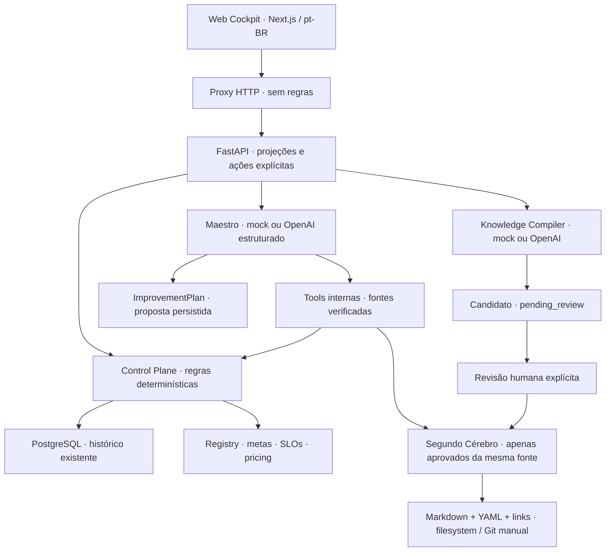

# Aula 4 — Roteiro final do L3 Control Plane

**Checkpoint candidato:** `lesson-04-cockpit` · **branch:** `codex/lesson-04-cockpit`.
**Duração da demonstração:** 18 minutos, após a teoria da Aula 4. Instalação e build ficam fora da aula.
**Idioma:** pt-BR. **Ambiente:** LAB NovaCore, dados fictícios, sem vínculo com clientes reais.

## 1. Objetivo e limites

> “Agentes executam. O Control Plane mede e interpreta. O Maestro coordena propostas de melhoria.
> O Segundo Cérebro preserva conhecimento validado. O Learning Loop melhora o contexto da próxima decisão.”

A demonstração termina em **LEARN**, antes de ACT autônomo. O professor conduz; alunos observam.
Não há live coding. Aprovar conhecimento **não** aprova uma compra, um plano ou uma transição de lifecycle.

## 2. Arquitetura que estará projetada



O runtime permanece API → Redis → workers Celery → **mesmo LangGraph** → PostgreSQL,
com OTel/Jaeger já construídos. O Maestro não é outro Supervisor. Ele opera fora do grafo empresarial.
A única nova infraestrutura é o serviço `cockpit`; o Segundo Cérebro usa diretório local montado na API.

## 3. Preparação — fazer antes da aula

### 3.1 Abrir terminal na cópia local do candidato

No Mac do professor:

```bash
cd "/Users/leandrolopes/Documents/ChatGPT/Disciplina Mult-Agents/agentic-operations-control-tower"
git branch --show-current
git log -1 --oneline
git status --short
```

Esperado: branch `codex/lesson-04-cockpit`. Arquivos de conhecimento podem aparecer modificados após ensaio.
Não execute reset/clean para “limpar” aprendizados. Nenhum comando deste roteiro move tags ou faz push.
Se estiver em outra branch e sem alterações próprias pendentes:

```bash
git switch codex/lesson-04-cockpit
```

### 3.2 Pré-requisitos e dependências

Abra Docker Desktop e aguarde ficar operacional. É necessária conexão apenas para instalar dependências
ou baixar imagens. O ensaio em mock não chama OpenAI.

```bash
docker version
uv --version
uv sync --locked --extra lesson04
export LLM_MODE=mock # preparação determinística do seed
export OTEL_ENABLED=true
export CONTROL_TOWER_PRICING_FILE=config/lesson04-pricing.json
export CONTROL_PLANE_CONFIG_FILE=config/lesson04-control-plane.json
uv run --extra lesson04 python scripts/seed_cockpit.py
```

Saída esperada: `Cenário didático preparado. Conhecimento existente preservado; nenhuma chamada LLM real.`
O seed cria três referências didáticas previamente curadas, um candidato pendente e um plano mock.
É idempotente: preserva itens existentes; só repõe candidato/plano quando não há um disponível.
Os seeds aprovados são **curadoria do material da aula**, não descobertas de produção nem aprovação feita pelo LLM.

### 3.3 Iniciar todos os serviços corretos — OpenAI principal

O logo oficial L3 e a identidade navy/cyan identificam o sistema; verde representa apenas status positivo.
Carregue a chave sem projetar o terminal de entrada. O `read -s` abaixo é para zsh no Mac;
nenhuma chave é escrita em arquivo ou enviada ao navegador. Se já exportou a variável nesta sessão,
não precisa repetir a leitura. O `.keys` do host não é montado automaticamente nos containers.

```bash
read -s "OPENAI_API_KEY?Chave OpenAI (entrada oculta): "
export OPENAI_API_KEY
export LLM_MODE=openai
export OPENAI_MODEL=gpt-4.1-mini
export VISIBILITY_TIMEOUT=900
./scripts/cockpit.sh config --quiet
./scripts/cockpit.sh up -d --build --wait
./scripts/cockpit.sh ps
curl --fail --silent --show-error http://localhost:8000/health
curl --fail --silent --show-error http://localhost:8000/ready
uv run --extra lesson04 python scripts/demo_cockpit.py
```

O launcher seleciona explicitamente os cinco arquivos Compose, configura UID/GID do usuário local
para escrita em `knowledge/` e preserva os volumes. Equivalente expandido:

```bash
export LOCAL_UID="$(id -u)"
export LOCAL_GID="$(id -g)"
docker compose -f compose.yaml -f compose.override.yaml -f compose.lesson04.yaml \
  -f compose.lesson04-complete.yaml -f compose.lesson04-cockpit.yaml up -d --build --wait
```

Não use apenas `docker compose up`: o perfil padrão representa o checkpoint anterior.
Não execute `docker compose config` sem `--quiet` com credenciais carregadas, pois pode imprimi-las.

Abrir no navegador:

```bash
open http://localhost:3000
open http://localhost:8000/docs
open http://localhost:16686
```

- Cockpit: porta 3000.
- API/Swagger: porta 8000.
- Jaeger: porta 16686.
- Navegador não recebe chave OpenAI. O Next.js apenas encaminha chamadas à API Python.

### 3.4 Conferência rápida da fonte didática

O helper deve mostrar:

```text
L3 CONTROL PLANE — ENSAIO DO COCKPIT
Fonte: DIDÁTICA / SINTÉTICA
Agentes: 7 | com sinais de atenção: 1
Supply: alvo=90.0% | atual=74% | gap=-16.0 p.p.
Execuções disponíveis: 6
Conhecimentos aprovados: 3 | pendentes: 1
Planos propostos persistidos: 1
Valor realizado: desconhecido. Nenhuma ação operacional autorizada ou executada.
```

Decimais e contagens de conhecimento/planos podem crescer após ensaios. O resultado Supply permanece 74%.
Há três populações **explicitamente distintas**:

1. Supply: **50 observações sintéticas de cobertura**, das quais 37 completas. Meta 90%, atual 74%, gap −16 p.p.; 14 observações degradadas, 28%.
2. Demais agentes e economia/latência do cenário: fixtures técnicas do checkpoint anterior, janela atual de 3 registros.
3. Operações: **6 execuções ilustrativas independentes**, usadas para timeline e extração. Não são as 50 observações do Supply.

A cobertura de evidências não prova que uma alternativa de fornecedor é viável. Não chame 74% de “taxa de fornecedores disponíveis”.
Os tokens do cenário são sintéticos, **não consumo OpenAI em mock**. No histórico persistido, mock conserva usage/custo desconhecidos.

## 4. Ensaio de 18 minutos — fala e gestos

### 00:00–02:00 · Visão Geral — enxergar a organização

**Clique:** `Visão Geral`. Fonte: `Cenário didático`. Use tela 1440×900 ou 1920×1080, zoom 100%.

**Fala:** “Um agente é uma unidade de inteligência. Um sistema multiagente é uma organização.
Até aqui observávamos execuções. Agora identificamos sete papéis, metas e sinais que exigem uma decisão de gestão.”

Aponte **Performance da workforce**: 7 ativos, 6 metas dentro do alvo, Supply em atenção, 3 alertas e 6 propostas.
Mostre **Valor sob gestão: R$ 140.000**, cenário didático, e **Valor realizado: Não validado**.
É a penalidade do pedido CO-001 (R$ 20.000/dia) multiplicada por 7 dias hipotéticos pela capability existente.
Não é impacto confirmado nem economia realizada.
Clique **1 agente requer atenção · Perguntar ao Maestro**. A contagem vem dos triggers do backend.
O drawer abre com Supply e uma pergunta preparada: **não ocorre chamada ao provider até clicar Enviar**.
Feche o painel para continuar o percurso.
Role até a tabela. Os círculos de SLO representam avaliações, não uma saúde global inventada.

**Explique antes:** cadastro ≠ lifecycle ≠ saúde do runtime ≠ status da execução.
Um agente `Ativo` no Registry pode produzir resultados degradados. Não existe health score individual medido aqui.

**Pergunta:** “Concluir uma execução basta para dizer que esse agente está funcionando bem?”

### 02:00–05:00 · Agent 360 — identidade, contrato e evidência

**Clique:** linha `Suprimentos`. Abra `Resumo`, depois `Metas`.

Mostre owners, versão, execução, tools e interfaces. Modelo na fonte didática é metadata de um
cenário OpenAI ilustrativo; isso não significa que o navegador acabou de chamar esse modelo.

**Fala:** “Você não consegue operar uma força de trabalho que não consegue identificar.
Agents need goals, not just tasks: agentes precisam de metas, não apenas tarefas.”

Na aba `Metas`, leia **90% → 74% → −16 p.p. → Fora da meta**.

**Fala:** “O número é calculado em Python: 37 observações completas em 50. O frontend apenas apresenta.
Não é uma nota de inteligência e não é prova de causa raiz. É um contrato mensurável para orientar investigação.”

**Código opcional, já aberto em outra aba:**

- `src/control_tower/cockpit/presentation.py`, método `views`: contagem das observações e chamada ao motor existente.
- `fixtures/cockpit/supply.json`: primeiras observações, `source=didactic` e `target=90`.
- `src/control_tower/control_plane/interpretation.py`, `measure_goal`: target, actual, gap e suficiência.

Não percorra as 50 linhas nem implemente gráficos ao vivo.

### 05:00–07:00 · Qualidade, economia e recomendação

**Clique:** abas `Qualidade`, `Economia`, `SLOs`, `Decisões`.

**Fala:** “Completed é status do runtime. Qualidade é um vetor antes de ser uma nota.
Custo não é valor. O consumo é registrado, o pricing configurado, o custo estimado. Economia realizada permanece desconhecida.”

Supply tem violação de cobertura e degradação. O perfil didático usa severidade média para cobertura
 e alta para degradação: isso permite demonstrar `Intervir` com o motor de regras aprovado.
Economia e latência vêm de outra amostra ilustrativa, indicada no roteiro; não extrapole esses custos para as 50 observações.

**Abra a recomendação:** `Intervir`, prioridade alta, evidências, lifecycle atual Ativo, sugerido Em revisão.
O botão de executar permanece indisponível.

**Fala:** “Observar não é operar. Operar é transformar sinais em decisões.
Recommendation is not authorization: recomendação não é autorização.”

**Código que vale mostrar:** `control_plane/decision_engine.py`, precedência das regras; `control_plane/lifecycle.py`, transições permitidas.
Nenhuma regra é reimplementada em React. Não altere thresholds ao vivo para “conseguir” o resultado.
Abra **Lifecycle**: o SVG desenha as 11 transições permitidas pelo backend. Azul destaca o cadastro Ativo;
abaixo, a proposta Ativo → Em revisão está **não executada**, com aprovação humana obrigatória.
Em Economia & Valor, diferencie custo LLM/por papel, custo do cenário proposto (R$ 12.500), exposição potencial
(R$ 140.000), tempo ilustrativo registrado até proposta e valor realizado ainda não validado.
**LLM Cost ≠ Agent Cost ≠ Workflow Cost ≠ Business Decision ≠ Business Value.**

### 07:00–10:00 · Maestro — da evidência ao plano

**Clique:** `Perguntar ao Maestro` ou menu `Maestro`.
Agente em foco: `Suprimentos`. Clique na sugestão:

> Como posso melhorar o agente de Supply?

**Experiência principal:** OpenAI real (`gpt-4.1-mini`), síntese em pt-BR com fatos e fontes verificáveis.
O texto varia; números e regras não. **Fallback mock explícito:** diagnóstico 90% versus 74%, 13 observações com cobertura incompleta,
proposta para revisar evidências, preparar avaliação antes/depois e solicitar revisão humana.

**Fala:** “O Supervisor coordena uma investigação. O Maestro consulta o Control Plane e o conhecimento aprovado
para coordenar a melhoria da força de trabalho. O LLM não calcula metas, pricing, SLOs ou transições.”

Aponte o diagnóstico. Expanda **Hipótese, plano de melhoria e staffs** e depois **Fontes utilizadas (N)**.
Envie uma segunda pergunta: **Qual evidência sustenta essa proposta e o que ainda falta validar?**
As duas respostas permanecem. Feche o drawer, entre em Operações, abra uma execução e use o botão global
**Perguntar ao Maestro**. O histórico permanece e surge **Contexto alterado para Execução INCIDENT-001**.
Envie: **Explique os limites desta execução em relação ao plano anterior.**
Página Maestro e drawer compartilham a sessão. O backend recebe IDs, resolve fatos e envia até 12 mensagens
recentes ao provider; não usa HTML nem memória implícita. Em Agent 360, **Última análise do Maestro**
mostra a proposta mais recente; **Continuar conversa** preserva a sessão da aba atual.
Ao abrir uma recomendação, use **Perguntar ao Maestro sobre esta recomendação**; em um documento,
o botão global carrega o conhecimento selecionado. Pendentes não viram verdade aprovada.
Expanda **Custo desta consulta ao Maestro** quando houver usage: modelo, tokens e estimativa USD
com pricing configurado. Essa consulta não entra nos custos históricos do workflow.
Mostre conhecimento relacionado e staffs: Desenvolvimento, Dados, Arquitetura, Avaliação/QA, Segurança,
Conhecimento e Revisor humano. São responsabilidades propostas, não sete novos agentes executando.

**Fala:** “Temos um plano proposto e persistido. Não existe autorização de mudança, PR automático ou deploy.
A inteligência sintetiza. As regras delimitam. O humano responde pela autorização.”

**Código opcional:** `cockpit/assistance.py`, `MaestroTools` e `Maestro.chat`; `cockpit/llm.py`, prompts e `responses.parse`;
`cockpit/models.py`, `ImprovementPlan` e `PlanDraft`.

**Pergunta:** “Qual evidência ainda falta para acreditar que esse plano realmente melhora o resultado?”

### 10:00–14:00 · Extração e revisão — memória com proveniência

**Clique:** `Operações` → primeira execução do `INCIDENT-001` → `Extrair aprendizado`.
Aguarde abrir o candidato. Saída mock: **Considerar estoque de segurança antes de propor transferências**.

Mostre `Aguardando revisão`, execução de origem, observações, inferência separada e evidências.
A execução é ilustrativa, sem transferência realizada. O fato de domínio aponta para `Tools.get_stock`,
que calcula quantidade transferível preservando estoque de segurança.

**Fala:** “O LLM propõe conhecimento. O sistema valida estrutura e proveniência. O humano autoriza conhecimento material.
Gerar texto não equivale a aprender uma verdade.”

**Revisão explícita pelo professor:** leia a origem e os limites antes de prosseguir.

- `Seu nome`: **Leandro Lopes**.
- `Justificativa`: **Revisei as evidências e o cálculo de estoque livre. Aprovação restrita ao caso didático; não comprova transferência ou economia realizada.**
- Marque **Revisei o conteúdo, a origem e os limites desta proposta.**
- Clique **Confirmar aprovação**. Alternativa: **Rejeitar candidato** se o conteúdo não for sustentado.

**Esperado:** mensagem de persistência, status Aprovado, nome/nota da revisão visíveis; formulário deixa de aparecer.
Essa aprovação não altera a aprovação operacional pendente do incidente.

**Clique:** `Voltar ao Segundo Cérebro`. Mostre lista, grafo e feed. Os links vêm de metadata, não de relações inventadas.
Candidatos podem aparecer no grafo com status pendente; **apenas aprovados** entram no retrieval do Maestro.

**Demonstre persistência**, no terminal:

```bash
git status --short -- knowledge
uv run --extra lesson04 python - <<'PY'
from control_tower.cockpit.knowledge import KnowledgeStore
for item in KnowledgeStore().list(source='didactic')[:5]:
    print(item.id, '|', item.validation_status, '|', item.title)
    print('  revisor:', item.reviewer or 'Ainda não revisado')
PY
```

Abra o Markdown correspondente em `knowledge/wiki/lessons/`. Frontmatter contém fonte, execução,
gerador, evidências, status, timestamps, revisor e nota. **Não é necessário commit durante a aula.**

### 14:00–16:00 · Reutilizar conhecimento e distinguir fontes

Volte ao Maestro e clique **O que aprendemos hoje?**.
Ele consulta novamente documentos aprovados; os recém-aprovados podem integrar a busca simples limitada aos cinco mais recentes relevantes.
Isso demonstra melhoria de contexto, **não treinamento do modelo**.

Mude `Fonte de dados` para **Histórico persistido**. Conhecimento didático deixa de aparecer.
Medições ausentes permanecem desconhecidas; nenhuma fixture preenche lacunas do histórico.

**Fala:** “O plano usa a fonte selecionada. Não tratamos ensaio como evidência operacional.”
Volte a **Cenário didático** para o fechamento.

### 16:00–18:00 · Learning Loop — fechamento da disciplina

**Clique:** `Learning Loop`. Siga a sequência Meta → Execução → Resultado → Medição → Control Plane →
Maestro → Plano → Staffs → Validação humana → Segundo Cérebro → Melhor contexto → Próxima execução.

**Fala:** “A organização não aprende porque executou mais. Ela aprende quando sua experiência melhora a próxima decisão.
O LAB está nos níveis de observar e recomendar, com delegação representada como proposta. Nível 5 não está operacional.”

Aponte **Maturidade da empresa agêntica**: Automação → Observável → Gerenciada → Adaptativa → Learning Enterprise.
O marcador do LAB está entre 3 e 4: medimos, interpretamos e propomos. Nível 5 é visão futura.
Maturidade organizacional e autoridade de execução são eixos distintos; nenhum libera ACT autônomo.

**Fechamento:** “Control Tower opera o processo. Control Plane opera a força de trabalho agêntica.
Operar agentes é uma disciplina de lifecycle, não apenas de runtime.
Agentes executam. Control Planes compreendem. Maestros coordenam a melhoria. Segundos Cérebros preservam a memória.
Learning Loops transformam experiência em melhor desempenho. Self-learning is not uncontrolled self-modification.”

## 5. Histórico real opcional — preparar antes da aula

A demo final usa fixtures para ter resultado repetível. Este bloco é opcional e altera o modo da stack.
Para mostrar uma execução **real do runtime em mock**, selecione esse modo explicitamente antes de publicar:

```bash
export LLM_MODE=mock
./scripts/cockpit.sh up -d --wait
curl --fail --silent --show-error http://localhost:8000/incidents \
  -H 'Content-Type: application/json' \
  -d "{\"incident_id\":\"COCKPIT-MOCK-001\",\"version\":\"cockpit-$(date +%s)\"}" \
  > /tmp/cockpit-accepted.json
EXECUTION_ID="$(uv run python -c 'import json; print(json.load(open("/tmp/cockpit-accepted.json"))["execution_id"])')"
curl --fail --silent --show-error "http://localhost:8000/executions/$EXECUTION_ID"
```

Aguarde alguns segundos e repita a última consulta até `completed`. Abra `Histórico persistido` → `Operações`.
O resultado exige revisão humana. Use `Extrair aprendizado` para gerar um candidato dessa fonte.
Não chame o número didático de 74% de resultado dessa execução.

Após este bloco opcional, repita o startup OpenAI da seção 3.3 para retomar a experiência principal.

## 6. OpenAI principal e fallback offline explícito

A preparação da seção 3 inicia Maestro e Compiler em OpenAI. O launcher assume `openai` quando
`LLM_MODE` não foi definido. Testes e CI devem declarar `LLM_MODE=mock` explicitamente.
Contratos Pydantic, fontes, validação e revisão humana são os mesmos. O SDK usa timeout de 45 s
sem retry automático; falhas preservam a conversa e não salvam plano parcial. Use **Tentar análise novamente**
apenas por decisão manual. Nunca há troca silenciosa para mock.

Sem chave no servidor, a UI mostra **Maestro indisponível: provider LLM não configurado.**
O perfil cockpit permite à API manter consultas do Control Plane disponíveis; workers continuam
exigindo credencial para aceitar execução OpenAI. Isso não relaxa a validação dos outros perfis.

Fallback offline (determinístico, sem chamadas pagas):

```bash
export LLM_MODE=mock
unset OPENAI_API_KEY
./scripts/cockpit.sh up -d --wait
```

Recarregue os dados e explique que a próxima resposta será mock. A interface conserva o gerador de cada
resposta antiga. Para voltar a OpenAI, repita a configuração segura e o startup da seção 3.3.
Para Knowledge Compiler, um candidato didático já preparado também evita depender da latência em aula;
sua aprovação continua sendo uma decisão explícita do professor.

Sessões são locais ao processo da API (até 128, histórico de 12 mensagens), sem autenticação empresarial.
Reiniciar a API ou recarregar a página perde a continuidade do chat. Os planos válidos e o conhecimento
continuam persistidos no filesystem. Navegar entre páginas ou trocar o contexto na mesma aba preserva o chat.

## 7. APIs e exemplos pequenos

As APIs anteriores continuam disponíveis. Novas rotas preenchem apenas as lacunas da apresentação:

| Método e rota | Função |
|---|---|
| GET `/cockpit/overview?source=didactic` | Projeção agregada para a UI |
| GET `/cockpit/reports/summary?source=durable` | Mesmo snapshot em formato de relatório |
| GET `/cockpit/alerts?source=didactic` | Alertas derivados no backend |
| GET `/cockpit/executions/{uuid}?source=didactic` | Resultado, qualidade, economia e timeline |
| POST `/maestro/chat` | Consulta fontes e persiste plano proposto |
| GET `/knowledge?source=didactic&q=estoque&status=approved` | Busca textual e filtros |
| GET `/knowledge/{id}` | Documento com metadata e evidência |
| POST `/knowledge/extract/{uuid}?source=didactic` | Gera candidato, nunca aprova |
| POST `/knowledge/{id}/approve` | Aprovação explícita com nome, nota e confirmação |
| POST `/knowledge/{id}/reject` | Rejeição explícita, persistida |

```bash
curl --fail --silent --show-error http://localhost:8000/maestro/chat \
  -H 'Content-Type: application/json' \
  -d '{"question":"Como posso melhorar o agente de Supply?","agent_id":"supply","source":"didactic"}' \
  > /tmp/cockpit-plan.json
uv run python - <<'PY'
import json
r=json.load(open('/tmp/cockpit-plan.json'))
print(r['plan']['diagnosis'])
print('Status:', r['plan']['status'])
print('Fontes:', ', '.join(r['sources_consulted']))
print(r['notice'])
PY
```

Aprovação tem corpo `{"reviewer":"Nome","note":"Justificativa","confirmed":true}`.
O roteiro principal usa o formulário para obrigar leitura e decisão; não inclua aprovação automática em scripts de carga.

## 8. Código a explorar e código a deixar pronto

| Mostrar por 30–60 s | Conceito |
|---|---|
| `cockpit/presentation.py:views` | Frontend não calcula metas nem escolhe ação |
| `cockpit/assistance.py:MaestroTools` | Fontes antes da síntese; sem SQL no Maestro |
| `cockpit/models.py:PlanDraft` | Contrato do LLM separado da autorização |
| `cockpit/assistance.py:KnowledgeCompiler.extract` | Observação, inferência, whitelist de referências e provenance |
| `cockpit/knowledge.py:review` | Apenas pending_review → approved/rejected; persistência |
| `knowledge/wiki/lessons/*.md` | Formato legível, editável e versionável |

**Pronto antes da aula:** Next.js, CSS, componentes, proxy, Dockerfiles, Compose, cadastro, pricing, fixtures,
contratos Pydantic, testes, seeds, permissões de volume e dependências de navegador.
Não gaste a demo ensinando Tailwind, Next, YAML ou criação de CRUD.

## 9. Validação técnica reproduzível

Na raiz do repo, com o perfil mock:

```bash
export LLM_MODE=mock
uv run --extra lesson04 pytest -q
uv run --extra lesson04 control-tower smoke
LESSON02_INTEGRATION=1 LESSON03_INTEGRATION=1 LESSON03_TRACING_INTEGRATION=1 LESSON04_INTEGRATION=1 \
  uv run --extra lesson04 pytest -q
uv run --extra lesson04 python scripts/demo_cockpit.py
```

Para testes da interface, Node 22 e npm devem estar instalados:

```bash
node --version
npm --version
npm --prefix web ci
npm --prefix web run typecheck
npm --prefix web run build
cd web
npx playwright install chromium
npm test
cd ..
```

Os testes Playwright usam o cockpit já iniciado na porta 3000. Criam planos e aprovam **um candidato exclusivamente sintético**,
com revisor e nota explicitando teste de interface. Não são aprovação humana de conteúdo operacional.
Não rode esses testes durante a demo; use uma cópia de trabalho dedicada ao ensaio.
Testes unitários usam providers substitutos e diretórios temporários. Não chamam OpenAI.

## 10. Fallbacks e troubleshooting

| Situação | Ação exata |
|---|---|
| Página não carrega | `./scripts/cockpit.sh ps` e `./scripts/cockpit.sh logs --tail=80 cockpit api` |
| API indisponível | `curl -i http://localhost:8000/ready`; verificar Redis/PostgreSQL sem apagar volumes |
| Conhecimento vazio | Selecionar `Cenário didático`; executar novamente `uv run --extra lesson04 python scripts/seed_cockpit.py`; clicar Atualizar |
| Permissão no knowledge | Voltar à raiz; usar `./scripts/cockpit.sh up -d --force-recreate api`; o launcher usa seu UID/GID |
| Frontend desatualizado | `./scripts/cockpit.sh up -d --build --wait` e recarregar o navegador |
| API OpenAI falha | Voltar explicitamente para mock usando os comandos da seção 6 |
| Conhecimento já aprovado | Não tentar reaprovar; extrair novo candidato da execução, sem sobrescrever o anterior |
| Modelo cita referência inexistente | Serviço rejeita a resposta; nenhum candidato/plano é salvo. Voltar a mock para a aula |
| Execução não terminou | Botão Extrair fica indisponível; consultar eventos do runtime ou usar fonte didática |
| Portas ocupadas | Verificar se há outro perfil Compose; não iniciar dois perfis do mesmo projeto simultaneamente |
| Browser de teste ausente | Dentro de `web`, executar `npx playwright install chromium` |

**Fallback sem UI:** use `scripts/demo_cockpit.py`, o exemplo do Maestro da seção 7 e os arquivos Markdown.
**Fallback sem Docker:** `LLM_MODE=mock uv run --extra lesson04 python scripts/seed_cockpit.py` funciona sem banco/provider,
com os arquivos de pricing/configuração indicados na seção 3; apresente `knowledge/plans/` e `knowledge/wiki/`.
Não transforme indisponibilidade em resultado “saudável”; explique que a fonte está indisponível.

## 11. Limitações deliberadas

- LAB, sem IAM/RBAC empresarial, multi-tenancy, auditoria inviolável ou autorização por identidade autenticada.
  O nome do revisor é declarado localmente. API e cockpit ficam restritos a localhost pelo Compose.
- Segundo Cérebro MVP: filesystem/Git manual, lock local e escrita atômica por arquivo. Não é storage distribuído.
- Sem vector database, graph database, ontologia completa ou certificação de conformidade com uma especificação OKF externa.
- Busca simples por texto/metadata; grafo apresenta até 12 documentos; histórico operacional até 30 registros.
- Markdown é exibido como texto seguro, sem executar HTML. Inferências precisam de revisão semântica humana.
  Schema e whitelist garantem estrutura/referências; não são prova de veracidade de todo texto de um LLM.
- `superseded` e estados de plano approved/rejected são previstos pelo contrato, sem workflow operacional de promoção neste checkpoint.
- Sem implementação completa dos staffs, troca automática de modelos, alteração automática de tools, PR ou deploy.
- Sem economia/ROI realizado inferido. Cached tokens não estão instrumentados no histórico atual.
- A próxima execução empresarial ainda não injeta conhecimento automaticamente; o retrieval demonstrado é do Maestro.
  O loop é assistido, não aprendizado irrestrito nem atualização de pesos.

### Maturidade na conclusão do Learning Loop

O fluxo de 12 etapas permanece. O arco Aula 1–4 saiu da UI e fica nos slides.
Aponte a régua de cinco níveis e a posição **entre 3 e 4**. Diga:
“O LAB atual mede, interpreta e propõe melhorias. Ainda não executa mudanças autônomas.”
“Learning Enterprise não significa auto-modificação sem controle.”
“Self-learning is not uncontrolled self-modification.” Nível 5 é visão futura, não capacidade operacional atual.

## 12. Encerrar sem apagar a memória

```bash
./scripts/cockpit.sh down
```

Não acrescentar `-v`. PostgreSQL e `knowledge/` precisam sobreviver ao ensaio.
Não criar tags, fazer push ou executar alterações de lifecycle como parte da aula.
