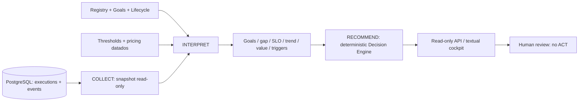
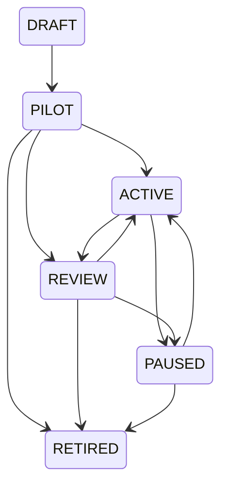

# Aula 4 complete — Operating the Agentic Workforce

## 1. Objetivo: da observabilidade à decisão operacional

Professor demonstra; alunos acompanham decisões e trade-offs. Sem live coding obrigatório.
Um sistema evolui nas quatro aulas: Enterprise Operations Control Tower de incidentes.

**Start:** IDENTIFIED + MEASURABLE AGENTIC WORKFORCE.
**Complete:** DECISION-ORIENTED AGENTIC WORKFORCE.

“Observar não é operar. Operar é transformar sinais em decisões.”

Agora perguntamos: o agente cumpre metas? Está dentro dos limites? Melhorou ou degradou?
Devemos intervir? O que recomendamos? O checkpoint **termina em RECOMMEND**, sem ACT.

### Agenda de 240 minutos (inclui o start)

| Bloco | Tempo |
|---|---:|
| Start: boundaries, Registry/lifecycle, goals, Quality, Economics e população; usar o runbook start | 100 min |
| Intervalo | 10 min |
| Teoria: metas, SLO, tendência, lifecycle, recomendação vs autorização | 25 min |
| Demo 1 — Goal Measurement | 15 min |
| Demo 2 — SLO Violation | 15 min |
| Demo 3 — Lifecycle | 15 min |
| Demo 4 — Recommendation | 20 min |
| Demo 5 — Collect → Interpret → Recommend | 15 min |
| Fechamento da disciplina | 15 min |
| Reserva para discussão/fallbacks | 10 min |

O start reserva 50 min de contexto/teoria; mais 25 aqui = **75 min explícitos**, além das discussões.
Build, instalação e geração de carga ficam prontos antes. Demos com fixtures levam menos de
um segundo de cálculo; o tempo do bloco é dedicado à explicação, não a escrever código.

## 2. Diferença entre start e complete

| Start | Complete |
|---|---|
| Cadastro e metas configuradas | Medição, actual, gap, attainment e unknown |
| Lifecycle metadata | Máquina pura de estados com transições permitidas |
| Sinais Quality/Economics | Janelas, SLOs, tendência e triggers |
| População operacional persistida | Recomendações determinísticas com evidência |
| Sem decisão de Control Plane | Proposta de intervenção; nenhuma execução automática |

Registry, HTTP/MCP, LangGraph, Redis/Celery, PostgreSQL, OTel/Jaeger, Finance e aprovação do
workflow permanecem. Nenhum novo provider, banco ou serviço.

## 3. Arquitetura



O Control Plane não executa LangGraph, não fica dentro do workflow e não consulta Jaeger para
calcular métricas. Spans `control_plane evaluate`, `goal evaluate`, `slo evaluate`, `decision engine`
ajudam a observar a avaliação. Sem prompts ou resultados privados nos spans.

### Semântica da coleta (explique em slide antes da demo)

- Snapshot consistente PostgreSQL, read-only. Últimas **6 execuções terminadas**, por criação
  decrescente e UUID como desempate. Janela atual 3, anterior 3. Não é uma janela de tempo.
- API separa `mode=mock` e `mode=openai`. Não compara custos entre modelos diferentes.
- Registry reflete configuração atual; métricas refletem a coorte histórica escolhida.
  `cohort_model` explicita o modelo histórico único (null se mock/misto). SCALE exige compatibilidade
  com o modelo configurado; outras propostas continuam condicionadas à revisão humana do contexto.
- Etapa considerada: último evento completed/failed do papel na tentativa final. Retries não
  viram múltiplas execuções. Custo inclui requests registrados do papel em todas as tentativas.
- História incompleta, etapa não observada, menos de 3 amostras ou usage parcial ⇒ **unknown**.
  Não excluir silenciosamente amostras desconhecidas para melhorar uma taxa.
- Conclusão técnica de etapa não certifica conteúdo, conformidade nem aceitação humana.
- `workflow_degraded_rate` usa outcomes não normais do workflow associado; é **contexto do
  workflow**, não nota individual nem prova de culpa do agente. Execução failed sem resultado
  deixa essa dimensão unknown; sua falha técnica pode aparecer na meta da etapa.
- Latência p95: nearest-rank das durações terminais da etapa; com 3 amostras é o máximo.
  Não é benchmark de produção nem latência incluindo fila.
- Custo: média do usage LLM registrado e atribuído ao papel, em USD. Finance/mock não têm
  usage LLM: unknown, nunca zero inventado. Sem divisão arbitrária do custo do workflow.

## 4. Preparação e configuração — antes da aula

Terminal macOS/zsh. Docker Desktop, Git, Python 3.12 e uv instalados. Não precisa chave OpenAI.
Não carregue `.keys`. Faça o checkout da branch candidata já disponível localmente:

```bash
cd '/Users/leandrolopes/Documents/ChatGPT/Disciplina Mult-Agents/agentic-operations-control-tower'
git switch codex/lesson-04-complete
git status --short
uv sync --locked --extra lesson04
LLM_MODE=mock uv run --extra lesson04 pytest -q
LLM_MODE=mock uv run --extra lesson04 control-tower smoke
```

Prepare a demo offline primeiro:

```bash
uv run --extra lesson04 python scripts/demo_lesson04_complete.py --fixture optimize --agent logistics --section pipeline
```

Esperado: `SOURCE: DIDACTIC FIXTURE`, OPTIMIZE, medium, approval=True, lifecycle active.
`openai` dentro da fixture identifica o formato dos eventos sintéticos, **não chama o provider**.
Tokens da fixture são artificiais. Não chamar esse ensaio de inferência real.

### Terminal da stack real

```bash
open -a Docker
export LLM_MODE=mock
export OTEL_ENABLED=true
export OTEL_CAPTURE_CONTENT=false
export DEMO_AGENT_DELAY_MS=0
export LOG_FORMAT=human
export API_PORT=8000
export COMPOSE_FILE=compose.yaml:compose.override.yaml:compose.lesson04.yaml:compose.lesson04-complete.yaml
docker compose config --quiet
docker compose build api
docker compose up -d --wait
curl --fail --silent --show-error http://localhost:8000/health
curl --fail --silent --show-error http://localhost:8000/ready
open http://localhost:8000/docs
```

Esperado alive/ready. Mesmos dois workers, API, Redis, PostgreSQL, Collector e Jaeger.
Imagem nova `novacore-control-tower:lesson04-complete`, preservando a imagem/tag do start.
O override monta `config/lesson04-control-plane.json` read-only na API. Nenhuma migration.

Prepare população mock com **três rodadas** da demo já existente. Cada rodada cria duas
execuções novas; mesmas identidades internas cruzadas HTTP/MCP demonstram idempotência:

```bash
uv run --extra lesson04 python scripts/demo_lesson04.py boundary
uv run --extra lesson04 python scripts/demo_lesson04.py boundary
uv run --extra lesson04 python scripts/demo_lesson04.py boundary
uv run --extra lesson04 python scripts/demo_lesson04_complete.py --live --mode mock
```

Se houver outros trabalhos concluindo simultaneamente, a população live muda. As fixtures
existem para manter a narrativa previsível sem adulterar o banco. Não apagar histórico.

### Thresholds didáticos explícitos

```bash
cat config/lesson04-control-plane.json
cat config/lesson04-pricing.json
```

| Configuração | Valor inicial |
|---|---|
| source | didactic_configured_example |
| Janelas atual/anterior | 3 execuções cada; mínimo 3 |
| Target da meta de conclusão técnica | 100%, preservado do Registry |
| Goal AT_RISK | abaixo do target por até 5 pontos percentuais |
| SLO stage completion | >=90%; WARN no lado aceitável até 5 pontos do limite |
| SLO latency p95 | <=2000 ms; WARN nos últimos 200 ms aceitáveis |
| SLO role LLM cost | <=USD 0.01; WARN nos últimos USD 0.002 aceitáveis |
| SLO workflow degradation | <=10%; WARN nos últimos 5 pontos aceitáveis |
| Tendência estável | variação relativa até 5% da janela anterior |
| Subdesempenho severo persistente | conclusão <50% em ambas as janelas |
| REVIEW high | pelo menos 2 violações high/critical |

Igual ao limite é WARN quando a margem é positiva; ultrapassar é VIOLATION. UNKNOWN não
satisfaz PASS. A meta aspiracional de 100% e o limite SLO de 90% respondem perguntas distintas.
Metas, thresholds e margens são exemplos didáticos, não políticas reais da NovaCore.

## 5. Demo 1 — Goal Measurement (15 min)

**Objetivo:** passar de “tem tarefa” para “cumpre a meta técnica observável”.
**Slide antes:** target, actual, gap=actual-target, attainment=actual/target; unknown.

```bash
uv run --extra lesson04 python scripts/demo_lesson04_complete.py --fixture stable --agent logistics --section goals
uv run --extra lesson04 python scripts/demo_lesson04_complete.py --fixture optimize --agent logistics --section goals
```

Esperado: primeiro target=100, actual=100, gap=0, ON_TARGET. Segundo actual≈66.666667,
gap≈-33.333333, OFF_TARGET: duas conclusões em três execuções observadas.
A janela anterior da segunda fixture tinha três conclusões. Não alterar o target ao vivo.

**Fala:** “Agents need goals, not just tasks. Aqui conseguimos medir conclusão técnica.
Não estamos dizendo que o fornecedor confirmou a entrega ou que o gestor aceitou a proposta.”
**Pergunta:** “O agente está apenas executando ou está cumprindo aquilo pelo qual foi criado?”
**Código (2 min):** `control_plane/collection.py:collect_stage` e
`control_plane/interpretation.py:measure_goal`. Mostrar ausência de evidência → unknown.
**Fallback:** `uv run --extra lesson04 pytest tests/test_lesson04_complete.py -k goal -v`.
**Preparado:** fixtures e coleta. Nenhum CSV, SQL ou Pydantic digitado ao vivo.

## 6. Demo 2 — SLO Violation (15 min)

**Objetivo:** funcionamento técnico não significa operação dentro do esperado.
**Slide antes:** SLO não é apenas uptime; PASS/WARN/VIOLATION/UNKNOWN, escopo e unidade.

```bash
uv run --extra lesson04 python scripts/demo_lesson04_complete.py --fixture cost --agent logistics --section slo
```

Esperado: conclusão=100%, p95=100 ms, workflow degradation=0%, custo=USD 0.02016 > 0.01.
SLO custo=VIOLATION; recomendação REVIEW. A fixture mantém a latência estável e aumenta
somente os tokens sintéticos de Logistics de 1000 para 50000 input, com 100 output.

**Fala:** “O sistema está funcionando. Mas está funcionando dentro do esperado? SLO de agente
não é apenas uptime. Token Cost ≠ Agent Cost ≠ Workflow Cost ≠ Business Value.”
**Código:** configuração JSON e `interpretation.py:evaluate_slo`; mostrar duas direções >= e <=.
**Pergunta:** “Podemos chamar esse número de custo total do agente?” Não: usage registrado apenas.
**Fallback:** `uv run --extra lesson04 pytest tests/test_lesson04_complete.py -k slo -v`.

## 7. Demo 3 — Lifecycle (15 min)

**Objetivo:** separar trigger/recommendation de autorização e alteração de estado.
**Slide antes:** registered ≠ lifecycle ≠ runtime health ≠ execution status.

```bash
uv run --extra lesson04 python scripts/demo_lesson04_complete.py --fixture review --agent logistics --section lifecycle
curl --fail --silent --show-error http://localhost:8000/agents/logistics | uv run python -m json.tool
```

Fixture: meta OFF_TARGET e violações high de conclusão/latência → REVIEW high, estado sugerido
review; o registro da fixture continua active. A segunda consulta é ao Registry real, independente
da fixture: também permanece active. Nunca apresentar isso como uma transição persistida.



RETIRED é terminal. Transições fora dessas arestas são rejeitadas.

```bash
cat src/control_tower/control_plane/lifecycle.py
uv run --extra lesson04 pytest tests/test_lesson04_complete.py -k explicit_lifecycle -q
```

**Fala:** “Operar agentes é uma disciplina de lifecycle, não apenas de runtime. A máquina
valida transições e exige autorização explícita. A função pura retorna um novo valor; não grava
no Registry nem pausa workers. O Decision Engine não chama essa função.”
**Pergunta:** “Por que não mudamos automaticamente para REVIEW?”
**Resposta:** “Recommendation is not authorization.”
**Fallback:** diagrama + testes da máquina; não simular alteração global do agente.

## 8. Demo 4 — Control Plane Recommendation (20 min)

**Objetivo:** decisão explicável sustentada por evidência, sem governance agent LLM.

```bash
uv run --extra lesson04 python scripts/demo_lesson04_complete.py --fixture optimize --agent logistics --section recommendation
```

Esperado:

```text
Logistics: lifecycle ACTIVE
Goal: OFF_TARGET (66.666667%; target 100%)
Cost: 0.00056 -> 0.02016 USD; trend DEGRADING
Latency p95: 100 ms / PASS
Workflow quality context: UNKNOWN (uma execução failed sem resultado)
Recommendation: OPTIMIZE / MEDIUM
Requires human approval: true
Lifecycle: active -> suggested none (not applied)
```

Não chamar quality de GOOD/STABLE quando essa dimensão está unknown. A regra OPTIMIZE usa
meta observada e aumento de custo, não inventa uma avaliação semântica de qualidade.

**Fala:** “LLMs interpretam e julgam. Código determinístico mede, calcula e valida. Aqui a
recomendação vem de regras transparentes, não de uma opinião gerada por outro agente.”

### Ordem das regras (primeira satisfeita vence)

1. ACTIVE e conclusão <50% nas duas janelas → **PAUSE / CRITICAL**, sugere paused.
2. Pelo menos 2 violações high/critical → **REVIEW / HIGH**, sugere review.
3. Workflow degradation acima do SLO → **INTERVENE / HIGH**, sugere review; não atribui culpa.
4. Goal OFF_TARGET e custo crescente → **OPTIMIZE / MEDIUM**, não sugere mudança de lifecycle.
5. Outra violação ou goal miss → **REVIEW / MEDIUM**.
6. Todas as metas ON_TARGET, tendências estáveis, quatro dimensões SLO PASS e qualidade=0%
   de outcomes não normais, modelo histórico compatível com o Registry → **SCALE / LOW**: avaliar experimento controlado, nunca aumentar
   workers automaticamente. Demanda/capacidade/quota precisam de verificação humana.
7. Sem evidência suficiente/regra aplicável → sem recomendação (`null`), com explicação.

Agentes fora de ACTIVE não recebem proposta automática para retomar/retirar.
RETIRE existe no enum, sem regra: o histórico atual não sustenta retirada de agentes.

Compare os outros sinais preparados:

```bash
uv run --extra lesson04 python scripts/demo_lesson04_complete.py --fixture intervene --agent logistics --section recommendation
uv run --extra lesson04 python scripts/demo_lesson04_complete.py --fixture pause --agent logistics --section recommendation
```

Esperado INTERVENE high e PAUSE critical; ambos approval=True e lifecycle inalterado.
**Código:** `decision_engine.py:recommend` (precedência, evidence, identidade estável, sem ACT).
**Pergunta:** “Por que toda recomendação tem evidência, unidade, escopo, prioridade e aprovação?”
**Fallback:** `uv run --extra lesson04 pytest tests/test_lesson04_complete.py -k decisions -v`.

## 9. Demo 5 — Collect → Interpret → Recommend (15 min)

Primeiro sintetize tudo com a fixture offline identificada:

```bash
uv run --extra lesson04 python scripts/demo_lesson04_complete.py --fixture optimize --section cockpit
uv run --extra lesson04 python scripts/demo_lesson04_complete.py --fixture optimize --agent logistics --section pipeline
```

Depois mostre a população real, sem garantir a mesma recomendação da fixture:

```bash
uv run --extra lesson04 python scripts/demo_lesson04_complete.py --live --mode mock
curl --fail --silent --show-error 'http://localhost:8000/control-plane/agents/logistics?mode=mock' | uv run python -m json.tool
curl --fail --silent --show-error 'http://localhost:8000/control-plane/recommendations?mode=mock' | uv run python -m json.tool
```

API read-only:

- GET `/control-plane/agents?mode=mock`: overview dos sete agentes.
- GET `/control-plane/agents/{agent_id}?mode=mock`: Registry, metas, SLO, qualidade, economics,
  tendências, valor parcial, triggers e recomendação.
- GET `/control-plane/recommendations?mode=mock`: apenas recomendações suportadas; pode ser `[]`.
- `mode=openai` lê histórico OpenAI existente; **não faz novas chamadas**.
- Agent desconhecido 404; modo inválido 422; store/config indisponível 503 sanitizado.
- Não há POST/PATCH de decisão ou lifecycle, nem novas tools MCP.

Com seis execuções mock recentes normais: metas ON_TARGET, mas custo/trend de custo unknown;
**sem SCALE automático**. Ausência de recomendação é resposta válida. Com menos amostras,
as próprias metas/SLOs ficam unknown.

**Fala:** “Control Tower opera o processo. Control Plane opera a força de trabalho agêntica.
Control Plane não precisa controlar tudo. Ele precisa transformar sinais em decisões melhores.”

### Execution Cost ≠ Business Value

A view detalhada mostra USD estimado para usage por papel e BRL para custo do cenário proposto.
BusinessValueAssessment também traz tempo de runtime até proposta (ms) como proxy parcial:
última tentativa, exclui fila e decisão humana, não prova ganho de tempo.
Valor realizado permanece unknown. Aprovação e execução efetiva não foram observadas.
Não afirmar “R$140k saved”; não converter moedas, inventar ROI ou tratar proposta como benefício.

**Código:** `service.py:ControlPlane.evaluate`: coleta, interpretação, recomendação. Não percorra
SQL/infraestrutura. `runtime/store.py:control_plane_samples` só se surgir pergunta sobre consistência.
**Fallback:** usar `--fixture` em vez de `--live`; sempre anunciar a mudança de fonte.

## 10. Perguntas para discussão

- Uma etapa completed pode produzir uma análise ruim? Sim; conclusão técnica não é qualidade semântica.
- Unknown permite escalar? Não; ausência de medida não prova operação aceitável.
- ACTIVE significa healthy? Não; lifecycle e runtime health são dimensões separadas.
- Um trigger altera lifecycle? Não; produz um sinal de revisão.
- Por que SCALE não liga workers? Recomendação não é autorização nem prova de capacidade do provider.
- O custo de tokens mede valor de negócio? Não.
- Se mudarmos preço ou thresholds, a recomendação pode mudar? Sim; é projeção da configuração atual.

## 11. Troubleshooting e regressão

- `ModuleNotFoundError`: repetir `uv sync --locked --extra lesson04`.
- 404 nos endpoints novos: imagem antiga; repetir build/up com os quatro arquivos Compose.
- 503: conferir `config/lesson04-control-plane.json`, pricing e `/ready`; não imprimir `.keys`/DSNs.
- Finance/mock com cost unknown: esperado. Não preencher zero para fazer o SLO passar.
- Todos unknown: menos de 3 execuções terminadas ou histórico incompleto. Preparar carga acima.
- Resultado live diferente da fixture: fontes/coortes diferentes. A fixture é controle didático.
- Histórico de modelos diferentes: tendência de custo unknown por falta de comparabilidade.
- Docker/provider/rede indisponíveis: todas as cinco demos com `--fixture` rodam offline após instalação.
- Atualizar página Swagger se schema estiver antigo. Não mudar tags para resolver ambiente.

Regressão com stack ligada:

```bash
LLM_MODE=mock LESSON02_INTEGRATION=1 LESSON03_INTEGRATION=1 LESSON03_TRACING_INTEGRATION=1 LESSON04_INTEGRATION=1 uv run --extra lesson04 pytest -q
LLM_MODE=mock uv run --extra lesson04 control-tower smoke
```

Encerramento, após a carga terminar:

```bash
docker compose down
```

Sem `-v`; preservar histórico. Não executar testes de SIGKILL junto com esta demo.

## 12. Limitações deliberadas

- Decision Engine rule-based e thresholds didáticos; janelas pequenas, sem forecasting/ML.
- Metas medem conclusão técnica. Quality is a vector before it becomes a score.
- Business Value parcial; sem valor realizado, human acceptance, economias/ROI inventados.
- Projeções read-only; recommendations não são persistidas. Mesmo conjunto de evidências/config gera
  mesmo recommendation_id; generated_at é o momento da avaliação. Config/pricing atuais reavaliam história.
- Lifecycle State Machine pura, sem histórico/persistência ou workflow de governança; nenhuma
  transição automática, auto-remediation, auto-modify, prompt rewriting ou model switching.
- Sem LLM-as-a-Judge sofisticado, enterprise governance/RBAC, frontend SPA ou dashboard completo.
- Sem Maestro, Second Brain ou Learning Loop implementados.
- Não é uma plataforma de produção. RETIRE sem regra; SCALE só propõe experimento condicionado.
- A aprovação da recomendação do Control Plane é separada da aprovação do incidente; nenhuma é executada.

## 13. Fechamento da disciplina (conceitual, sem implementar)

**MAESTRO:** “Supervisor coordinates one workflow. Maestro coordinates the workforce.”

**SECOND BRAIN:** “Validated agent outcomes become organizational memory.” Um resultado gerado
não vira conhecimento validado apenas por ter sido persistido.

**LEARNING LOOP:**

```text
Goal → Execution → Outcome → Measurement → Feedback → Knowledge
     → Adaptation → Next Execution
```

Learning Loop ≠ uncontrolled self-modification. Mudança exige evidência, avaliação e autorização.

### Arco final

```text
AULA 1: Agents can collaborate.
↓
AULA 2: Agents can execute concurrently and survive failures.
↓
AULA 3: The runtime can be deployed and observed.
↓
AULA 4 START: The workforce can be identified and measured.
↓
AULA 4 COMPLETE: The workforce can be interpreted and managed.
↓
VISION: The organization can coordinate, remember and learn.
```

“Managed” neste checkpoint significa apoio à decisão humana. A fronteira implementada é:
**COLLECT → INTERPRET → RECOMMEND**. Não Collect → Interpret → Auto-modify.
