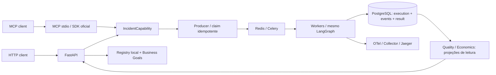

# Aula 4 — Operating the Agentic Workforce

## Da observabilidade à decisão operacional

**Checkpoint: candidato `lesson-04-start` — parar nos inputs do futuro Control Plane.**
Professor demonstra; alunos observam decisões e trade-offs. Não há exercício de programação.
Aula 3 terminou: “We can expose and observe the runtime.” Agora: “Como começamos a operá-lo?”

Narrativa: HTTP é a única boundary? → MCP → o que existe? → Registry → o que deve entregar?
→ Business Goals → completou bem? → Quality → quanto custou? → Economics.

Mensagem final: sabemos identificar a workforce e consultar sinais de execução. Ainda não
implementamos um motor que decide o que fazer com esses sinais.

## Agenda deste checkpoint (100 minutos dentro da Aula 4)

| Bloco | Tempo | Objetivo |
|---|---:|---|
| Contexto e teoria: boundary, identidade, qualidade e custo | 30 min | Problema antes da ferramenta |
| Demo 1A/1B — Same Capability, Different Boundary | 15 min | Duas entradas, mesma capability |
| Demo 2 — Agent Registry + Goals | 10 min | Identidade, responsabilidade e expectativa |
| Teoria: status, qualidade e incerteza | 10 min | Preparar leitura de null/fallback |
| Demo 3 — Normal vs Degraded | 15 min | Conclusão não implica equivalência |
| Teoria: usage, pricing, cost e business value | 10 min | Medida vs configuração vs estimativa |
| Demo 4 — First Execution Economics | 10 min | Ler dados disponíveis sem inventar custo |

Este start não é a agenda completa de 240 minutos. Reserve no planejamento final **ao menos
60–80 minutos de teoria/contexto na aula inteira**. O complete ainda não foi implementado.
Build, instalação, mudança de perfil e inspeção longa de código devem ser ensaiados antes.

## Arquitetura e diferenças da Aula 3



- Nenhum novo grafo, agente, banco ou broker. Finance permanece determinístico.
- `application.py` reúne submissão e projeções públicas anteriormente na API. HTTP e MCP chamam
  os mesmos métodos; somente o producer publica, somente workers executam o grafo.
- MCP expõe 3 tools: `submit_incident`, `get_execution_status`, `get_execution_result`.
- O contrato de submit usa `request: IncidentSubmissionRequest`: um objeto contendo os mesmos
  campos públicos do POST. Não envia IncidentState. Resultado/consulta usam os mesmos Pydantic da API.
- MCP roda por stdio como processo com role adicional **na mesma imagem**. O helper usa
  `docker compose exec -T api python -m control_tower.mcp.server`; isso não chama o endpoint HTTP.
- HTTP e MCP são interfaces da capability `analyze-reference`. Os agentes são nós internos,
  não sete endpoints HTTP ou sete MCP servers.
- Registry: status `registered` significa cadastro, **não health check**; model/type representam
  configuração atual do runtime, não configuração histórica de uma execução.
- Quality/Economics leem PostgreSQL. Não consultam Jaeger nem escrevem avaliações retroativas.
- Usage de OpenAI já era persistido por `ResilientInterpreter` nos eventos `llm.completed`.
  Leitura adicional das opções persistidas recupera o modelo original, mesmo após voltar a mock.
  Não há migração de banco nem mudança no store congelado da Aula 2.

## Preparação antes da aula

Pré-requisitos: Git, Docker Desktop em execução, Python 3.12 e `uv`. Use o checkout do candidato
aprovado para ensaio. Não mude tags. Comandos abaixo para Terminal macOS/zsh na raiz do repo.
Não execute cargas OpenAI pendentes enquanto muda os perfis. Aguarde execuções terminarem.

```bash
cd '/Users/leandrolopes/Documents/ChatGPT/Disciplina Mult-Agents/agentic-operations-control-tower'
git branch --show-current
git status --short
uv sync --locked --extra lesson04
uv run --extra lesson04 pytest
uv run --extra lesson04 control-tower smoke
open -a Docker
```

Espere Docker indicar que o engine está pronto. Prepare ambiente **mock** sem carregar `.keys`:

```bash
export LLM_MODE=mock
export OTEL_ENABLED=true
export OTEL_CAPTURE_CONTENT=false
export DEMO_AGENT_DELAY_MS=0
export LOG_FORMAT=human
export API_PORT=8000
export COMPOSE_FILE=compose.yaml:compose.override.yaml:compose.lesson04.yaml
docker compose config --quiet
docker compose build api
docker compose up -d --wait
curl --fail --silent --show-error http://localhost:8000/health
curl --fail --silent --show-error http://localhost:8000/ready
open http://localhost:8000/docs
```

Esperado: `alive`, depois `ready`, Redis/PostgreSQL `ok`. Dois workers, API, Collector e Jaeger
continuam na topologia aprovada. A imagem candidata é `novacore-control-tower:lesson04-start`.
O extra `lesson04` inclui `lesson03` e o SDK oficial MCP 1.x (versão efetiva no lockfile).
Não atualize todas as dependências nem instale frameworks adicionais.

Validação opcional com integrações do banco e traces (stack ligado):

```bash
LESSON02_INTEGRATION=1 LESSON03_INTEGRATION=1 LESSON03_TRACING_INTEGRATION=1 LESSON04_INTEGRATION=1 \
  uv run --extra lesson04 pytest
```

A suíte default não chama provider real; integrações são opt-in. Mock permanece offline após
instalação/imagens disponíveis. A UI Swagger pode precisar carregar assets de CDN.

## Demo 1A — SDK MCP Client (15 min; alternativa à 1B)

**Problema:** HTTP é a única boundary possível?

**Hipótese:** outro protocolo pode consumir a mesma capability sem alterar seu core.

**Evidência:** HTTP e MCP publicam via mesmo producer, compartilham identidade e resultado.

### Fala antes

> “A Aula 3 nos deu um serviço. Hoje vamos mudar a forma de acessá-lo. Não precisamos construir
> outra inteligência nem outro workflow para isso. Service Boundary é o princípio; HTTP e MCP
> são formas diferentes de expor capacidades.”

Execute:

```bash
uv run --extra lesson04 python scripts/demo_lesson04.py boundary
```

O helper realiza chamadas reais, nesta ordem:

1. `POST /incidents` HTTP com incidente `L04-HTTP`, versão nova e delay **artificial** de 1 segundo.
2. Inicialização da sessão MCP e `tools/list` (SDK, JSON-RPC, stdio real).
3. `submit_incident` MCP com a **mesma identidade**: mesmo UUID, `created=false`.
4. `submit_incident` MCP com `L04-MCP`: outra execução.
5. `get_execution_status` MCP lê a execução criada pelo HTTP.
6. HTTP acompanha os dois UUIDs até completed, mostrando worker e duração.
7. `get_execution_result` MCP e GET HTTP comparam o mesmo resultado público.
8. Guarda UUIDs em `artifacts/lesson04-demo.json` para as próximas demos.

Output curto esperado (UUID/worker/duração variam):

```text
HTTP accepted: <id> | queued | worker=- | duration_ms=None
MCP tools: submit_incident, get_execution_status, get_execution_result
HTTP → MCP same identity: same execution_id, created=false (durable idempotency)
MCP accepted: <outro-id> | queued | worker=- | duration_ms=None
HTTP status: <id> | completed | worker=worker-a@... | duration_ms=...
HTTP = MCP public result | outcome=recommendation | approval=pending | actions=false
Same capability, different boundary.
```

Queued/running podem passar entre consultas; não é falha. `created=false` é idempotência,
não duplicação do workflow. Uma sessão MCP não exige usar um LLM como cliente nesta demo.

### Código que vale mostrar (2 min dentro do bloco)

```bash
sed -n '1,120p' src/control_tower/application.py
cat src/control_tower/mcp/tools.py
```

Mostre `submit_incident` → `self.enqueue`, e os três adaptadores curtos. A API chama o mesmo
método. Não percorra SDK/JSON-RPC/implementação Celery. Abra `api/app.py` apenas para apontar o call.

**Pergunta:** “Workflow, agents, LangGraph, Redis ou PostgreSQL mudaram?”

**Resposta:** não; mudou a boundary e o código comum de entrada foi extraído.

**Mensagem:** “MCP não torna a capability inteligente. Ele a torna acessível de forma agent-native.”

**Tracing:** com OTel habilitado, `mcp tool submit_incident` inicia um span real do SDK OTel e
propaga contexto pelo publisher Celery existente até o worker. O cliente stdio deste checkpoint
não envia um parent W3C remoto: o trace inicia no servidor MCP. Não afirmar trace cliente→servidor.
Sem OTel, `trace_id` continua identificador de correlação histórico, não prova de trace exportado.
Logs do MCP vão para stderr; stdout é reservado ao protocolo. O helper guarda stderr em
`artifacts/lesson04-mcp.log` e informa o caminho para não poluir a projeção.

**Fallback da demonstração:** se o cliente falhar, confira os UUIDs no HTTP e use os testes
MCP offline. Não apresente testes como execução distribuída real:

```bash
uv run --extra lesson04 pytest tests/test_lesson04.py -k mcp -v
```

## Demo 1B — Codex as MCP Client (15 min; alternativa à 1A)

Ensaie antes e escolha **1A ou 1B** para o bloco de 15 minutos. Se mostrar as duas, reserve
10 minutos adicionais. A 1A continua sendo o fallback reproduzível e prepara os UUIDs para
as demos seguintes; execute-a antes da aula se optar pela 1B ao vivo.

### Preparar e registrar (antes da aula)

Mantenha a stack **mock** da preparação ligada. O launcher resolve a raiz do repositório,
usa `exec -T` (sem pseudo-terminal) e inicia o mesmo servidor stdio dentro da imagem da API.
O container hospeda o processo; **nenhuma tool chama HTTP**. Docker ausente produz erro em
stderr. Não execute o launcher sozinho esperando uma interface visual: ele aguarda JSON-RPC.

No Terminal macOS, copie:

```bash
cd '/Users/leandrolopes/Documents/ChatGPT/Disciplina Mult-Agents/agentic-operations-control-tower'
CODEX_BIN="$(command -v codex || true)"
if [ -z "$CODEX_BIN" ]; then
  CODEX_BIN=/Applications/ChatGPT.app/Contents/Resources/codex
fi
"$CODEX_BIN" --version
"$CODEX_BIN" mcp add novacore -- /bin/bash "$PWD/scripts/start_lesson04_mcp.sh"
"$CODEX_BIN" mcp get novacore
"$CODEX_BIN" mcp list
"$CODEX_BIN"
```

Esses comandos registram o servidor local no Codex do professor. `mcp list` confirma cadastro,
**não prova execução de tools**. Dentro da sessão interativa digite `/mcp`, veja `novacore`
conectado e as três tools. Se houver aprovação para tools, revise o nome e os argumentos.
Mantenha as aprovações normais. Não habilite bypass de segurança.

Configuração equivalente em `~/.codex/config.toml` (use registro CLI acima **ou** esta entrada;
não duplique a seção). Troque o caminho somente se seu checkout estiver em outro local:

```toml
[mcp_servers.novacore]
command = "/bin/bash"
args = ["/Users/leandrolopes/Documents/ChatGPT/Disciplina Mult-Agents/agentic-operations-control-tower/scripts/start_lesson04_mcp.sh"]
startup_timeout_sec = 30
tool_timeout_sec = 60
```

### Prompts para copiar, um de cada vez

1. “Use somente o servidor MCP novacore, sem shell ou chamadas HTTP. Liste as tools disponíveis
   e explique brevemente o contrato de submit_incident.”
2. “Submeta usando submit_incident com request: incident_id=L04-CODEX,
   version=codex-demo-01, reference_case_id=INCIDENT-001, demo_delay_ms=1000,
   llm_failure=none, fallback=human. Mostre o execution_id retornado.”
3. “Consulte get_execution_status para o execution_id que acabou de receber. Mostre status,
   worker responsável e duração. Se ainda estiver queued/running, consulte novamente quando eu pedir.”
4. “Recupere get_execution_result para essa mesma execução. Se estiver pendente, diga que
   devemos aguardar; não invente resultado.”
5. “Resuma o resultado público da Control Tower em três frases. Distinga recommended_action,
   estimated_cost_brl do cenário industrial e aprovação pendente. Confirme actions_executed=false.”

Nova rodada: altere a versão para `codex-demo-02`, `codex-demo-03`, etc. Repetir exatamente a
identidade/corpo reutiliza o UUID (`created=false`); alterar opções sem mudar version gera conflito.
O envelope continua replay do mesmo case de referência, não outro workflow empresarial.

```text
Codex → MCP → IncidentCapability → Producer → Redis/Celery
      → Worker → LangGraph → Agents → Recommendation
```

**Fala:** “O cliente descobriu capacidades, enviou trabalho e interpretou um resultado público.
Same capability, different boundary. O Codex pode usar seu próprio modelo; o workflow do
servidor continua em mock offline. Aprovação humana permanece obrigatória.”

**Mostrar no código:** `scripts/start_lesson04_mcp.sh`, depois os três adaptadores em
`src/control_tower/mcp/tools.py` e sua chamada à `IncidentCapability`. Não explicar internals
JSON-RPC nem abrir prompts internos.

**Esperado:** três tools; UUID aceito; status completed; outcome recommendation;
approval_status pending; actions_executed false. Status intermediários podem passar rápido.
O cliente só recebe a projeção pública curta, não a justificativa interna integral do LLM.

**Fallback:** se autenticação/rede do Codex ou startup do cliente falhar, execute a Demo 1A.
Logs normais ficam em stderr; stdout pertence ao protocolo. Não adicione `echo` ao launcher.

Sintaxe: [documentação oficial de MCP no Codex](https://learn.chatgpt.com/docs/extend/mcp?surface=cli).
Conexão real validada no Codex CLI 0.155.0-alpha.16.4 em sessão `exec` temporária: descoberta
das três tools, submit, status e result, terminando completed/mock/pending/actions=false.
A interface Desktop e a sessão interativa `/mcp` não foram operadas neste ensaio.
**Codex interactive client not validated in this execution environment.**
A validação efetivamente realizada e seus limites estão em
[refinement-validation.md](lesson-04/refinement-validation.md).

## Mini Demo — GET /incidents (3 min dentro da Demo 2)

```bash
curl --fail --silent --show-error http://localhost:8000/incidents | uv run python -m json.tool
curl --fail --silent --show-error 'http://localhost:8000/incidents?status=completed&limit=10' | uv run python -m json.tool
```

**Fala:** “Agora conseguimos observar não apenas uma execução conhecida, mas a população
operacional persistida. Control Plane trabalha sobre uma população de agentes e execuções,
não apenas sobre um UUID isolado.”

Cada linha representa uma operação persistida: `incident_id` pode se repetir; `execution_id`
identifica a execução. Contrato: incident_id, execution_id, version, status, outcome,
approval_status, created_at, completed_at. Não contém IncidentState, eventos, prompts ou payload.
`version=null`: a versão original não é persistida separadamente do hash de idempotência;
não é defensável reconstruí-la. Isso não muda a idempotência do POST.
Datas vêm do banco/documento; completed_at fica null enquanto ausente. Outcome/aprovação
ficam null sem resultado. Ordenação: created_at DESC, desempate execution_id DESC.
Limit padrão 20, mínimo 1, máximo 100. Status: queued, running, completed, failed.
Parâmetro inválido: 422; banco vazio: []; banco indisponível: 503 sanitizado.
Não há paginação nem tool MCP adicional para listar incidentes.

**Código (30 segundos):** GET em `api/app.py` → `IncidentCapability.list_incidents` em
`application.py` → projeção em `runtime/store.py`. SQL fica fora do endpoint.
**Fallback:** use `uv run --extra lesson04 pytest tests/test_lesson04_refinements.py -k incident -v`
e deixe explícito que é contrato testado com fixture, não população real.

## Demo 2 — Registry e Business Goals (10 min)

**Problema:** como sabemos o que existe?

**Hipótese:** identidade, ownership e metas tornam a workforce identificável.

**Evidência:** sete registros reais, Finance sem modelo, metas explicitamente didáticas.

```bash
uv run --extra lesson04 python scripts/demo_lesson04.py registry
uv run --extra lesson04 python scripts/demo_lesson04.py registry supply
curl --fail --silent --show-error http://localhost:8000/agents/finance | uv run python -m json.tool
```

Alternativa Swagger: GET `/agents` → Try it out → Execute. Depois GET `/agents/{agent_id}`,
preencher `supply`, executar; repetir com `finance`.

### Fala

> “Nós já tínhamos esses agentes. O cadastro agora explicita identidade, papel, responsáveis,
> versão, execução, tools e expectativas. Registered não significa que o agente está saudável.
> Em mock ele é determinístico; em OpenAI alguns papéis usam síntese LLM. Finance segue código.”

Mostre as metas de Supply: métrica ligada à conclusão da evidência da etapa, janela por execução,
target ilustrativo 100% (sucesso=100%, falha=0%), `target_source=didactic_configured_example`.
Não são KPIs reais da NovaCore; não há avaliação automática completa de metas neste checkpoint.
Não afirmar que “conclusão da evidência” prova fornecedor comercialmente disponível.

```bash
sed -n '1,150p' src/control_tower/control_plane/registry.py
```

**Pergunta:** “Sabemos quem é, quem responde por ele e o que deve entregar?”

**Mensagem:** “Você não consegue operar uma força de trabalho que não consegue identificar.”

**Fallback:** Registry é local e não depende do banco; se a API falhar, inspecione a configuração
no código e rode `uv run --extra lesson04 pytest tests/test_lesson04.py -k registry -v`.

## Demo 3 — Normal vs Degraded Quality (15 min)

**Problema:** completed significa execução boa?

**Hipótese:** status de runtime e qualidade são dimensões diferentes.

**Evidência:** normal e degraded terminam completed, com outcomes diferentes.

Primeiro garanta que Demo 1 terminou. Os UUIDs normais permanecem no PostgreSQL e no arquivo local.
Ative o perfil de falha artificial **já existente da Aula 3**:

```bash
export COMPOSE_FILE=compose.yaml:compose.override.yaml:compose.lesson04.yaml:compose.lesson03-failure.yaml
docker compose up -d --wait
uv run --extra lesson04 python scripts/demo_lesson04.py degraded
uv run --extra lesson04 python scripts/demo_lesson04.py quality
```

**Nenhuma chave real e nenhuma chamada OpenAI necessária.** O perfil usa placeholder e o helper
sempre envia `llm_failure=timeout`: a falha ocorre antes da rede. Não execute Demo 1 nem POST sem
`llm_failure=timeout` nesse perfil. O retry é de request, seguido de fallback do case validado.
Não use esse perfil para worker loss/SIGKILL.

### Output e fala

```text
normal: outcome_type=recommendation, fallback_used=false, human_review_required=true
        approval_status=pending, evidence_complete=null, policy_compliant=null
degraded: outcome_type=degraded_recommendation, fallback_used=true, human_review_required=true
          approval_status=pending, evidence_complete=null, policy_compliant=null
```

O helper mostra esses campos em linhas curtas. Ambos completed. Confiança é copiada do resultado
existente (0.65 no case), **não probabilidade calibrada** e não nota criada por este módulo.
A recomendação normal também exige aprovação humana: human_review_required não é defeito.
`evidence_complete` e `policy_compliant` ficam unknown porque o resultado persistido não contém
avaliação suficiente para certificar completude/conformidade. Não fabricar inferência histórica.

> “Completed responde se o runtime concluiu. Quality responde outras perguntas: houve degradação,
> precisamos de revisão, que evidências estão disponíveis? Quality is a vector before it becomes
> a score. Null é informação sobre nosso limite, não autorização para inventar um valor.”

```bash
cat src/control_tower/control_plane/quality.py
```

**Pergunta:** “As duas completaram. São equivalentes?”

**Conclusão:** “Completed é status. Quality exige outros sinais.”

**Fallback:** usar testes normal/degraded; manter explícito que são fixtures. Caso pare em queued,
verificar workers e consultar eventos antes de atribuir isso ao LLM.

### Voltar para mock (obrigatório depois da demo)

```bash
export COMPOSE_FILE=compose.yaml:compose.override.yaml:compose.lesson04.yaml
export LLM_MODE=mock
docker compose up -d --wait
curl --fail --silent --show-error http://localhost:8000/agents/supply | uv run python -m json.tool
```

Esperado: Supply deterministic/model=null. O resultado degraded histórico continua degraded.
A classificação da execução não depende do modo atual do Registry.

## Demo 4 — First Execution Economics (10 min)

**Problema:** quanto custou chegar ao resultado?

**Hipótese:** usage registrado permite uma estimativa configurável, sem confundir custo e valor.

**Evidência:** chamadas, tokens, retry e fallback vêm do histórico durável.

```bash
uv run --extra lesson04 python scripts/demo_lesson04.py economics
```

Usa o UUID normal salvo na Demo 1. Esperado:

```text
llm_calls: 0
input_tokens: unavailable
output_tokens: unavailable
retry_count: 0
fallback_used: False
estimated_llm_cost: unavailable
estimated_execution_cost: unavailable
cost_source: mock_no_usage
```

Mock não inventa inference nem custo. O `estimated_cost_brl=12500.00` da recomendação é custo
**do cenário industrial**, não preço do workflow. Não usar esse número como custo do agente.

Para ler a execução degraded salva, sem copiar UUID manualmente:

```bash
DEGRADED_ID=$(uv run python -c 'import json; print(json.load(open("artifacts/lesson04-demo.json"))["degraded"])')
uv run --extra lesson04 python scripts/demo_lesson04.py economics "$DEGRADED_ID"
```

Esperado para falha artificial: 2 tentativas de request registradas, 1 retry de LLM, fallback=true,
**tokens e custo indisponíveis**. `llm_calls` conta tentativas registradas, inclusive simuladas;
não é contador de requests faturados. `task_retry_count` distingue retry de task do retry de LLM.

### Usage real já existente (opcional; não necessário para a aula)

A API pode ler qualquer UUID real do mesmo banco, sem disparar outra inferência. Copie o UUID de
uma execução OpenAI previamente validada e substitua o valor solicitado pelo `read`:

```bash
read 'REAL_ID?Cole o UUID de uma execução OpenAI já existente: '
uv run --extra lesson04 python scripts/demo_lesson04.py economics "$REAL_ID"
```

Se não existe execução real, não inventar. Use mock e o teste de cálculo controlado abaixo.
Este checkpoint não inclui execução OpenAI paga automática em seu ensaio padrão.

### Pricing reference — gpt-4.1-mini / 2026-10-02

O exercício já contém uma referência pública datada em `config/lesson04-pricing.json`.
A API monta o arquivo e usa `CONTROL_TOWER_PRICING_FILE`. Fora do Compose, variável ausente
continua significando pricing não configurado.

| Campo | Valor |
|---|---|
| version | openai-public-pricing-2026-10-02 |
| source | OpenAI public API pricing |
| reference_date | 2026-10-02 |
| Model | gpt-4.1-mini |
| Input | USD 0.40 / 1M tokens |
| Cached input | USD 0.10 / 1M tokens |
| Output | USD 1.60 / 1M tokens |

Fonte: [página oficial do gpt-4.1-mini](https://developers.openai.com/api/docs/models/gpt-4.1-mini).
“Esta é uma configuração didática baseada no preço público da data de referência. Preços
podem mudar depois dessa data.” Valores monetários são strings decimais, calculados com Decimal.

Não temos cached_input_tokens persistidos. Guardamos a tarifa, **não aplicamos desconto**:
`cached_input_discount_applied=false`. Todo input registrado usa a tarifa padrão; não afirmar
que cache foi zero. “Pricing capability is richer than current measurement capability.”

```text
estimated_llm_cost = (input_tokens × 0.40 + output_tokens × 1.60) / 1_000_000
10117 input + 831 output → USD 0.0053764
```

O exemplo só representa execução real se esses tokens estiverem persistidos no banco consultado.
Não dependa de UUID local em outra instalação. Sem histórico real, use o teste offline abaixo
como exemplo aritmético identificado como fixture.

Três leituras possíveis no output:

| Situação | Tokens | estimated_llm_cost | cost_unavailable_reason |
|---|---|---|---|
| A. Mock | unavailable | unavailable | mock_no_usage |
| B. Usage completo + modelo + tabela | measured | estimativa em USD | null |
| C. Usage real, modelo sem tarifa | measured | unavailable | model_not_priced |

Modelo ausente: `model_unavailable`; usage ausente/parcial: `usage_unavailable_or_partial`.
A conta cobre somente `cost_scope=recorded_usage_only_not_invoice`. Falhas podem consumir tokens não
informados. Não cobre infraestrutura, ferramentas, APIs terceiras, trabalho humano, engenharia,
impacto de negócio, cenário industrial ou faturamento real do provider.
`estimated_execution_cost=null` permanece. Pricing é aplicado na consulta, não é snapshot de
fatura histórica: mudar a tabela muda a estimativa, nunca os eventos. `pricing_version` e
`reference_date` identificam a referência utilizada quando há custo disponível.

```bash
cat config/lesson04-pricing.json
uv run --extra lesson04 pytest tests/test_lesson04_refinements.py -k "pricing or estimate or cost" -v
```

Mostre apenas os contratos e a expressão de cálculo:

```bash
cat src/control_tower/control_plane/economics.py
```

**Pergunta:** “Falhas são apenas um problema de confiabilidade?”

**Mensagem:** “Reliability também possui consequência econômica. Provider usage é medido.
Pricing é configurado. Cost é estimado. Token Cost ≠ Agent Cost ≠ Workflow Cost ≠ Business Value.”

## APIs novas / erros

| Endpoint | Retorno | Ausência |
|---|---|---|
| GET /incidents | lista de IncidentSummary | [] se banco vazio |
| GET /agents | 7 AgentRecords | não depende do banco |
| GET /agents/{agent_id} | AgentRecord público | 404 |
| GET /executions/{id}/quality | QualityAssessment | 404 |
| GET /executions/{id}/economics | ExecutionEconomics | 404 |

UUID inválido: 422. Store/histórico/configuração inválidos: 503 sanitizado. MCP devolve tool error
com mensagem pública; não exporta IncidentState, prompts, chave, DSN ou resposta LLM integral.
Health/readiness, POST, status/events/result da Aula 3 continuam com os mesmos contratos.

## Troubleshooting e fallbacks

- `No module named mcp/celery/psycopg`: `uv sync --locked --extra lesson04`; rode com esse extra.
- Docker indisponível: abrir Docker Desktop; aguardar engine. Não apagar volumes para corrigir.
- `unknown endpoint /agents`: imagem antiga; conferir COMPOSE_FILE e executar build/up acima.
- `409`: mesma identidade com opções diferentes. Helper cria versão nova por demo; para request
  manual use outra version para nova operação. Reenvio de mesma operação mantém corpo/version.
- Queued prolongado: `docker compose ps` e `docker compose logs --tail 40 worker-a worker-b`.
- Erro MCP: manter `-T`; não inserir logs em stdout. Não executar o server diretamente esperando
  uma UI: ele aguarda mensagens JSON-RPC. Use o helper com cliente SDK.
- `503` Economics: conferir JSON de pricing, moeda e permissões do arquivo montado. Não imprimir
  `.env`, `.keys` ou configuração resolvida que contenha secrets.
- `usage_unavailable`: esperado para timeout artificial e histórico sem usage; não é zero tokens.
- Collector fora: runtime deve continuar. Inspecione resultado em PostgreSQL via API.
- Perfil de falha esquecido: voltar a COMPOSE_FILE de 3 arquivos e LLM_MODE=mock; recriar containers.
- Reiniciar o terminal: reexportar COMPOSE_FILE e ambiente. IDs continuam em artifacts/lesson04-demo.json.

Encerramento, quando todas as execuções terminarem:

```bash
docker compose down
```

Não usar `down -v`, purge, nem remover histórico. Para preservar ambiente em execução, não encerrar.

## Limitações e fronteira com lesson-04-complete

- Registry simples/local, não enterprise discovery; ownership/targets são configuração didática.
- Metas estruturadas, sem full automated measurement, human acceptance ou KPIs inventados.
- Quality signal-based, sem LLM-as-a-Judge, score global ou auditoria completa de políticas.
- Economics por execução, sem atribuição monetária por agente, business value, infraestrutura
  ou faturamento real; não depende de backend best-effort de observabilidade.
- MCP adicional, stdio local, não substitui HTTP. Sem auth remota, routing ou MCP avançado.
- Sem Control Plane recommendation engine, SLO evaluation, lifecycle decisions, SCALE/PAUSE/etc.,
  Maestro, Second Brain, learning loop, model switching, Kubernetes, autoscaling ou dashboard.
- Nenhuma ação automática, compra, transporte, transferência ou auto-modification.
- O futuro complete deverá decidir como usar esses inputs; não existe decisão implementada aqui.

| Future Control Plane | Agora |
|---|---|
| Registry / Business Goals | configuração estruturada |
| Quality / Economics | sinais consultáveis |
| Business Value / SLO / Decision Engine / Lifecycle | não implementados |

Fonte do SDK: [MCP Python SDK oficial, linha 1.x](https://github.com/modelcontextprotocol/python-sdk/tree/v1.x).
Pin `<2` mantém esta API compatível; versão exata é fixada em `uv.lock`.
