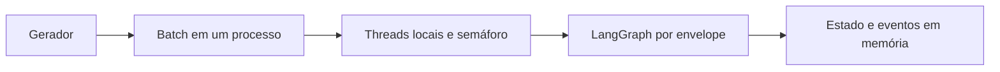
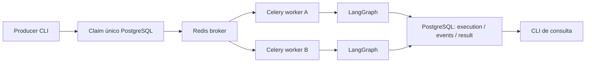

# Guided Demo / Observation Guide — Aula 2

**Execução Distribuída e Escala** — De um workflow multiagente para uma operação concorrente e resiliente.
Os alunos acompanham decisões e experimentos; não escrevem código durante a aula.

## Problema

“Funcionou para 1 incidente. O que acontece quando chegam 500?”
O gerador reproduz 120 atrasos de fornecedor, 85 desvios de produção, 140 eventos logísticos,
65 riscos de SLA e 90 eventos de estoque. São envelopes sintéticos de chegada.
O workload técnico continua sendo o workflow de INCIDENT-001, repetido para cada envelope.
As seis demos originais usam mock; dois blocos curtos adicionais usam OpenAI/falha artificial.
Não inferir novas recomendações específicas para cada categoria/planta.

## Arquitetura antes (start preservado)



## Arquitetura implementada no complete



Cada worker adquire lock de sessão PostgreSQL antes de executar. A recomendação final continua
aguardando aprovação humana. Não há ações de compra/transporte/transferência.

## Seis demonstrações

| Demo | Observar | Comandos principais | Resultado esperado | Pergunta |
|---|---|---|---|---|
| 1. Concorrência local | 1 versus 5 threads | `batch --incidents 10 --workers 1/5 --demo-delay-ms 500` | Mesma carga, menor espera total com concorrência | O que foi sobreposto? |
| 2. Capacidade | 5/20/50 threads, limite 5 | `batch --incidents 50 --workers N --provider-limit 5 --demo-delay-ms 500` | Throughput limitado; espera cresce | Mais workers removem o gargalo? |
| 3. Queue + Workers | Enfileirar antes de iniciar consumidores | `enqueue --count 20 --version demo3-v1 --demo-delay-ms 500`, `executions` | queued → running → completed, A e B processam | Quem decide os agentes internos? |
| 4. Retry e queda | Tentativa 1 falha; tentativa 2 completa | `enqueue --count 1 --version demo4-retry-v1 --fail-specialist logistics`; queda conforme runbook | Mesma identidade, novo attempt, eventos persistidos | Que parte é repetida? |
| 5. Duplicata | Repetir o mesmo enqueue | `enqueue --count 1 --version demo5-v1 --demo-delay-ms 3000` duas vezes | Mesmo UUID e apenas uma tentativa efetiva | Hash sozinho impediria concorrência? |
| 6. Histórico durável | Consultar após parar workers | `execution UUID`, `events UUID`, `result UUID` | Histórico/resultado continuam no banco | Durabilidade significa resume por nó? |

Os comandos da tabela usam a forma curta; prefixar `uv run control-tower`.
`1/5` e `N` são comparações, não argumentos literais. Os comandos copiáveis completos, terminais e
procedimento de kill estão no [runbook do professor](../../docs/course/lesson-02-runbook.md).

## Reprodução posterior

```bash
uv sync --locked --extra lesson02
docker compose up -d --wait
uv run --extra lesson02 control-tower db-init
```

Iniciar dois workers nos terminais 1/2 conforme runbook. No terminal 3:

```bash
uv run --extra lesson02 control-tower enqueue --count 20 --version reproducao-v1 --demo-delay-ms 500
uv run --extra lesson02 control-tower executions
```

Copiar um UUID para `execution`, `events` e `result`. Usar `--json` somente para inspeção detalhada.
Ao terminar, Ctrl-C nos workers, depois `docker compose down` (sem `-v`). Docker é apenas infraestrutura.

## Outputs e aprendizados

[Outputs reais do complete](../../docs/course/lesson-02/complete-demo-outputs.md) e
[baseline start](../../docs/course/lesson-02/demo-outputs.md). Tempos variam; não são benchmark.

- LangGraph coordena agentes dentro de uma execução; a fila coordena múltiplas execuções.
- A fila absorve picos, mas não aumenta a capacidade do gargalo nem limita automaticamente a chegada.
- Retry é inevitável. Duplicidade precisa ser planejada: claim único + exclusão mútua.
- At-least-once delivery + idempotent processing; não exactly-once.
- Worker pode desaparecer; identidade/histórico persistem. Recuperação reinicia o workflow inteiro.
- `completed` é conclusão computacional; aprovação humana permanece pendente.
- Redis/Postgres local não são infraestrutura com alta disponibilidade.

## O que comparar no Git

Aula 1: grafo/agentes/ferramentas preservados. Start: gerador + batch + contratos voláteis.
Complete: app/task Celery, producer, claim/lock, store e consultas duráveis adicionados.
Tags existentes não são alteradas; o candidato complete ainda aguarda revisão.

## Limitações a discutir

Lock depende da conexão PostgreSQL; não é fencing de efeitos externos. Commit do claim e publicação
no broker não são atômicos: reenviar mesma operação recupera publicação ausente. Sem transactional
outbox, DLQ avançada, checkpoint por nó, telemetria ou escalonamento automático.
Ver [contratos e semântica de ack](../../docs/course/lesson-02/distributed-contracts.md).

## Bloco adicional — provider real e continuidade operacional

Após Queue + Workers, observar 3 incidentes/2 workers com OpenAI no **mesmo grafo**. Comparar queued,
running, completed, worker e duração. O provider-limit anterior era uma simulação. Dois workers não
aumentam automaticamente a capacidade de OpenAI; especialistas paralelos também consomem requests.

“A inteligência não mudou. Mudou o ambiente operacional ao redor dela.”
“Um LLM é também uma dependência externa com latência, capacidade, falhas e custo.”

Depois provocar timeout artificial: uma repetição, decisão de fallback, degraded_recommendation
explícita para o case seguro ou human_review_required sem recomendação. Não é troca automática
para mock nem fallback de produção. Aprovação humana continua obrigatória.

Retry tenta a mesma capacidade; redelivery recupera trabalho de worker perdido; fallback muda a
forma de executar; escalation reconhece limite da automação. Falha artificial não chama o provider.
Voltar a mock e reiniciar workers antes das demos SIGKILL/retry/idempotência.
Comandos e diagrama estão no runbook; [outputs reais](../../docs/course/lesson-02/llm-demo-outputs.md).
